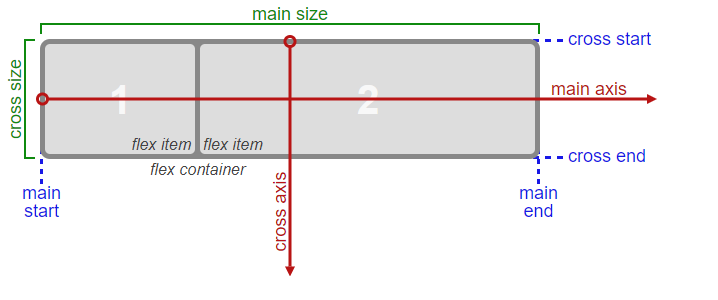

# Introduction to Basic HTML & HTML5
HTML, or HyperText Markup Language, is a markup language used to describe the structure of a web page. It uses a special syntax or notation to organize and give information about the page to the browser. Elements usually have opening and closing tags that surround and give meaning to content. For example, there are different tag options to place around text to show whether it is a heading, a paragraph, or a list.

For example:

<h1>Top level heading: Maybe a page title</h1>

A paragraph of text. Some information we would like to communicate to the viewer. This can be as long or short as we would like.

<ol>
  <li>Number one on the list</li>
  <li>Number two</li>
  <li>A third item</li>
</ol>
Becomes:

Top level heading: Maybe a page title
A paragraph of text. Some information we would like to communicate to the user. This can be as long or short as we would like.

Number one on the list
Number two
A third item
The HyperText part of HTML comes from the early days of the web and its original use case. Pages usually contained static documents that contained references to other documents. These references contained hypertext links used by the browser to navigate to the reference document so the user could read the reference document without having to manually search for it.

As web pages and web applications grow more complex, the W3 Consortium updates the HTML specification to ensure that a webpage can be shown reliably on any browser. The latest version of HTML is HTML5.

This section introduces how to use HTML elements to give structure and meaning to your web content.

### Basic HTML and HTML5: Say Hello to HTML ElementsPassed
Welcome to freeCodeCamp's HTML coding challenges. These will walk you through web development step-by-step.

First, you'll start by building a simple web page using HTML. You can edit code in your code editor, which is embedded into this web page.

Do you see the code in your code editor that says <h1>Hello</h1>? That's an HTML element.

Most HTML elements have an opening tag and a closing tag.

Opening tags look like this:

<h1>

Closing tags look like this:

</h1>

The only difference between opening and closing tags is the forward slash after the opening bracket of a closing tag.

Each challenge has tests you can run at any time by clicking the "Run tests" button. When you pass all tests, you'll be prompted to submit your solution and go to the next coding challenge.

To pass the test on this challenge, change your h1 element's text to say "Hello World".

<h1>Hello World</h1>

### Basic HTML and HTML5: Headline with the h2 ElementPassed
Over the next few lessons, we'll build an HTML5 cat photo web app piece-by-piece.

The h2 element you will be adding in this step will add a level two heading to the web page.

This element tells the browser about the structure of your website. h1 elements are often used for main headings, while h2 elements are generally used for subheadings. There are also h3, h4, h5 and h6 elements to indicate different levels of subheadings.

Add an h2 tag that says "CatPhotoApp" to create a second HTML element below your "Hello World" h1 element.

<h1>Hello World</h1>
<h2>CatPhotoApp</h2>

### Basic HTML and HTML5: Inform with the Paragraph ElementPassed
p elements are the preferred element for paragraph text on websites. p is short for "paragraph".

You can create a paragraph element like this:

I'm a p tag!

Create a p element below your h2 element, and give it the text "Hello Paragraph".

Note: As a convention, all HTML tags are written in lowercase, for example 

 and not 

.

<h1>Hello World</h1>
<h2>CatPhotoApp</h2>

Hello Paragraph

### Basic HTML and HTML5: Fill in the Blank with Placeholder TextPassed
Web developers traditionally use lorem ipsum text as placeholder text. The lorem ipsum text is randomly scraped from a famous passage by Cicero of Ancient Rome.

Lorem ipsum text has been used as placeholder text by typesetters since the 16th century, and this tradition continues on the web.

Well, 5 centuries is long enough. Since we're building a CatPhotoApp, let's use something called "kitty ipsum text".

Replace the text inside your p element with the first few words of this kitty ipsum text: Kitty ipsum dolor sit amet, shed everywhere shed everywhere stretching attack your ankles chase the red dot, hairball run catnip eat the grass sniff.

<h1>Hello World</h1>

<h2>CatPhotoApp</h2>

Kitty ipsum dolor sit amet, shed everywhere shed everywhere stretching attack your ankles chase the red dot, hairball run catnip eat the grass sniff.

### Basic HTML and HTML5: Uncomment HTMLPassed
Commenting is a way that you can leave comments for other developers within your code without affecting the resulting output that is displayed to the end user.

Commenting is also a convenient way to make code inactive without having to delete it entirely.

Comments in HTML start with <!-- and end with a -->

Uncomment your h1, h2 and p elements.

<h1>Hello World</h1>

<h2>CatPhotoApp</h2>

Kitty ipsum dolor sit amet, shed everywhere shed everywhere stretching attack your ankles chase the red dot, hairball run catnip eat the grass sniff.

### Basic HTML and HTML5: Comment out HTMLPassed
Remember that in order to start a comment, you need to use <!-- and to end a comment, you need to use -->

Here you'll need to end the comment before your h2 element begins.

Comment out your h1 element and your p element, but not your h2 element.

<!--
<h1>Hello World</h1>
-->

<h2>CatPhotoApp</h2>
<!--

Kitty ipsum dolor sit amet, shed everywhere shed everywhere stretching attack your ankles chase the red dot, hairball run catnip eat the grass sniff.

-->

### Basic HTML and HTML5: Delete HTML ElementsPassed
Our phone doesn't have much vertical space.

Let's remove the unnecessary elements so we can start building our CatPhotoApp.

Delete your h1 element so we can simplify our view.

<h2>CatPhotoApp</h2>

Kitty ipsum dolor sit amet, shed everywhere shed everywhere stretching attack your ankles chase the red dot, hairball run catnip eat the grass sniff.

### Basic HTML and HTML5: Introduction to HTML5 ElementsPassed
HTML5 introduces more descriptive HTML tags. These include main, header, footer, nav, video, article, section and others.

These tags give a descriptive structure to your HTML, make your HTML easier to read, and help with Search Engine Optimization (SEO) and accessibility. The main HTML5 tag helps search engines and other developers find the main content of your page.

Example usage, a main element with two child elements nested inside it:

<h2>CatPhotoApp</h2>
<main> 

Kitty ipsum dolor sit amet, shed everywhere shed everywhere stretching attack your ankles chase the red dot, hairball run catnip eat the grass sniff.

Purr jump eat the grass rip the couch scratched sunbathe, shed everywhere rip the couch sleep in the sink fluffy fur catnip scratched.

</main> 

### Basic HTML and HTML5: Add Images to Your Website
You can add images to your website by using the img element, and point to a specific image's URL using the src attribute.

An example of this would be:

Note that img elements are self-closing.

All img elements must have an alt attribute. The text inside an alt attribute is used for screen readers to improve accessibility and is displayed if the image fails to load.

Note: If the image is purely decorative, using an empty alt attribute is a best practice.

Ideally the alt attribute should not contain special characters unless needed.

Let's add an alt attribute to our img example above:

Let's try to add an image to our website:

Within the existing main element, insert an img element before the existing p elements.

Now set the src attribute so that it points to this url:

https://bit.ly/fcc-relaxing-cat

Finally, don't forget to give your img element an alt attribute with applicable text.

<h2>CatPhotoApp</h2>
<main>

  
Kitty ipsum dolor sit amet, shed everywhere shed everywhere stretching attack your ankles chase the red dot, hairball run catnip eat the grass sniff.

  
Purr jump eat the grass rip the couch scratched sunbathe, shed everywhere rip the couch sleep in the sink fluffy fur catnip scratched.

</main>

### Basic HTML and HTML5: Link to External Pages with Anchor Elements
You can use a (anchor) elements to link to content outside of your web page.

a elements need a destination web address called an href attribute. They also need anchor text. Here's an example:

<a href="https://freecodecamp.org">this links to freecodecamp.org</a>

Then your browser will display the text "this links to freecodecamp.org" as a link you can click. And that link will take you to the web address https://www.freecodecamp.org.

Create an a element that links to https://freecatphotoapp.com and has "cat photos" as its anchor text.

<h2>CatPhotoApp</h2>
<main>

  

<a href="https://freecatphotoapp.com">cat photos</a>

  
Kitty ipsum dolor sit amet, shed everywhere shed everywhere stretching attack your ankles chase the red dot, hairball run catnip eat the grass sniff.

  
Purr jump eat the grass rip the couch scratched sunbathe, shed everywhere rip the couch sleep in the sink fluffy fur catnip scratched.

</main>

### Basic HTML and HTML5: Link to Internal Sections of a Page with Anchor Elements
a (anchor) elements can also be used to create internal links to jump to different sections within a webpage.

To create an internal link, you assign a link's href attribute to a hash symbol # plus the value of the id attribute for the element that you want to internally link to, usually further down the page. You then need to add the same id attribute to the element you are linking to. An id is an attribute that uniquely describes an element.

Below is an example of an internal anchor link and its target element:

<a href="#contacts-header">Contacts</a>
...
<h2 id="contacts-header">Contacts</h2>
When users click the Contacts link, they'll be taken to the section of the webpage with the Contacts header element.

Change your external link to an internal link by changing the href attribute to "#footer" and the text from "cat photos" to "Jump to Bottom".

Remove the target="_blank" attribute from the anchor tag since this causes the linked document to open in a new window tab.

Then add an id attribute with a value of "footer" to the <footer> element at the bottom of the page.

<h2>CatPhotoApp</h2>
<main>

  <a href="#footer">Jump to Bottom</a>

  

  
Kitty ipsum dolor sit amet, shed everywhere shed everywhere stretching attack your ankles chase the red dot, hairball run catnip eat the grass sniff. Purr jump eat the grass rip the couch scratched sunbathe, shed everywhere rip the couch sleep in the sink fluffy fur catnip scratched. Kitty ipsum dolor sit amet, shed everywhere shed everywhere stretching attack your ankles chase the red dot, hairball run catnip eat the grass sniff.

  
Purr jump eat the grass rip the couch scratched sunbathe, shed everywhere rip the couch sleep in the sink fluffy fur catnip scratched. Kitty ipsum dolor sit amet, shed everywhere shed everywhere stretching attack your ankles chase the red dot, hairball run catnip eat the grass sniff. Purr jump eat the grass rip the couch scratched sunbathe, shed everywhere rip the couch sleep in the sink fluffy fur catnip scratched.

  
Meowwww loved it, hated it, loved it, hated it yet spill litter box, scratch at owner, destroy all furniture, especially couch or lay on arms while you're using the keyboard. Missing until dinner time toy mouse squeak roll over. With tail in the air lounge in doorway. Man running from cops stops to pet cats, goes to jail.

  
Intently stare at the same spot poop in the plant pot but kitten is playing with dead mouse. Get video posted to internet for chasing red dot leave fur on owners clothes meow to be let out and mesmerizing birds leave fur on owners clothes or favor packaging over toy so purr for no reason. Meow to be let out play time intently sniff hand run outside as soon as door open yet destroy couch.

</main>

<footer id="footer">Copyright Cat Photo App</footer>

### Basic HTML and HTML5: Nest an Anchor Element within a Paragraph
You can nest links within other text elements.

  Here's a <a target="_blank" href="http://freecodecamp.org"> link to freecodecamp.org</a> for you to follow.

Let's break down the example: Normal text is wrapped in the p element:

 Here's a ... for you to follow. 
 Next is the anchor element <a> (which requires a closing tag </a>):
<a> ... </a> target is an anchor tag attribute that specifies where to open the link and the value "_blank" specifies to open the link in a new tab href is an anchor tag attribute that contains the URL address of the link:
<a href="http://freecodecamp.org"> ... </a> The text, "link to freecodecamp.org", within the a element called anchor text, will display a link to click:
<a href=" ... ">link to freecodecamp.org</a> The final output of the example will look like this:

Here's a link to freecodecamp.org for you to follow.

Nest the existing a element within a new p element. The new paragraph should have text that says "View more cat photos", where "cat photos" is a link, and the rest is plain text.

<h2>CatPhotoApp</h2>
<main>

  View more <a href="https://freecatphotoapp.com" target="_blank"> 
cat photos</a>

  

  
Kitty ipsum dolor sit amet, shed everywhere shed everywhere stretching attack your ankles chase the red dot, hairball run catnip eat the grass sniff.

  
Purr jump eat the grass rip the couch scratched sunbathe, shed everywhere rip the couch sleep in the sink fluffy fur catnip scratched.

</main>

### Basic HTML and HTML5: Make Dead Links Using the Hash Symbol
Sometimes you want to add a elements to your website before you know where they will link.

This is also handy when you're changing the behavior of a link using JavaScript, which we'll learn about later.

The current value of the href attribute is a link that points to "https://freecatphotoapp.com". Replace the href attribute value with a #, also known as a hash symbol, to create a dead link.

For example: href="#"
<h2>CatPhotoApp</h2>
<main>
  
Click here to view more <a href="#" target="_blank">cat photos</a>.

  

  
Kitty ipsum dolor sit amet, shed everywhere shed everywhere stretching attack your ankles chase the red dot, hairball run catnip eat the grass sniff.

  
Purr jump eat the grass rip the couch scratched sunbathe, shed everywhere rip the couch sleep in the sink fluffy fur catnip scratched.

</main>

### Basic HTML and HTML5: Turn an Image into a Link
You can make elements into links by nesting them within an a element.

Nest your image within an a element. Here's an example:

Remember to use # as your a element's href property in order to turn it into a dead link.

Place the existing image element within an a (anchor) element.

Once you've done this, hover over your image with your cursor. Your cursor's normal pointer should become the link clicking pointer. The photo is now a link.

<h2>CatPhotoApp</h2>
<main>
  
Click here to view more <a href="#">cat photos</a>.

  

  
Kitty ipsum dolor sit amet, shed everywhere shed everywhere stretching attack your ankles chase the red dot, hairball run catnip eat the grass sniff.

  
Purr jump eat the grass rip the couch scratched sunbathe, shed everywhere rip the couch sleep in the sink fluffy fur catnip scratched.

</main>

### Basic HTML and HTML5: Create a Bulleted Unordered List
HTML has a special element for creating unordered lists, or bullet point style lists.

Unordered lists start with an opening <ul> element, followed by any number of <li> elements. Finally, unordered lists close with a </ul>

For example:

<ul>
  <li>milk</li>
  <li>cheese</li>
</ul>
would create a bullet point style list of "milk" and "cheese".

Remove the last two p elements and create an unordered list of three things that cats love at the bottom of the page.
<h2>CatPhotoApp</h2>
<main>
  
Click here to view more <a href="#">cat photos</a>.

  

 <ul>
  <li>milk</li>
  <li>balls</li>
  <li>food</li>
</ul>

</main>

### Basic HTML and HTML5: Create an Ordered List
HTML has another special element for creating ordered lists, or numbered lists.

Ordered lists start with an opening <ol> element, followed by any number of <li> elements. Finally, ordered lists are closed with the </ol> tag.

For example:

<ol>
  <li>Garfield</li>
  <li>Sylvester</li>
</ol>
would create a numbered list of "Garfield" and "Sylvester".

Create an ordered list of the top 3 things cats hate the most.

<h2>CatPhotoApp</h2>
<main>
  
Click here to view more <a href="#">cat photos</a>.

  

  
Things cats love:

  <ul>
    <li>cat nip</li>
    <li>laser pointers</li>
    <li>lasagna</li>
  </ul>
  
Top 3 things cats hate:

  <ol>
  <li>noises</li>
  <li>heat</li>
  <li>dogs</li>
</ol>
</main>

### Basic HTML and HTML5: Create a Text Field
Now let's create a web form.

input elements are a convenient way to get input from your user.

You can create a text input like this:

<input type="text">

Note that input elements are self-closing.

Create an input element of type text below your lists.

<h2>CatPhotoApp</h2>
<main>
  
Click here to view more <a href="#">cat photos</a>.

  

  
Things cats love:

  <ul>
    <li>cat nip</li>
    <li>laser pointers</li>
    <li>lasagna</li>
  </ul>
  
Top 3 things cats hate:

  <ol>
    <li>flea treatment</li>
    <li>thunder</li>
    <li>other cats</li>
  </ol>

  <input type="text">

  ### Basic HTML and HTML5: Add Placeholder Text to a Text Field
Placeholder text is what is displayed in your input element before your user has inputted anything.

You can create placeholder text like so:

<input type="text" placeholder="this is placeholder text">

Note: Remember that input elements are self-closing.

Set the placeholder value of your text input to "cat photo URL".

<h2>CatPhotoApp</h2>
<main>
  
Click here to view more <a href="#">cat photos</a>.

  

  
Things cats love:

  <ul>
    <li>cat nip</li>
    <li>laser pointers</li>
    <li>lasagna</li>
  </ul>
  
Top 3 things cats hate:

  <ol>
    <li>flea treatment</li>
    <li>thunder</li>
    <li>other cats</li>
  </ol>
  <input type="text" placeholder="cat photo URL">
</main>

### Basic HTML and HTML5: Create a Form Element
You can build web forms that actually submit data to a server using nothing more than pure HTML. You can do this by specifying an action on your form element.

For example:

<form action="/url-where-you-want-to-submit-form-data"></form>

Nest the existing input element inside a form element and assign "https://freecatphotoapp.com/submit-cat-photo" to the action attribute of the form element.

<h2>CatPhotoApp</h2>
<main>
  
Click here to view more <a href="#">cat photos</a>.

  

  
Things cats love:

  <ul>
    <li>cat nip</li>
    <li>laser pointers</li>
    <li>lasagna</li>
  </ul>
  
Top 3 things cats hate:

  <ol>
    <li>flea treatment</li>
    <li>thunder</li>
    <li>other cats</li>
  </ol>
  

  <form action="https://freecatphotoapp.com/submit-cat-photo"><input type="text" placeholder="cat photo URL"></form>

</main>

### Basic HTML and HTML5: Add a Submit Button to a Form
Let's add a submit button to your form. Clicking this button will send the data from your form to the URL you specified with your form's action attribute.

Here's an example submit button:

<button type="submit">this button submits the form</button>

Add a button as the last element of your form element with a type of submit, and "Submit" as its text.

<h2>CatPhotoApp</h2>
<main>
  
Click here to view more <a href="#">cat photos</a>.

  

  
Things cats love:

  <ul>
    <li>cat nip</li>
    <li>laser pointers</li>
    <li>lasagna</li>
  </ul>
  
Top 3 things cats hate:

  <ol>
    <li>flea treatment</li>
    <li>thunder</li>
    <li>other cats</li>
  </ol>
  <form action="https://freecatphotoapp.com/submit-cat-photo">
    <input type="text" placeholder="cat photo URL"> <button type="submit">Submit</button>
  </form>

 
</main>

### Basic HTML and HTML5: Use HTML5 to Require a Field
You can require specific form fields so that your user will not be able to submit your form until he or she has filled them out.

For example, if you wanted to make a text input field required, you can just add the attribute required within your input element, like this: <input type="text" required>

Make your text input a required field, so that your user can't submit the form without completing this field.

Then try to submit the form without inputting any text. See how your HTML5 form notifies you that the field is required?

<h2>CatPhotoApp</h2>
<main>
  
Click here to view more <a href="#">cat photos</a>.

  

  
Things cats love:

  <ul>
    <li>cat nip</li>
    <li>laser pointers</li>
    <li>lasagna</li>
  </ul>
  
Top 3 things cats hate:

  <ol>
    <li>flea treatment</li>
    <li>thunder</li>
    <li>other cats</li>
  </ol>
  <form action="https://freecatphotoapp.com/submit-cat-photo">
    <input type="text" placeholder="cat photo URL" required>
    <button type="submit">Submit</button>
  </form>
</main>

### Basic HTML and HTML5: Create a Set of Radio Buttons
You can use radio buttons for questions where you want the user to only give you one answer out of multiple options.

Radio buttons are a type of input.

Each of your radio buttons can be nested within its own label element. By wrapping an input element inside of a label element it will automatically associate the radio button input with the label element surrounding it.

All related radio buttons should have the same name attribute to create a radio button group. By creating a radio group, selecting any single radio button will automatically deselect the other buttons within the same group ensuring only one answer is provided by the user.

Here's an example of a radio button:

<label> 
  <input type="radio" name="indoor-outdoor">Indoor 
</label>
It is considered best practice to set a for attribute on the label element, with a value that matches the value of the id attribute of the input element. This allows assistive technologies to create a linked relationship between the label and the child input element. For example:

<label for="indoor"> 
  <input id="indoor" type="radio" name="indoor-outdoor">Indoor 
</label>
Add a pair of radio buttons to your form, each nested in its own label element. One should have the option of indoor and the other should have the option of outdoor. Both should share the name attribute of indoor-outdoor to create a radio group.

<h2>CatPhotoApp</h2>
<main>
  
Click here to view more <a href="#">cat photos</a>.

  

  
Things cats love:

  <ul>
    <li>cat nip</li>
    <li>laser pointers</li>
    <li>lasagna</li>
  </ul>
  
Top 3 things cats hate:

  <ol>
    <li>flea treatment</li>
    <li>thunder</li>
    <li>other cats</li>
  </ol>
  <form action="https://freecatphotoapp.com/submit-cat-photo">
    <input type="text" placeholder="cat photo URL" required>
    <button type="submit">Submit</button>
      <label for="indoor"> 
  <input id="indoor" type="radio" name="indoor-outdoor">Indoor 
</label>

<label for="indoor"> 
  <input id="indoor" type="radio" name="indoor-outdoor">Outdoor 
</label>
  </form>
### Basic HTML and HTML5: Create a Set of Checkboxes
Forms commonly use checkboxes for questions that may have more than one answer.

Checkboxes are a type of input.

Each of your checkboxes can be nested within its own label element. By wrapping an input element inside of a label element it will automatically associate the checkbox input with the label element surrounding it.

All related checkbox inputs should have the same name attribute.

It is considered best practice to explicitly define the relationship between a checkbox input and its corresponding label by setting the for attribute on the label element to match the id attribute of the associated input element.

Here's an example of a checkbox:

<label for="loving"><input id="loving" type="checkbox" name="personality"> Loving</label>

Add to your form a set of three checkboxes. Each checkbox should be nested within its own label element. All three should share the name attribute of personality.

<h2>CatPhotoApp</h2>
<main>
  
Click here to view more <a href="#">cat photos</a>.

  

  
Things cats love:

  <ul>
    <li>cat nip</li>
    <li>laser pointers</li>
    <li>lasagna</li>
  </ul>
  
Top 3 things cats hate:

  <ol>
    <li>flea treatment</li>
    <li>thunder</li>
    <li>other cats</li>
  </ol>
  <form action="https://freecatphotoapp.com/submit-cat-photo">
    <label for="indoor"><input id="indoor" type="radio" name="indoor-outdoor"> Indoor</label>
    <label for="outdoor"><input id="outdoor" type="radio" name="indoor-outdoor"> Outdoor</label> 
    <input type="text" placeholder="cat photo URL" required>
    <button type="submit">Submit</button>

  <label for="loving"><input id="loving" type="checkbox" name="personality"> Loving</label>
  <label for="loving"><input id="loving" type="checkbox" name="personality"> Loving</label>

  <label for="loving"><input id="loving" type="checkbox" name="personality"> Loving</label>
  </form>

</main>

### Basic HTML and HTML5: Use the value attribute with Radio Buttons and Checkboxes
When a form gets submitted, the data is sent to the server and includes entries for the options selected. Inputs of type radio and checkbox report their values from the value attribute.

For example:

<label for="indoor">
  <input id="indoor" value="indoor" type="radio" name="indoor-outdoor">Indoor
</label>
<label for="outdoor">
  <input id="outdoor" value="outdoor" type="radio" name="indoor-outdoor">Outdoor
</label>
Here, you have two radio inputs. When the user submits the form with the indoor option selected, the form data will include the line: indoor-outdoor=indoor. This is from the name and value attributes of the "indoor" input.

If you omit the value attribute, the submitted form data uses the default value, which is on. In this scenario, if the user clicked the "indoor" option and submitted the form, the resulting form data would be indoor-outdoor=on, which is not useful. So the value attribute needs to be set to something to identify the option.

Give each of the radio and checkbox inputs the value attribute. Use the input label text, in lowercase, as the value for the attribute.

<h2>CatPhotoApp</h2>
<main>
  
Click here to view more <a href="#">cat photos</a>.

  

  
Things cats love:

  <ul>
    <li>cat nip</li>
    <li>laser pointers</li>
    <li>lasagna</li>
  </ul>
  
Top 3 things cats hate:

  <ol>
    <li>flea treatment</li>
    <li>thunder</li>
    <li>other cats</li>
  </ol>
  <form action="https://freecatphotoapp.com/submit-cat-photo">
    <label for="indoor"><input id="indoor" type="radio" value="indoor" name="indoor-outdoor"> Indoor</label>
    <label for="outdoor"><input id="outdoor" type="radio" value="outdoor" name="indoor-outdoor"> Outdoor</label> 
    <label for="loving"><input id="loving" type="checkbox" value="loving" name="personality"> Loving</label>
    <label for="lazy"><input id="lazy" type="checkbox" value="lazy" name="personality"> Lazy</label>
    <label for="energetic"><input id="energetic" value="energetic" type="checkbox" name="personality"> Energetic</label> 
    <input type="text" placeholder="cat photo URL" required>
    <button type="submit">Submit</button>
  </form>
</main>

### Basic HTML and HTML5: Check Radio Buttons and Checkboxes by Default
You can set a checkbox or radio button to be checked by default using the checked attribute.

To do this, just add the word "checked" to the inside of an input element. For example:

<input type="radio" name="test-name" checked>

Set the first of your radio buttons and the first of your checkboxes to both be checked by default.

<h2>CatPhotoApp</h2>
<main>
  
Click here to view more <a href="#">cat photos</a>.

  

  
Things cats love:

  <ul>
    <li>cat nip</li>
    <li>laser pointers</li>
    <li>lasagna</li>
  </ul>
  
Top 3 things cats hate:

  <ol>
    <li>flea treatment</li>
    <li>thunder</li>
    <li>other cats</li>
  </ol>
  <form action="https://freecatphotoapp.com/submit-cat-photo">
    <label for="indoor"><input id="indoor" type="radio" name="indoor-outdoor" value="indoor" checked> Indoor</label>
    <label for="outdoor"><input id="outdoor" type="radio" name="indoor-outdoor" value="outdoor"> Outdoor</label> 
    <label for="loving"><input id="loving" type="checkbox" name="personality" value="loving" checked> Loving</label>
    <label for="lazy"><input id="lazy" type="checkbox" name="personality" value="lazy"> Lazy</label>
    <label for="energetic"><input id="energetic" type="checkbox" name="personality" value="energetic"> Energetic</label> 
    <input type="text" placeholder="cat photo URL" required>
    <button type="submit">Submit</button>
  </form>
</main>

### Basic HTML and HTML5: Nest Many Elements within a Single div Element
The div element, also known as a division element, is a general purpose container for other elements.

The div element is probably the most commonly used HTML element of all.

Just like any other non-self-closing element, you can open a div element with 
 and close it on another line with 
.

Nest your "Things cats love" and "Things cats hate" lists all within a single div element.

Hint: Try putting your opening div tag above your "Things cats love" p element and your closing div tag after your closing ol tag so that both of your lists are within one div.

<h2>CatPhotoApp</h2>
<main>
  
Click here to view more <a href="#">cat photos</a>.

  

  
Things cats love:

  <ul>
    <li>cat nip</li>
    <li>laser pointers</li>
    <li>lasagna</li>
  </ul>
  
Top 3 things cats hate:

  <ol>
    <li>flea treatment</li>
    <li>thunder</li>
    <li>other cats</li>
  </ol>

  <form action="https://freecatphotoapp.com/submit-cat-photo">
    <label for="indoor"><input id="indoor" type="radio" name="indoor-outdoor" value="indoor" checked> Indoor</label>
    <label for="outdoor"><input id="outdoor" type="radio" name="indoor-outdoor" value="outdoor"> Outdoor</label> 
    <label for="loving"><input id="loving" type="checkbox" name="personality" value="loving" checked> Loving</label>
    <label for="lazy"><input id="lazy" type="checkbox" name="personality" value="lazy"> Lazy</label>
    <label for="energetic"><input id="energetic" type="checkbox" name="personality" value="energetic"> Energetic</label> 
    <input type="text" placeholder="cat photo URL" required>
    <button type="submit">Submit</button>
  </form>
</main>

### Basic HTML and HTML5: Declare the Doctype of an HTML Document
The challenges so far have covered specific HTML elements and their uses. However, there are a few elements that give overall structure to your page, and should be included in every HTML document.

At the top of your document, you need to tell the browser which version of HTML your page is using. HTML is an evolving language, and is updated regularly. Most major browsers support the latest specification, which is HTML5. However, older web pages may use previous versions of the language.

You tell the browser this information by adding the <!DOCTYPE ...> tag on the first line, where the ... part is the version of HTML. For HTML5, you use <!DOCTYPE html>.

The ! and uppercase DOCTYPE is important, especially for older browsers. The html is not case sensitive.

Next, the rest of your HTML code needs to be wrapped in html tags. The opening <html> goes directly below the <!DOCTYPE html> line, and the closing </html> goes at the end of the page.

Here's an example of the page structure:

<!DOCTYPE html>
<html>
  <!-- Your HTML code goes here -->
</html>
Add a DOCTYPE tag for HTML5 to the top of the blank HTML document in the code editor. Under it, add opening and closing html tags, which wrap around an h1 element. The heading can include any text.

<!DOCTYPE html>
<html>
  <h1>Text</h1>
</html>

### Basic HTML and HTML5: Define the Head and Body of an HTML Document
You can add another level of organization in your HTML document within the html tags with the head and body elements. Any markup with information about your page would go into the head tag. Then any markup with the content of the page (what displays for a user) would go into the body tag.

Metadata elements, such as link, meta, title, and style, typically go inside the head element.

Here's an example of a page's layout:

<!DOCTYPE html>
<html>
  <head>
    <!-- metadata elements -->
  </head>
  <body>
    <!-- page contents -->
  </body>
</html>
Edit the markup so there's a head and a body. The head element should only include the title, and the body element should only include the h1 and p.

<!DOCTYPE html>
<html>
  <head>
  
  <title>The best page ever</title>
  </head>
  <body>
  <h1>The best page ever</h1>
  
Cat ipsum dolor sit amet, jump launch to pounce upon little yarn mouse, bare fangs at toy run hide in litter box until treats are fed. Go into a room to decide you didn't want to be in there anyway. I like big cats and i can not lie kitty ipsum dolor sit amet, shed everywhere shed everywhere stretching attack your ankles chase the red dot, hairball run catnip eat the grass sniff. Meow i could pee on this if i had the energy for slap owner's face at 5am until human fills food dish yet scamper. Knock dish off table head butt cant eat out of my own dish scratch the furniture. Make meme, make cute face. Sleep in the bathroom sink chase laser but pee in the shoe. Paw at your fat belly licks your face and eat grass, throw it back up kitty ipsum dolor sit amet, shed everywhere shed everywhere stretching attack your ankles chase the red dot, hairball run catnip eat the grass sniff.

</body>
</html>

Basic CSS: Change the Color of Text
Now let's change the color of some of our text.

We can do this by changing the style of your h2 element.

The property that is responsible for the color of an element's text is the color style property.

Here's how you would set your h2 element's text color to blue:

<h2 style="color: blue;">CatPhotoApp</h2>

Note that it is a good practice to end inline style declarations with a ; .

Change your h2 element's style so that its text color is red.

<h2 style="color: red;">CatPhotoApp</h2>>CatPhotoApp</h2>
<main>
  
Click here to view more <a href="#">cat photos</a>.

  

  

    
Things cats love:

    <ul>
      <li>cat nip</li>
      <li>laser pointers</li>
      <li>lasagna</li>
    </ul>
    
Top 3 things cats hate:

    <ol>
      <li>flea treatment</li>
      <li>thunder</li>
      <li>other cats</li>
    </ol>
  

  <form action="https://freecatphotoapp.com/submit-cat-photo">
    <label><input type="radio" name="indoor-outdoor" checked> Indoor</label>
    <label><input type="radio" name="indoor-outdoor"> Outdoor</label> 
    <label><input type="checkbox" name="personality" checked> Loving</label>
    <label><input type="checkbox" name="personality"> Lazy</label>
    <label><input type="checkbox" name="personality"> Energetic</label> 
    <input type="text" placeholder="cat photo URL" required>
    <button type="submit">Submit</button>
  </form>
</main>

### Basic CSS: Use CSS Selectors to Style Elements
With CSS, there are hundreds of CSS properties that you can use to change the way an element looks on your page.

When you entered <h2 style="color: red;">CatPhotoApp</h2>, you were styling that individual h2 element with inline CSS, which stands for Cascading Style Sheets.

That's one way to specify the style of an element, but there's a better way to apply CSS.

At the top of your code, create a style block like this:

Inside that style block, you can create a CSS selector for all h2 elements. For example, if you wanted all h2 elements to be red, you would add a style rule that looks like this:

Note that it's important to have both opening and closing curly braces ({ and }) around each element's style rule(s). You also need to make sure that your element's style definition is between the opening and closing style tags. Finally, be sure to add a semicolon to the end of each of your element's style rules.

Delete your h2 element's style attribute, and instead create a CSS style block. Add the necessary CSS to turn all h2 elements blue.

<h2>CatPhotoApp</h2>
<main>
  
Click here to view more <a href="#">cat photos</a>.

  

  

    
Things cats love:

    <ul>
      <li>cat nip</li>
      <li>laser pointers</li>
      <li>lasagna</li>
    </ul>
    
Top 3 things cats hate:

    <ol>
      <li>flea treatment</li>
      <li>thunder</li>
      <li>other cats</li>
    </ol>
  

  <form action="https://freecatphotoapp.com/submit-cat-photo">
    <label><input type="radio" name="indoor-outdoor" checked> Indoor</label>
    <label><input type="radio" name="indoor-outdoor"> Outdoor</label> 
    <label><input type="checkbox" name="personality" checked> Loving</label>
    <label><input type="checkbox" name="personality"> Lazy</label>
    <label><input type="checkbox" name="personality"> Energetic</label> 
    <input type="text" placeholder="cat photo URL" required>
    <button type="submit">Submit</button>
  </form>
</main>

Basic CSS: Use a CSS Class to Style an Element
Classes are reusable styles that can be added to HTML elements.

Here's an example CSS class declaration:

You can see that we've created a CSS class called blue-text within the 

<h2 class="red-text">CatPhotoApp</h2>
<main>
  
Click here to view more <a href="#">cat photos</a>.

  

  

    
Things cats love:

    <ul>
      <li>cat nip</li>
      <li>laser pointers</li>
      <li>lasagna</li>
    </ul>
    
Top 3 things cats hate:

    <ol>
      <li>flea treatment</li>
      <li>thunder</li>
      <li>other cats</li>
    </ol>
  

  <form action="https://freecatphotoapp.com/submit-cat-photo">
    <label><input type="radio" name="indoor-outdoor" checked> Indoor</label>
    <label><input type="radio" name="indoor-outdoor"> Outdoor</label> 
    <label><input type="checkbox" name="personality" checked> Loving</label>
    <label><input type="checkbox" name="personality"> Lazy</label>
    <label><input type="checkbox" name="personality"> Energetic</label> 
    <input type="text" placeholder="cat photo URL" required>
    <button type="submit">Submit</button>
  </form>
</main>

### Basic CSS: Style Multiple Elements with a CSS Class
Classes allow you to use the same CSS styles on multiple HTML elements. You can see this by applying your red-text class to the first p element.

<h2 class="red-text">CatPhotoApp</h2>
<main>
  
Click here to view more <a href="#">cat photos</a>.

  

  

    
Things cats love:

    <ul>
      <li>cat nip</li>
      <li>laser pointers</li>
      <li>lasagna</li>
    </ul>
    
Top 3 things cats hate:

    <ol>
      <li>flea treatment</li>
      <li>thunder</li>
      <li>other cats</li>
    </ol>
  

  <form action="https://freecatphotoapp.com/submit-cat-photo">
    <label><input type="radio" name="indoor-outdoor" checked> Indoor</label>
    <label><input type="radio" name="indoor-outdoor"> Outdoor</label> 
    <label><input type="checkbox" name="personality" checked> Loving</label>
    <label><input type="checkbox" name="personality"> Lazy</label>
    <label><input type="checkbox" name="personality"> Energetic</label> 
    <input type="text" placeholder="cat photo URL" required>
    <button type="submit">Submit</button>
  </form>
</main>

### Basic CSS: Change the Font Size of an Element
Font size is controlled by the font-size CSS property, like this:

h1 {
  font-size: 30px;
}
Inside the same 

<h2 class="red-text">CatPhotoApp</h2>
<main>
  
Click here to view more <a href="#">cat photos</a>.

  

  

    
Things cats love:

    <ul>
      <li>cat nip</li>
      <li>laser pointers</li>
      <li>lasagna</li>
    </ul>
    
Top 3 things cats hate:

    <ol>
      <li>flea treatment</li>
      <li>thunder</li>
      <li>other cats</li>
    </ol>
  

  <form action="https://freecatphotoapp.com/submit-cat-photo">
    <label><input type="radio" name="indoor-outdoor" checked> Indoor</label>
    <label><input type="radio" name="indoor-outdoor"> Outdoor</label> 
    <label><input type="checkbox" name="personality" checked> Loving</label>
    <label><input type="checkbox" name="personality"> Lazy</label>
    <label><input type="checkbox" name="personality"> Energetic</label> 
    <input type="text" placeholder="cat photo URL" required>
    <button type="submit">Submit</button>
  </form>
</main>

### Basic CSS: Set the Font Family of an Element
You can set which font an element should use, by using the font-family property.

For example, if you wanted to set your h2 element's font to sans-serif, you would use the following CSS:

h2 {
  font-family: sans-serif;
}
Make all of your p elements use the monospace font.

<h2 class="red-text">CatPhotoApp</h2>
<main>
  
Click here to view more <a href="#">cat photos</a>.

  

  

    
Things cats love:

    <ul>
      <li>cat nip</li>
      <li>laser pointers</li>
      <li>lasagna</li>
    </ul>
    
Top 3 things cats hate:

    <ol>
      <li>flea treatment</li>
      <li>thunder</li>
      <li>other cats</li>
    </ol>
  

  <form action="https://freecatphotoapp.com/submit-cat-photo">
    <label><input type="radio" name="indoor-outdoor" checked> Indoor</label>
    <label><input type="radio" name="indoor-outdoor"> Outdoor</label> 
    <label><input type="checkbox" name="personality" checked> Loving</label>
    <label><input type="checkbox" name="personality"> Lazy</label>
    <label><input type="checkbox" name="personality"> Energetic</label> 
    <input type="text" placeholder="cat photo URL" required>
    <button type="submit">Submit</button>
  </form>
</main>

### Basic CSS: Import a Google Font
In addition to specifying common fonts that are found on most operating systems, we can also specify non-standard, custom web fonts for use on our website. There are many sources for web fonts on the Internet. For this example we will focus on the Google Fonts library.

Google Fonts is a free library of web fonts that you can use in your CSS by referencing the font's URL.

So, let's go ahead and import and apply a Google font (note that if Google is blocked in your country, you will need to skip this challenge).

To import a Google Font, you can copy the font's URL from the Google Fonts library and then paste it in your HTML. For this challenge, we'll import the Lobster font. To do this, copy the following code snippet and paste it into the top of your code editor (before the opening style element):

<link href="https://fonts.googleapis.com/css?family=Lobster" rel="stylesheet" type="text/css">

Now you can use the Lobster font in your CSS by using Lobster as the FAMILY_NAME as in the following example:
font-family: FAMILY_NAME, GENERIC_NAME;.

The GENERIC_NAME is optional, and is a fallback font in case the other specified font is not available. This is covered in the next challenge.

Family names are case-sensitive and need to be wrapped in quotes if there is a space in the name. For example, you need quotes to use the "Open Sans" font, but not to use the Lobster font.

Import the Lobster font to your web page. Then, use an element selector to set Lobster as the font-family for your h2 element.

<link href="https://fonts.googleapis.com/css?family=Lobster" rel="stylesheet" type="text/css">

<h2 class="red-text">CatPhotoApp</h2>
<main>
  
Click here to view more <a href="#">cat photos</a>.

  

  

    
Things cats love:

    <ul>
      <li>cat nip</li>
      <li>laser pointers</li>
      <li>lasagna</li>
    </ul>
    
Top 3 things cats hate:

    <ol>
      <li>flea treatment</li>
      <li>thunder</li>
      <li>other cats</li>
    </ol>
  

  <form action="https://freecatphotoapp.com/submit-cat-photo">
    <label><input type="radio" name="indoor-outdoor" checked> Indoor</label>
    <label><input type="radio" name="indoor-outdoor"> Outdoor</label> 
    <label><input type="checkbox" name="personality" checked> Loving</label>
    <label><input type="checkbox" name="personality"> Lazy</label>
    <label><input type="checkbox" name="personality"> Energetic</label> 
    <input type="text" placeholder="cat photo URL" required>
    <button type="submit">Submit</button>
  </form>
</main>

### Basic CSS: Specify How Fonts Should Degrade
There are several default fonts that are available in all browsers. These generic font families include monospace, serif and sans-serif

When one font isn't available, you can tell the browser to "degrade" to another font.

For example, if you wanted an element to use the Helvetica font, but degrade to the sans-serif font when Helvetica isn't available, you will specify it as follows:

p {
  font-family: Helvetica, sans-serif;
}
Generic font family names are not case-sensitive. Also, they do not need quotes because they are CSS keywords.

To begin, apply the monospace font to the h2 element, so that it now has two fonts - Lobster and monospace.

In the last challenge, you imported the Lobster font using the link tag. Now comment out that import of the Lobster font (using the HTML comments you learned before) from Google Fonts so that it isn't available anymore. Notice how your h2 element degrades to the monospace font.

Note: If you have the Lobster font installed on your computer, you won't see the degradation because your browser is able to find the font.

<!--
<link href="https://fonts.googleapis.com/css?family=Lobster" rel="stylesheet" type="text/css">
-->

<h2 class="red-text">CatPhotoApp</h2>
<main>
  
Click here to view more <a href="#">cat photos</a>.

  

  

    
Things cats love:

    <ul>
      <li>cat nip</li>
      <li>laser pointers</li>
      <li>lasagna</li>
    </ul>
    
Top 3 things cats hate:

    <ol>
      <li>flea treatment</li>
      <li>thunder</li>
      <li>other cats</li>
    </ol>
  

  <form action="https://freecatphotoapp.com/submit-cat-photo">
    <label><input type="radio" name="indoor-outdoor" checked> Indoor</label>
    <label><input type="radio" name="indoor-outdoor"> Outdoor</label> 
    <label><input type="checkbox" name="personality" checked> Loving</label>
    <label><input type="checkbox" name="personality"> Lazy</label>
    <label><input type="checkbox" name="personality"> Energetic</label> 
    <input type="text" placeholder="cat photo URL" required>
    <button type="submit">Submit</button>
  </form>
</main>

### Basic CSS: Size Your Images
CSS has a property called width that controls an element's width. Just like with fonts, we'll use px (pixels) to specify the image's width.

For example, if we wanted to create a CSS class called larger-image that gave HTML elements a width of 500 pixels, we'd use:

Create a class called smaller-image and use it to resize the image so that it's only 100 pixels wide.

<link href="https://fonts.googleapis.com/css?family=Lobster" rel="stylesheet" type="text/css">

<h2 class="red-text">CatPhotoApp</h2>
<main>
  
Click here to view more <a href="#">cat photos</a>.

  

  

    
Things cats love:

    <ul>
      <li>cat nip</li>
      <li>laser pointers</li>
      <li>lasagna</li>
    </ul>
    
Top 3 things cats hate:

    <ol>
      <li>flea treatment</li>
      <li>thunder</li>
      <li>other cats</li>
    </ol>
  

  <form action="https://freecatphotoapp.com/submit-cat-photo">
    <label><input type="radio" name="indoor-outdoor" checked> Indoor</label>
    <label><input type="radio" name="indoor-outdoor"> Outdoor</label> 
    <label><input type="checkbox" name="personality" checked> Loving</label>
    <label><input type="checkbox" name="personality"> Lazy</label>
    <label><input type="checkbox" name="personality"> Energetic</label> 
    <input type="text" placeholder="cat photo URL" required>
    <button type="submit">Submit</button>
  </form>
</main>

### Basic CSS: Add Borders Around Your Elements
CSS borders have properties like style, color and width.

For example, if we wanted to create a red, 5 pixel border around an HTML element, we could use this class:

Create a class called thick-green-border. This class should add a 10px, solid, green border around an HTML element. Apply the class to your cat photo.

Remember that you can apply multiple classes to an element using its class attribute, by separating each class name with a space. For example:

<link href="https://fonts.googleapis.com/css?family=Lobster" rel="stylesheet" type="text/css">

<h2 class="red-text">CatPhotoApp</h2>
<main>
  
Click here to view more <a href="#">cat photos</a>.

  

  

    
Things cats love:

    <ul>
      <li>cat nip</li>
      <li>laser pointers</li>
      <li>lasagna</li>
    </ul>
    
Top 3 things cats hate:

    <ol>
      <li>flea treatment</li>
      <li>thunder</li>
      <li>other cats</li>
    </ol>
  

  <form action="https://freecatphotoapp.com/submit-cat-photo">
    <label><input type="radio" name="indoor-outdoor" checked> Indoor</label>
    <label><input type="radio" name="indoor-outdoor"> Outdoor</label> 
    <label><input type="checkbox" name="personality" checked> Loving</label>
    <label><input type="checkbox" name="personality"> Lazy</label>
    <label><input type="checkbox" name="personality"> Energetic</label> 
    <input type="text" placeholder="cat photo URL" required>
    <button type="submit">Submit</button>
  </form>
</main>

### Basic CSS: Add Rounded Corners with border-radius
Your cat photo currently has sharp corners. We can round out those corners with a CSS property called border-radius.

You can specify a border-radius with pixels. Give your cat photo a border-radius of 10px.

Note: This challenge allows for multiple possible solutions. For example, you may add border-radius to either the .thick-green-border class or the .smaller-image class.
 
<link href="https://fonts.googleapis.com/css?family=Lobster" rel="stylesheet" type="text/css">

<h2 class="red-text">CatPhotoApp</h2>
<main>
  
Click here to view more <a href="#">cat photos</a>.

  

  

    
Things cats love:

    <ul>
      <li>cat nip</li>
      <li>laser pointers</li>
      <li>lasagna</li>
    </ul>
    
Top 3 things cats hate:

    <ol>
      <li>flea treatment</li>
      <li>thunder</li>
      <li>other cats</li>
    </ol>
  

  <form action="https://freecatphotoapp.com/submit-cat-photo">
    <label><input type="radio" name="indoor-outdoor" checked> Indoor</label>
    <label><input type="radio" name="indoor-outdoor"> Outdoor</label> 
    <label><input type="checkbox" name="personality" checked> Loving</label>
    <label><input type="checkbox" name="personality"> Lazy</label>
    <label><input type="checkbox" name="personality"> Energetic</label> 
    <input type="text" placeholder="cat photo URL" required>
    <button type="submit">Submit</button>
  </form>
</main>

### Basic CSS: Make Circular Images with a border-radius
In addition to pixels, you can also specify the border-radius using a percentage.

Give your cat photo a border-radius of 50%.

<link href="https://fonts.googleapis.com/css?family=Lobster" rel="stylesheet" type="text/css">

<h2 class="red-text">CatPhotoApp</h2>
<main>
  
Click here to view more <a href="#">cat photos</a>.

  

  

    
Things cats love:

    <ul>
      <li>cat nip</li>
      <li>laser pointers</li>
      <li>lasagna</li>
    </ul>
    
Top 3 things cats hate:

    <ol>
      <li>flea treatment</li>
      <li>thunder</li>
      <li>other cats</li>
    </ol>
  

  <form action="https://freecatphotoapp.com/submit-cat-photo">
    <label><input type="radio" name="indoor-outdoor" checked> Indoor</label>
    <label><input type="radio" name="indoor-outdoor"> Outdoor</label> 
    <label><input type="checkbox" name="personality" checked> Loving</label>
    <label><input type="checkbox" name="personality"> Lazy</label>
    <label><input type="checkbox" name="personality"> Energetic</label> 
    <input type="text" placeholder="cat photo URL" required>
    <button type="submit">Submit</button>
  </form>
</main>

### Basic CSS: Give a Background Color to a div Element
You can set an element's background color with the background-color property.

For example, if you wanted an element's background color to be green, you'd put this within your style element:

.green-background {
  background-color: green;
}
Create a class called silver-background with the background-color of silver. Assign this class to your div element.

<link href="https://fonts.googleapis.com/css?family=Lobster" rel="stylesheet" type="text/css">

<h2 class="red-text">CatPhotoApp</h2>
<main>
  
Click here to view more <a href="#">cat photos</a>.

  

  

    
Things cats love:

    <ul>
      <li>cat nip</li>
      <li>laser pointers</li>
      <li>lasagna</li>
    </ul>
    
Top 3 things cats hate:

    <ol>
      <li>flea treatment</li>
      <li>thunder</li>
      <li>other cats</li>
    </ol>
  

  <form action="https://freecatphotoapp.com/submit-cat-photo">
    <label><input type="radio" name="indoor-outdoor" checked> Indoor</label>
    <label><input type="radio" name="indoor-outdoor"> Outdoor</label> 
    <label><input type="checkbox" name="personality" checked> Loving</label>
    <label><input type="checkbox" name="personality"> Lazy</label>
    <label><input type="checkbox" name="personality"> Energetic</label> 
    <input type="text" placeholder="cat photo URL" required>
    <button type="submit">Submit</button>
  </form>
</main>

### Basic CSS: Set the id of an Element
In addition to classes, each HTML element can also have an id attribute.

There are several benefits to using id attributes: You can use an id to style a single element and later you'll learn that you can use them to select and modify specific elements with JavaScript.

id attributes should be unique. Browsers won't enforce this, but it is a widely agreed upon best practice. So please don't give more than one element the same id attribute.

Here's an example of how you give your h2 element the id of cat-photo-app:
<link href="https://fonts.googleapis.com/css?family=Lobster" rel="stylesheet" type="text/css">

<h2 class="red-text">CatPhotoApp</h2>
<main>
  
Click here to view more <a href="#">cat photos</a>.

  

  

    
Things cats love:

    <ul>
      <li>cat nip</li>
      <li>laser pointers</li>
      <li>lasagna</li>
    </ul>
    
Top 3 things cats hate:

    <ol>
      <li>flea treatment</li>
      <li>thunder</li>
      <li>other cats</li>
    </ol>
  

  <form id="cat-photo-form" action="https://freecatphotoapp.com/submit-cat-photo">
    <label><input type="radio" name="indoor-outdoor" checked> Indoor</label>
    <label><input type="radio" name="indoor-outdoor"> Outdoor</label> 
    <label><input type="checkbox" name="personality" checked> Loving</label>
    <label><input type="checkbox" name="personality"> Lazy</label>
    <label><input type="checkbox" name="personality"> Energetic</label> 
    <input type="text" placeholder="cat photo URL" required>
    <button type="submit">Submit</button>
  </form>
</main>

### Basic CSS: Use an id Attribute to Style an Element
One cool thing about id attributes is that, like classes, you can style them using CSS.

However, an id is not reusable and should only be applied to one element. An id also has a higher specificity (importance) than a class so if both are applied to the same element and have conflicting styles, the styles of the id will be applied.

Here's an example of how you can take your element with the id attribute of cat-photo-element and give it the background color of green. In your style element:

#cat-photo-element {
  background-color: green;
}
Note that inside your style element, you always reference classes by putting a . in front of their names. You always reference ids by putting a # in front of their names.

Try giving your form, which now has the id attribute of cat-photo-form, a green background.

<link href="https://fonts.googleapis.com/css?family=Lobster" rel="stylesheet" type="text/css">

<h2 class="red-text">CatPhotoApp</h2>
<main>
  
Click here to view more <a href="#">cat photos</a>.

  

  

    
Things cats love:

    <ul>
      <li>cat nip</li>
      <li>laser pointers</li>
      <li>lasagna</li>
    </ul>
    
Top 3 things cats hate:

    <ol>
      <li>flea treatment</li>
      <li>thunder</li>
      <li>other cats</li>
    </ol>
  

  <form action="https://freecatphotoapp.com/submit-cat-photo" id="cat-photo-form">
    <label><input type="radio" name="indoor-outdoor" checked> Indoor</label>
    <label><input type="radio" name="indoor-outdoor"> Outdoor</label> 
    <label><input type="checkbox" name="personality" checked> Loving</label>
    <label><input type="checkbox" name="personality"> Lazy</label>
    <label><input type="checkbox" name="personality"> Energetic</label> 
    <input type="text" placeholder="cat photo URL" required>
    <button type="submit">Submit</button>
  </form>
</main>

### Basic CSS: Adjust the Padding of an Element
Now let's put our Cat Photo App away for a little while and learn more about styling HTML.

You may have already noticed this, but all HTML elements are essentially little rectangles.

Three important properties control the space that surrounds each HTML element: padding, border, and margin.

An element's padding controls the amount of space between the element's content and its border.

Here, we can see that the blue box and the red box are nested within the yellow box. Note that the red box has more padding than the blue box.

When you increase the blue box's padding, it will increase the distance (padding) between the text and the border around it.

Change the padding of your blue box to match that of your red box.

<h5 class="injected-text">margin</h5>

  <h5 class="box red-box">padding</h5>
  <h5 class="box blue-box">padding</h5>

### Basic CSS: Adjust the Margin of an Element
An element's margin controls the amount of space between an element's border and surrounding elements.

Here, we can see that the blue box and the red box are nested within the yellow box. Note that the red box has a bigger margin than the blue box, making it appear smaller.

When you increase the blue box's margin, it will increase the distance between its border and surrounding elements.

Change the margin of the blue box to match that of the red box.

<h5 class="injected-text">margin</h5>

  <h5 class="box red-box">padding</h5>
  <h5 class="box blue-box">padding</h5>

### Basic CSS: Add a Negative Margin to an Element
An element's margin controls the amount of space between an element's border and surrounding elements.

If you set an element's margin to a negative value, the element will grow larger.

Try to set the margin to a negative value like the one for the red box.

Change the margin of the blue box to -15px, so it fills the entire horizontal width of the yellow box around it.

  <h5 class="box red-box">padding</h5>
  <h5 class="box blue-box">padding</h5>

### Basic CSS: Add Different Padding to Each Side of an Element
Sometimes you will want to customize an element so that it has different amounts of padding on each of its sides.

CSS allows you to control the padding of all four individual sides of an element with the padding-top, padding-right, padding-bottom, and padding-left properties.

Give the blue box a padding of 40px on its top and left side, but only 20px on its bottom and right side.

<h5 class="injected-text">margin</h5>

  <h5 class="box red-box">padding</h5>
  <h5 class="box blue-box">padding</h5>

### Basic CSS: Add Different Margins to Each Side of an Element
Sometimes you will want to customize an element so that it has a different margin on each of its sides.

CSS allows you to control the margin of all four individual sides of an element with the margin-top, margin-right, margin-bottom, and margin-left properties.

Give the blue box a margin of 40px on its top and left side, but only 20px on its bottom and right side.

<h5 class="injected-text">margin</h5>

  <h5 class="box red-box">padding</h5>
  <h5 class="box blue-box">padding</h5>

### Basic CSS: Use Clockwise Notation to Specify the Padding of an Element
Instead of specifying an element's padding-top, padding-right, padding-bottom, and padding-left properties individually, you can specify them all in one line, like this:

padding: 10px 20px 10px 20px;

These four values work like a clock: top, right, bottom, left, and will produce the exact same result as using the side-specific padding instructions.

Use Clockwise Notation to give the ".blue-box" class a padding of 40px on its top and left side, but only 20px on its bottom and right side.

<h5 class="injected-text">margin</h5>

  <h5 class="box red-box">padding</h5>
  <h5 class="box blue-box">padding</h5>

### Basic CSS: Use Clockwise Notation to Specify the Margin of an Element
Let's try this again, but with margin this time.

Instead of specifying an element's margin-top, margin-right, margin-bottom, and margin-left properties individually, you can specify them all in one line, like this:

margin: 10px 20px 10px 20px;

These four values work like a clock: top, right, bottom, left, and will produce the exact same result as using the side-specific margin instructions.

Use Clockwise Notation to give the element with the blue-box class a margin of 40px on its top and left side, but only 20px on its bottom and right side.

<h5 class="injected-text">margin</h5>

  <h5 class="box red-box">padding</h5>
  <h5 class="box blue-box">padding</h5>

### Basic CSS: Use Attribute Selectors to Style Elements
You have been adding id or class attributes to elements that you wish to specifically style. These are known as ID and class selectors. There are other CSS Selectors you can use to select custom groups of elements to style.

Let's bring out CatPhotoApp again to practice using CSS Selectors.

For this challenge, you will use the [attr=value] attribute selector to style the checkboxes in CatPhotoApp. This selector matches and styles elements with a specific attribute value. For example, the below code changes the margins of all elements with the attribute type and a corresponding value of radio:

[type='radio'] {
  margin: 20px 0px 20px 0px;
}
Using the type attribute selector, try to give the checkboxes in CatPhotoApp a top margin of 10px and a bottom margin of 15px.

<link href="https://fonts.googleapis.com/css?family=Lobster" rel="stylesheet" type="text/css">

<h2 class="red-text">CatPhotoApp</h2>
<main>
  
Click here to view more <a href="#">cat photos</a>.

  

  

    
Things cats love:

    <ul>
      <li>cat nip</li>
      <li>laser pointers</li>
      <li>lasagna</li>
    </ul>
    
Top 3 things cats hate:

    <ol>
      <li>flea treatment</li>
      <li>thunder</li>
      <li>other cats</li>
    </ol>
  

  <form action="https://freecatphotoapp.com/submit-cat-photo" id="cat-photo-form">
    <label><input type="radio" name="indoor-outdoor" checked> Indoor</label>
    <label><input type="radio" name="indoor-outdoor"> Outdoor</label> 
    <label><input type="checkbox" name="personality" checked> Loving</label>
    <label><input type="checkbox" name="personality"> Lazy</label>
    <label><input type="checkbox" name="personality"> Energetic</label> 
    <input type="text" placeholder="cat photo URL" required>
    <button type="submit">Submit</button>
  </form>
</main>

### Basic CSS: Understand Absolute versus Relative Units
The last several challenges all set an element's margin or padding with pixels (px). Pixels are a type of length unit, which is what tells the browser how to size or space an item. In addition to px, CSS has a number of different length unit options that you can use.

The two main types of length units are absolute and relative. Absolute units tie to physical units of length. For example, in and mm refer to inches and millimeters, respectively. Absolute length units approximate the actual measurement on a screen, but there are some differences depending on a screen's resolution.

Relative units, such as em or rem, are relative to another length value. For example, em is based on the size of an element's font. If you use it to set the font-size property itself, it's relative to the parent's font-size.

Note: There are several relative unit options that are tied to the size of the viewport. They are covered in the Responsive Web Design Principles section.

Add a padding property to the element with class red-box and set it to 1.5em.

<h5 class="injected-text">margin</h5>

  <h5 class="box red-box">padding</h5>
  <h5 class="box green-box">padding</h5>

### Basic CSS: Style the HTML Body Element
Now let's start fresh and talk about CSS inheritance.

Every HTML page has a body element.

We can prove that the body element exists here by giving it a background-color of black.

We can do this by adding the following to our style element:

body {
  background-color: black;
}

###  Basic CSS: Inherit Styles from the Body Element
Now we've proven that every HTML page has a body element, and that its body element can also be styled with CSS.

Remember, you can style your body element just like any other HTML element, and all your other elements will inherit your body element's styles.

First, create a h1 element with the text Hello World

Then, let's give all elements on your page the color of green by adding color: green; to your body element's style declaration.

Finally, give your body element the font-family of monospace by adding font-family: monospace; to your body element's style declaration.

<h1>Hello World</h1>

### Basic CSS: Prioritize One Style Over Another
Sometimes your HTML elements will receive multiple styles that conflict with one another.

For example, your h1 element can't be both green and pink at the same time.

Let's see what happens when we create a class that makes text pink, then apply it to an element. Will our class override the body element's color: green; CSS property?

Create a CSS class called pink-text that gives an element the color pink.

Give your h1 element the class of pink-text.

<h1 class="pink-text">Hello World!</h1>

### Basic CSS: Override Styles in Subsequent CSS
Our "pink-text" class overrode our body element's CSS declaration!

We just proved that our classes will override the body element's CSS. So the next logical question is, what can we do to override our pink-text class?

Create an additional CSS class called blue-text that gives an element the color blue. Make sure it's below your pink-text class declaration.

Apply the blue-text class to your h1 element in addition to your pink-text class, and let's see which one wins.

Applying multiple class attributes to a HTML element is done with a space between them like this:

class="class1 class2"

Note: It doesn't matter which order the classes are listed in the HTML element.

However, the order of the class declarations in the 
<h1 class="pink-text blue-text">Hello World!</h1>

### Basic CSS: Override Class Declarations by Styling ID Attributes
We just proved that browsers read CSS from top to bottom in order of their declaration. That means that, in the event of a conflict, the browser will use whichever CSS declaration came last. Notice that if we even had put blue-text before pink-text in our h1 element's classes, it would still look at the declaration order and not the order of their use!

But we're not done yet. There are other ways that you can override CSS. Do you remember id attributes?

Let's override your pink-text and blue-text classes, and make your h1 element orange, by giving the h1 element an id and then styling that id.

Give your h1 element the id attribute of orange-text. Remember, id styles look like this:

<h1 id="orange-text">

Leave the blue-text and pink-text classes on your h1 element.

Create a CSS declaration for your orange-text id in your style element. Here's an example of what this looks like:

#brown-text {
  color: brown;
}
Note: It doesn't matter whether you declare this CSS above or below pink-text class, since id attribute will always take precedence.

<h1 id="orange-text" class="pink-text blue-text">Hello World!</h1>

### Basic CSS: Override Class Declarations with Inline Styles
So we've proven that id declarations override class declarations, regardless of where they are declared in your style element CSS.

There are other ways that you can override CSS. Do you remember inline styles?

Use an inline style to try to make our h1 element white. Remember, in line styles look like this:

<h1 style="color: green;">

Leave the blue-text and pink-text classes on your h1 element.

<h1 id="orange-text" style="color:white" class="pink-text blue-text">Hello World!</h1>

### Basic CSS: Override All Other Styles by using Important
Yay! We just proved that inline styles will override all the CSS declarations in your style element.

But wait. There's one last way to override CSS. This is the most powerful method of all. But before we do it, let's talk about why you would ever want to override CSS.

In many situations, you will use CSS libraries. These may accidentally override your own CSS. So when you absolutely need to be sure that an element has specific CSS, you can use !important

Let's go all the way back to our pink-text class declaration. Remember that our pink-text class was overridden by subsequent class declarations, id declarations, and inline styles.

Let's add the keyword !important to your pink-text element's color declaration to make 100% sure that your h1 element will be pink.

An example of how to do this is:

color: red !important;

<h1 id="orange-text" class="pink-text blue-text" style="color: white">Hello World!</h1>

### Basic CSS: Use Hex Code for Specific Colors
Did you know there are other ways to represent colors in CSS? One of these ways is called hexadecimal code, or hex code for short.

We usually use decimals, or base 10 numbers, which use the symbols 0 to 9 for each digit. Hexadecimals (or hex) are base 16 numbers. This means it uses sixteen distinct symbols. Like decimals, the symbols 0-9 represent the values zero to nine. Then A,B,C,D,E,F represent the values ten to fifteen. Altogether, 0 to F can represent a digit in hexadecimal, giving us 16 total possible values. You can find more information about hexadecimal numbers here.

In CSS, we can use 6 hexadecimal digits to represent colors, two each for the red (R), green (G), and blue (B) components. For example, #000000 is black and is also the lowest possible value. You can find more information about the RGB color system here.

body {
  color: #000000;
}
Replace the word black in our body element's background-color with its hex code representation, #000000.

### Basic CSS: Use Hex Code to Mix Colors
To review, hex codes use 6 hexadecimal digits to represent colors, two each for red (R), green (G), and blue (B) components.

From these three pure colors (red, green, and blue), we can vary the amounts of each to create over 16 million other colors!

For example, orange is pure red, mixed with some green, and no blue. In hex code, this translates to being #FFA500.

The digit 0 is the lowest number in hex code, and represents a complete absence of color.

The digit F is the highest number in hex code, and represents the maximum possible brightness.

Replace the color words in our style element with their correct hex codes.

Color	Hex Code
Dodger Blue	#1E90FF
Green	#00FF00
Orange	#FFA500
Red	#FF0000

<h1 class="red-text">I am red!</h1>

<h1 class="green-text">I am green!</h1>

<h1 class="dodger-blue-text">I am dodger blue!</h1>

<h1 class="orange-text">I am orange!</h1>

### Basic CSS: Use Abbreviated Hex Code
Many people feel overwhelmed by the possibilities of more than 16 million colors. And it's difficult to remember hex code. Fortunately, you can shorten it.

For example, red's hex code #FF0000 can be shortened to #F00. This shortened form gives one digit for red, one digit for green, and one digit for blue.

This reduces the total number of possible colors to around 4,000. But browsers will interpret #FF0000 and #F00 as exactly the same color.

Go ahead, try using the abbreviated hex codes to color the correct elements.

Color	Short Hex Code
Cyan	#0FF
Green	#0F0
Red	#F00
Fuchsia	#F0F

<h1 class="red-text">I am red!</h1>

<h1 class="fuchsia-text">I am fuchsia!</h1>

<h1 class="cyan-text">I am cyan!</h1>

<h1 class="green-text">I am green!</h1>

### Basic CSS: Use RGB values to Color Elements
Another way you can represent colors in CSS is by using RGB values.

The RGB value for black looks like this:

rgb(0, 0, 0)

The RGB value for white looks like this:

rgb(255, 255, 255)

Instead of using six hexadecimal digits like you do with hex code, with RGB you specify the brightness of each color with a number between 0 and 255.

If you do the math, the two digits for one color equal 16 times 16, which gives us 256 total values. So RGB, which starts counting from zero, has the exact same number of possible values as hex code.

Here's an example of how you'd change the body background to orange using its RGB code.

body {
  background-color: rgb(255, 165, 0);
}
Let's replace the hex code in our body element's background color with the RGB value for black: rgb(0, 0, 0)

### Basic CSS: Use RGB to Mix Colors
Just like with hex code, you can mix colors in RGB by using combinations of different values.

Replace the hex codes in our style element with their correct RGB values.

Color	RGB
Blue	rgb(0, 0, 255)
Red	rgb(255, 0, 0)
Orchid	rgb(218, 112, 214)
Sienna	rgb(160, 82, 45)

<h1 class="red-text">I am red!</h1>

<h1 class="orchid-text">I am orchid!</h1>

<h1 class="sienna-text">I am sienna!</h1>

<h1 class="blue-text">I am blue!</h1>

### Basic CSS: Use CSS Variables to change several elements at once
CSS Variables are a powerful way to change many CSS style properties at once by changing only one value.

Follow the instructions below to see how changing just three values can change the styling of many elements.

In the penguin class, change the black value to gray, the gray value to white, and the yellow value to orange.

  

    

    

    

    

  

  

    

    

    

    

      

    

    

      

    

    

    

    

    

  

### Basic CSS: Create a custom CSS Variable
To create a CSS variable, you just need to give it a name with two hyphens in front of it and assign it a value like this:

--penguin-skin: gray;
This will create a variable named --penguin-skin and assign it the value of gray. Now you can use that variable elsewhere in your CSS to change the value of other elements to gray.

In the penguin class, create a variable name --penguin-skin and give it a value of gray.

  

    

    

    

    

  

  

    

    

    

    

      

    

    

      

    

    

    

    

    

  

### Basic CSS: Use a custom CSS Variable
After you create your variable, you can assign its value to other CSS properties by referencing the name you gave it.

background: var(--penguin-skin);
This will change the background of whatever element you are targeting to gray because that is the value of the --penguin-skin variable. Note that styles will not be applied unless the variable names are an exact match.

Apply the --penguin-skin variable to the background property of the penguin-top, penguin-bottom, right-hand and left-hand classes.

  

    

    

    

    

  

  

    

    

    

    

      

    

    

      

    

    

    

    

    

  

### Basic CSS: Attach a Fallback value to a CSS Variable
When using your variable as a CSS property value, you can attach a fallback value that your browser will revert to if the given variable is invalid.

Note: This fallback is not used to increase browser compatibility, and it will not work on IE browsers. Rather, it is used so that the browser has a color to display if it cannot find your variable.

Here's how you do it:

background: var(--penguin-skin, black);
This will set background to black if your variable wasn't set. Note that this can be useful for debugging.

It looks like there is a problem with the variables supplied to the .penguin-top and .penguin-bottom classes. Rather than fix the typo, add a fallback value of black to the background property of the .penguin-top and .penguin-bottom classes.

  

    

    

    

    

  

  

    

    

    

    

      

    

    

      

    

    

    

    

    

  

### Basic CSS: Improve Compatibility with Browser Fallbacks
When working with CSS you will likely run into browser compatibility issues at some point. This is why it's important to provide browser fallbacks to avoid potential problems.

When your browser parses the CSS of a webpage, it ignores any properties that it doesn't recognize or support. For example, if you use a CSS variable to assign a background color on a site, Internet Explorer will ignore the background color because it does not support CSS variables. In that case, the browser will use whatever value it has for that property. If it can't find any other value set for that property, it will revert to the default value, which is typically not ideal.

This means that if you do want to provide a browser fallback, it's as easy as providing another more widely supported value immediately before your declaration. That way an older browser will have something to fall back on, while a newer browser will just interpret whatever declaration comes later in the cascade.

It looks like a variable is being used to set the background color of the .red-box class. Let's improve our browser compatibility by adding another background declaration right before the existing declaration and set its value to red.

### Basic CSS: Inherit CSS Variables
When you create a variable, it is available for you to use inside the selector in which you create it. It also is available in any of that selector's descendants. This happens because CSS variables are inherited, just like ordinary properties.

To make use of inheritance, CSS variables are often defined in the :root element.

:root is a pseudo-class selector that matches the root element of the document, usually the html element. By creating your variables in :root, they will be available globally and can be accessed from any other selector in the style sheet.

Define a variable named --penguin-belly in the :root selector and give it the value of pink. You can then see that the variable is inherited and that all the child elements which use it get pink backgrounds.

  

    

    

    

    

  

  

    

    

    

    

      

    

    

      

    

    

    

    

    

  

### Basic CSS: Change a variable for a specific area
When you create your variables in :root they will set the value of that variable for the whole page.

You can then over-write these variables by setting them again within a specific element.

Change the value of --penguin-belly to white in the penguin class.

  

    

    

    

    

  

  

    

    

    

    

      

    

    

      

    

    

    

    

    

  

### Basic CSS: Use a media query to change a variable
CSS Variables can simplify the way you use media queries.

For instance, when your screen is smaller or larger than your media query break point, you can change the value of a variable, and it will apply its style wherever it is used.

In the :root selector of the media query, change it so --penguin-size is redefined and given a value of 200px. Also, redefine --penguin-skin and give it a value of black. Then resize the preview to see this change in action.

  

    

    

    

    

  

  

    

    

    

    

      

    

    

      

    

    

    

    

    

  

  ### Applied Visual Design: Create Visual Balance Using the text-align Property
This section of the curriculum focuses on Applied Visual Design. The first group of challenges build on the given card layout to show a number of core principles.

Text is often a large part of web content. CSS has several options for how to align it with the text-align property.

text-align: justify; causes all lines of text except the last line to meet the left and right edges of the line box.

text-align: center; centers the text

text-align: right; right-aligns the text

And text-align: left; (the default) left-aligns the text.

Align the h4 tag's text, which says "Google", to the center. Then justify the paragraph tag which contains information about how Google was founded.

  

    

      <h4>Google</h4>
      
Google was founded by Larry Page and Sergey Brin while they were Ph.D. students at Stanford University.

    

    

      <a href="https://en.wikipedia.org/wiki/Larry_Page" target="_blank" class="links">Larry Page</a>
      <a href="https://en.wikipedia.org/wiki/Sergey_Brin" target="_blank" class="links">Sergey Brin</a>
    

  

### Applied Visual Design: Adjust the Width of an Element Using the width Property
You can specify the width of an element using the width property in CSS. Values can be given in relative length units (such as em), absolute length units (such as px), or as a percentage of its containing parent element. Here's an example that changes the width of an image to 220px:

img {
  width: 220px;
}
Add a width property to the entire card and set it to an absolute value of 245px. Use the fullCard class to select the element.

  

    

      <h4>Google</h4>
      
Google was founded by Larry Page and Sergey Brin while they were Ph.D. students at Stanford University.

    

    

      <a href="https://en.wikipedia.org/wiki/Larry_Page" target="_blank" class="links">Larry Page</a>
      <a href="https://en.wikipedia.org/wiki/Sergey_Brin" target="_blank" class="links">Sergey Brin</a>
    

  

### Applied Visual Design: Adjust the Height of an Element Using the height Property
You can specify the height of an element using the height property in CSS, similar to the width property. Here's an example that changes the height of an image to 20px:

img {
  height: 20px;
}
Add a height property to the h4 tag and set it to 25px.

Note: You may need to be at 100% zoom to pass the test on this challenge.

  

    

      <h4>Google</h4>
      
Google was founded by Larry Page and Sergey Brin while they were Ph.D. students at Stanford University.

    

    

      <a href="https://en.wikipedia.org/wiki/Larry_Page" target="_blank" class="links">Larry Page</a>
      <a href="https://en.wikipedia.org/wiki/Sergey_Brin" target="_blank" class="links">Sergey Brin</a>
    

  

### Applied Visual Design: Use the strong Tag to Make Text Bold
To make text bold, you can use the strong tag. This is often used to draw attention to text and symbolize that it is important. With the strong tag, the browser applies the CSS of font-weight: bold; to the element.

Wrap a strong tag around "Stanford University" inside the p tag (do not include the period).

  

    

      <h4>Google</h4>
      
Google was founded by Larry Page and Sergey Brin while they were Ph.D. students at <strong>Stanford University.</strong>

    

    

      <a href="https://en.wikipedia.org/wiki/Larry_Page" target="_blank" class="links">Larry Page</a>  
      <a href="https://en.wikipedia.org/wiki/Sergey_Brin" target="_blank" class="links">Sergey Brin</a>
    

  

### Applied Visual Design: Use the u Tag to Underline Text
To underline text, you can use the u tag. This is often used to signify that a section of text is important, or something to remember. With the u tag, the browser applies the CSS of text-decoration: underline; to the element.

Wrap the u tag only around the text "Ph.D. students".

Note: Try to avoid using the u tag when it could be confused for a link. Anchor tags also have a default underlined formatting.

  

    

      <h4>Google</h4>
      
Google was founded by Larry Page and Sergey Brin while they were <u>Ph.D. students</u> at <strong>Stanford University</strong>.

    

    

      <a href="https://en.wikipedia.org/wiki/Larry_Page" target="_blank" class="links">Larry Page</a>  
      <a href="https://en.wikipedia.org/wiki/Sergey_Brin" target="_blank" class="links">Sergey Brin</a>
    

  

### Applied Visual Design: Use the em Tag to Italicize Text
To emphasize text, you can use the em tag. This displays text as italicized, as the browser applies the CSS of font-style: italic; to the element.

Wrap an em tag around the contents of the paragraph tag to give it emphasis.

  

    

      <h4>Google</h4>
      
<em>Google was founded by Larry Page and Sergey Brin while they were <u>Ph.D. students</u> at <strong>Stanford University</strong>.</em>

    

    

      <a href="https://en.wikipedia.org/wiki/Larry_Page" target="_blank" class="links">Larry Page</a>  
      <a href="https://en.wikipedia.org/wiki/Sergey_Brin" target="_blank" class="links">Sergey Brin</a>
    

  

### Applied Visual Design: Use the s Tag to Strikethrough Text
To strikethrough text, which is when a horizontal line cuts across the characters, you can use the s tag. It shows that a section of text is no longer valid. With the s tag, the browser applies the CSS of text-decoration: line-through; to the element.

Wrap the s tag around "Google" inside the h4 tag and then add the word "Alphabet" beside it, which should not have the strikethrough formatting.

  

    

      <h4><s>Google</s> Alphabet</h4>
      
<em>Google was founded by Larry Page and Sergey Brin while they were <u>Ph.D. students</u> at <strong>Stanford University</strong>.</em>

    

    

      <a href="https://en.wikipedia.org/wiki/Larry_Page" target="_blank" class="links">Larry Page</a>  
      <a href="https://en.wikipedia.org/wiki/Sergey_Brin" target="_blank" class="links">Sergey Brin</a>
    

  

### Applied Visual Design: Create a Horizontal Line Using the hr Element
You can use the hr tag to add a horizontal line across the width of its containing element. This can be used to define a change in topic or to visually separate groups of content.

Add an hr tag underneath the h4 which contains the card title.

Note: In HTML, hr is a self-closing tag, and therefore doesn't need a separate closing tag.

  

    

      <h4><s>Google</s>Alphabet</h4>

      
<em>Google was founded by Larry Page and Sergey Brin while they were <u>Ph.D. students</u> at <strong>Stanford University</strong>.</em>

    

    

      <a href="https://en.wikipedia.org/wiki/Larry_Page" target="_blank" class="links">Larry Page</a>  
      <a href="https://en.wikipedia.org/wiki/Sergey_Brin" target="_blank" class="links">Sergey Brin</a>
    

  

### Applied Visual Design: Adjust the background-color Property of Text
Instead of adjusting your overall background or the color of the text to make the foreground easily readable, you can add a background-color to the element holding the text you want to emphasize. This challenge uses rgba() instead of hex codes or normal rgb().

rgba stands for:
  r = red
  g = green
  b = blue
  a = alpha/level of opacity
The RGB values can range from 0 to 255. The alpha value can range from 1, which is fully opaque or a solid color, to 0, which is fully transparent or clear. rgba() is great to use in this case, as it allows you to adjust the opacity. This means you don't have to completely block out the background.

You'll use background-color: rgba(45, 45, 45, 0.1) for this challenge. It produces a dark gray color that is nearly transparent given the low opacity value of 0.1.

To make the text stand out more, adjust the background-color of the h4 element to the given rgba() value.

Also for the h4, remove the height property and add padding of 10px.

  

    

      <h4>Alphabet</h4>
      

      
<em>Google was founded by Larry Page and Sergey Brin while they were <u>Ph.D. students</u> at <strong>Stanford University</strong>.</em>

    

    

      <a href="https://en.wikipedia.org/wiki/Larry_Page" target="_blank" class="links">Larry Page</a>  
      <a href="https://en.wikipedia.org/wiki/Sergey_Brin" target="_blank" class="links">Sergey Brin</a>
    

  

### Applied Visual Design: Adjust the Size of a Header Versus a Paragraph Tag
The font size of header tags (h1 through h6) should generally be larger than the font size of paragraph tags. This makes it easier for the user to visually understand the layout and level of importance of everything on the page. You use the font-size property to adjust the size of the text in an element.

To make the heading significantly larger than the paragraph, change the font-size of the h4 tag to 27 pixels.

  

    

      <h4>Alphabet</h4>
      

      
<em>Google was founded by Larry Page and Sergey Brin while they were <u>Ph.D. students</u> at <strong>Stanford University</strong>.</em>

    

    

      <a href="https://en.wikipedia.org/wiki/Larry_Page" target="_blank" class="links">Larry Page</a>  
      <a href="https://en.wikipedia.org/wiki/Sergey_Brin" target="_blank" class="links">Sergey Brin</a>
    

  

### Applied Visual Design: Add a box-shadow to a Card-like Element
The box-shadow property applies one or more shadows to an element.

The box-shadow property takes values for

offset-x (how far to push the shadow horizontally from the element),
offset-y (how far to push the shadow vertically from the element),
blur-radius,
spread-radius and
color, in that order.
The blur-radius and spread-radius values are optional.

Multiple box-shadows can be created by using commas to separate properties of each box-shadow element.

Here's an example of the CSS to create multiple shadows with some blur, at mostly-transparent black colors:

box-shadow: 0 10px 20px rgba(0,0,0,0.19), 0 6px 6px rgba(0,0,0,0.23);
The element now has an id of thumbnail. With this selector, use the example CSS values above to place a box-shadow on the card.

  

    

      <h4>Alphabet</h4>
      

      
<em>Google was founded by Larry Page and Sergey Brin while they were <u>Ph.D. students</u> at <strong>Stanford University</strong>.</em>

    

    

      <a href="https://en.wikipedia.org/wiki/Larry_Page" target="_blank" class="links">Larry Page</a>  
      <a href="https://en.wikipedia.org/wiki/Sergey_Brin" target="_blank" class="links">Sergey Brin</a>
    

  

### Applied Visual Design: Decrease the Opacity of an Element
The opacity property in CSS is used to adjust the opacity, or conversely, the transparency for an item.

A value of 1 is opaque, which isn't transparent at all.
A value of 0.5 is half see-through.
A value of 0 is completely transparent.
The value given will apply to the entire element, whether that's an image with some transparency, or the foreground and background colors for a block of text.

Set the opacity of the anchor tags to 0.7 using links class to select them.

  

    

      <h4>Alphabet</h4>
      

      
<em>Google was founded by Larry Page and Sergey Brin while they were <u>Ph.D. students</u> at <strong>Stanford University</strong>.</em>

    

    

      <a href="https://en.wikipedia.org/wiki/Larry_Page" target="_blank" class="links">Larry Page</a>  
      <a href="https://en.wikipedia.org/wiki/Sergey_Brin" target="_blank" class="links">Sergey Brin</a>
    

  

### Applied Visual Design: Use the text-transform Property to Make Text Uppercase
The text-transform property in CSS is used to change the appearance of text. It's a convenient way to make sure text on a webpage appears consistently, without having to change the text content of the actual HTML elements.

The following table shows how the different text-transformvalues change the example text "Transform me".

Value	Result
lowercase	"transform me"
uppercase	"TRANSFORM ME"
capitalize	"Transform Me"
initial	Use the default value
inherit	Use the text-transform value from the parent element
none	Default: Use the original text
Transform the text of the h4 to be uppercase using the text-transform property.

  

    

      <h4>Alphabet</h4>
      

      
<em>Google was founded by Larry Page and Sergey Brin while they were <u>Ph.D. students</u> at <strong>Stanford University</strong>.</em>

    

    

      <a href="https://en.wikipedia.org/wiki/Larry_Page" target="_blank" class="links">Larry Page</a>  
      <a href="https://en.wikipedia.org/wiki/Sergey_Brin" target="_blank" class="links">Sergey Brin</a>
    

  

### Applied Visual Design: Set the font-size for Multiple Heading Elements
The font-size property is used to specify how large the text is in a given element. This rule can be used for multiple elements to create visual consistency of text on a page. In this challenge, you'll set the values for all h1 through h6 tags to balance the heading sizes.

Set the font-size of the h1 tag to 68px.
Set the font-size of the h2 tag to 52px.
Set the font-size of the h3 tag to 40px.
Set the font-size of the h4 tag to 32px.
Set the font-size of the h5 tag to 21px.
Set the font-size of the h6 tag to 14px.

<h1>This is h1 text</h1>
<h2>This is h2 text</h2>
<h3>This is h3 text</h3>
<h4>This is h4 text</h4>
<h5>This is h5 text</h5>
<h6>This is h6 text</h6>

### Applied Visual Design: Set the font-weight for Multiple Heading Elements
You set the font-size of each heading tag in the last challenge, here you'll adjust the font-weight.

The font-weight property sets how thick or thin characters are in a section of text.

Set the font-weight of the h1 tag to 800.
Set the font-weight of the h2 tag to 600.
Set the font-weight of the h3 tag to 500.
Set the font-weight of the h4 tag to 400.
Set the font-weight of the h5 tag to 300.
Set the font-weight of the h6 tag to 200.

<h1>This is h1 text</h1>
<h2>This is h2 text</h2>
<h3>This is h3 text</h3>
<h4>This is h4 text</h4>
<h5>This is h5 text</h5>
<h6>This is h6 text</h6>

### Applied Visual Design: Set the font-size of Paragraph Text
The font-size property in CSS is not limited to headings, it can be applied to any element containing text.

Change the value of the font-size property for the paragraph to 16px to make it more visible.

  Lorem ipsum dolor sit amet, consectetur adipiscing elit, sed do eiusmod tempor incididunt ut labore et dolore magna aliqua. Ut enim ad minim veniam, quis nostrud exercitation ullamco laboris nisi ut aliquip ex ea commodo consequat. Duis aute irure dolor in reprehenderit in voluptate velit esse cillum dolore eu fugiat nulla pariatur.

### Applied Visual Design: Set the line-height of Paragraphs
CSS offers the line-height property to change the height of each line in a block of text. As the name suggests, it changes the amount of vertical space that each line of text gets.

Add a line-height property to the p tag and set it to 25px.

  Lorem ipsum dolor sit amet, consectetur adipiscing elit, sed do eiusmod tempor incididunt ut labore et dolore magna aliqua. Ut enim ad minim veniam, quis nostrud exercitation ullamco laboris nisi ut aliquip ex ea commodo consequat. Duis aute irure dolor in reprehenderit in voluptate velit esse cillum dolore eu fugiat nulla pariatur.

### Applied Visual Design: Adjust the Hover State of an Anchor Tag
This challenge will touch on the usage of pseudo-classes. A pseudo-class is a keyword that can be added to selectors, in order to select a specific state of the element.

For example, the styling of an anchor tag can be changed for its hover state using the :hover pseudo-class selector. Here's the CSS to change the color of the anchor tag to red during its hover state:

a:hover {
  color: red;
}
The code editor has a CSS rule to style all a tags black. Add a rule so that when the user hovers over the a tag, the color is blue.

<a href="https://freecatphotoapp.com/" target="_blank">CatPhotoApp</a>

### Applied Visual Design: Change an Element's Relative Position
CSS treats each HTML element as its own box, which is usually referred to as the CSS Box Model. Block-level items automatically start on a new line (think headings, paragraphs, and divs) while inline items sit within surrounding content (like images or spans). The default layout of elements in this way is called the normal flow of a document, but CSS offers the position property to override it.

When the position of an element is set to relative, it allows you to specify how CSS should move it relative to its current position in the normal flow of the page. It pairs with the CSS offset properties of left or right, and top or bottom. These say how many pixels, percentages, or ems to move the item away from where it is normally positioned. The following example moves the paragraph 10 pixels away from the bottom:

p {
  position: relative;
  bottom: 10px;
}
Changing an element's position to relative does not remove it from the normal flow - other elements around it still behave as if that item were in its default position. Note: Positioning gives you a lot of flexibility and power over the visual layout of a page. It's good to remember that no matter the position of elements, the underlying HTML markup should be organized and make sense when read from top to bottom. This is how users with visual impairments (who rely on assistive devices like screen readers) access your content.

Change the position of the h2 to relative, and use a CSS offset to move it 15 pixels away from the top of where it sits in the normal flow. Notice there is no impact on the positions of the surrounding h1 and p elements.

<body>
  <h1>On Being Well-Positioned</h1>
  <h2>Move me!</h2>
  
I still think the h2 is where it normally sits.

</body>

### Applied Visual Design: Move a Relatively Positioned Element with CSS Offsets
The CSS offsets of top or bottom, and left or right tell the browser how far to offset an item relative to where it would sit in the normal flow of the document. You're offsetting an element away from a given spot, which moves the element away from the referenced side (effectively, the opposite direction). As you saw in the last challenge, using the top offset moved the h2 downwards. Likewise, using a left offset moves an item to the right.

Use CSS offsets to move the h2 15 pixels to the right and 10 pixels up.

<head>

</head>
<body>
  <h1>On Being Well-Positioned</h1>
  <h2>Move me!</h2>
  
I still think the h2 is where it normally sits.

</body>

### Applied Visual Design: Lock an Element to its Parent with Absolute Positioning
The next option for the CSS position property is absolute, which locks the element in place relative to its parent container. Unlike the relative position, this removes the element from the normal flow of the document, so surrounding items ignore it. The CSS offset properties (top or bottom and left or right) are used to adjust the position.

One nuance with absolute positioning is that it will be locked relative to its closest positioned ancestor. If you forget to add a position rule to the parent item, (this is typically done using position: relative;), the browser will keep looking up the chain and ultimately default to the body tag.

Lock the #searchbar element to the top-right of its section parent by declaring its position as absolute. Give it top and right offsets of 50 pixels each.

<body>
  <h1>Welcome!</h1>
  <section>
    <form id="searchbar">
      <label for="search">Search:</label>
      <input type="search" id="search" name="search">
      <input type="submit" name="submit" value="Go!">
    </form>
  </section>
</body>

### Applied Visual Design: Lock an Element to the Browser Window with Fixed Positioning
The next layout scheme that CSS offers is the fixed position, which is a type of absolute positioning that locks an element relative to the browser window. Similar to absolute positioning, it's used with the CSS offset properties and also removes the element from the normal flow of the document. Other items no longer "realize" where it is positioned, which may require some layout adjustments elsewhere.

One key difference between the fixed and absolute positions is that an element with a fixed position won't move when the user scrolls.

The navigation bar in the code is labeled with an id of navbar. Change its position to fixed, and offset it 0 pixels from the top and 0 pixels from the left. After you have added the code, scroll the preview window to see how the navigation stays in place.

<body>
  <header>
    <h1>Welcome!</h1>
    <nav id="navbar">
      <ul>
        <li><a href="">Home</a></li>
        <li><a href="">Contact</a></li>
      </ul>
    </nav>
  </header>
  
I shift up when the #navbar is fixed to the browser window.

</body>

### Applied Visual Design: Push Elements Left or Right with the float Property
The next positioning tool does not actually use position, but sets the float property of an element. Floating elements are removed from the normal flow of a document and pushed to either the left or right of their containing parent element. It's commonly used with the width property to specify how much horizontal space the floated element requires.

The given markup would work well as a two-column layout, with the section and aside elements next to each other. Give the #left item a float of left and the #right item a float of right.

<head>
  
</head>
<body>
  <header>
    <h1>Welcome!</h1>
  </header>
  <section id="left">
    <h2>Content</h2>
    
Good stuff

  </section>
  <aside id="right">
    <h2>Sidebar</h2>
    
Links

  </aside>
</body>

### Applied Visual Design: Change the Position of Overlapping Elements with the z-index Property
When elements are positioned to overlap (i.e. using position: absolute | relative | fixed | sticky), the element coming later in the HTML markup will, by default, appear on the top of the other elements. However, the z-index property can specify the order of how elements are stacked on top of one another. It must be an integer (i.e. a whole number and not a decimal), and higher values for the z-index property of an element move it higher in the stack than those with lower values.

Add a z-index property to the element with the class name of first (the red rectangle) and set it to a value of 2 so it covers the other element (blue rectangle).

### Applied Visual Design: Center an Element Horizontally Using the margin Property
Another positioning technique is to center a block element horizontally. One way to do this is to set its margin to a value of auto.

This method works for images, too. Images are inline elements by default, but can be changed to block elements when you set the display property to block.

Center the div on the page by adding a margin property with a value of auto.

### Applied Visual Design: Learn about Complementary Colors
Color theory and its impact on design is a deep topic and only the basics are covered in the following challenges. On a website, color can draw attention to content, evoke emotions, or create visual harmony. Using different combinations of colors can really change the look of a website, and a lot of thought can go into picking a color palette that works with your content.

The color wheel is a useful tool to visualize how colors relate to each other - it's a circle where similar hues are neighbors and different hues are farther apart. When two colors are opposite each other on the wheel, they are called complementary colors. They have the characteristic that if they are combined, they "cancel" each other out and create a gray color. However, when placed side-by-side, these colors appear more vibrant and produce a strong visual contrast.

Some examples of complementary colors with their hex codes are:

red (#FF0000) and cyan (#00FFFF)
green (#00FF00) and magenta (#FF00FF)
blue (#0000FF) and yellow (#FFFF00)
This is different than the outdated RYB color model that many of us were taught in school, which has different primary and complementary colors. Modern color theory uses the additive RGB model (like on a computer screen) and the subtractive CMY(K) model (like in printing). Read here for more information on this complex subject.

There are many color picking tools available online that have an option to find the complement of a color.

Note: For all color challenges: Using color can be a powerful way to add visual interest to a page. However, color alone should not be used as the only way to convey important information because users with visual impairments may not understand that content. This issue will be covered in more detail in the Applied Accessibility challenges.

Change the background-color property of the blue and yellow classes to their respective colors. Notice how the colors look different next to each other than they do compared against the white background.

### Applied Visual Design: Learn about Tertiary Colors
Computer monitors and device screens create different colors by combining amounts of red, green, and blue light. This is known as the RGB additive color model in modern color theory. Red (R), green (G), and blue (B) are called primary colors. Mixing two primary colors creates the secondary colors cyan (G + B), magenta (R + B) and yellow (R + G). You saw these colors in the Complementary Colors challenge. These secondary colors happen to be the complement to the primary color not used in their creation, and are opposite to that primary color on the color wheel. For example, magenta is made with red and blue, and is the complement to green.

Tertiary colors are the result of combining a primary color with one of its secondary color neighbors. For example, within the RGB color model, red (primary) and yellow (secondary) make orange (tertiary). This adds six more colors to a simple color wheel for a total of twelve.

There are various methods of selecting different colors that result in a harmonious combination in design. One example that can use tertiary colors is called the split-complementary color scheme. This scheme starts with a base color, then pairs it with the two colors that are adjacent to its complement. The three colors provide strong visual contrast in a design, but are more subtle than using two complementary colors.

Here are three colors created using the split-complement scheme:

Color	Hex Code
orange	#FF7F00
cyan	#00FFFF
raspberry	#FF007F
Change the background-color property of the orange, cyan, and raspberry classes to their respective colors. Make sure to use the hex codes and not the color names.

### Applied Visual Design: Adjust the Color of Various Elements to Complementary Colors
The Complementary Colors challenge showed that opposite colors on the color wheel can make each other appear more vibrant when placed side-by-side. However, the strong visual contrast can be jarring if it's overused on a website, and can sometimes make text harder to read if it's placed on a complementary-colored background. In practice, one of the colors is usually dominant and the complement is used to bring visual attention to certain content on the page.

This page will use a shade of teal (#09A7A1) as the dominant color, and its orange (#FF790E) complement to visually highlight the sign-up buttons. Change the background-color of both the header and footer from black to the teal color. Then change the h2 text color to teal as well. Finally, change the background-color of the button to the orange color.

<header>
  <h1>Cooking with FCC!</h1>
</header>
<main>
  <article>
    <h2>Machine Learning in the Kitchen</h2>
    
Join this two day workshop that walks through how to implement cutting-edge snack-getting algorithms with a command line interface. Coding usually involves writing exact instructions, but sometimes you need your computer to execute flexible commands, like <code>fetch Pringles</code>.

    <button>Sign Up</button>
  </article>
  <article>
    <h2>Bisection Vegetable Chopping</h2>
    
This week-long retreat will level-up your coding ninja skills to actual ninja skills. No longer is the humble bisection search limited to sorted arrays or coding interview questions, applying its concepts in the kitchen will have you chopping carrots in O(log n) time before you know it.

    <button>Sign Up</button>
  </article>
</main>
 
<footer>&copy; 2018 FCC Kitchen</footer>

### Applied Visual Design: Adjust the Hue of a Color
Colors have several characteristics including hue, saturation, and lightness. CSS3 introduced the hsl() property as an alternative way to pick a color by directly stating these characteristics.

Hue is what people generally think of as 'color'. If you picture a spectrum of colors starting with red on the left, moving through green in the middle, and blue on right, the hue is where a color fits along this line. In hsl(), hue uses a color wheel concept instead of the spectrum, where the angle of the color on the circle is given as a value between 0 and 360.

Saturation is the amount of gray in a color. A fully saturated color has no gray in it, and a minimally saturated color is almost completely gray. This is given as a percentage with 100% being fully saturated.

Lightness is the amount of white or black in a color. A percentage is given ranging from 0% (black) to 100% (white), where 50% is the normal color.

Here are a few examples of using hsl() with fully-saturated, normal lightness colors:

Color	HSL
red	hsl(0, 100%, 50%)
yellow	hsl(60, 100%, 50%)
green	hsl(120, 100%, 50%)
cyan	hsl(180, 100%, 50%)
blue	hsl(240, 100%, 50%)
magenta	hsl(300, 100%, 50%)
Change the background-color of each div element based on the class names (green, cyan, or blue) using hsl(). All three should have full saturation and normal lightness.

### Applied Visual Design: Adjust the Tone of a Color
The hsl() option in CSS also makes it easy to adjust the tone of a color. Mixing white with a pure hue creates a tint of that color, and adding black will make a shade. Alternatively, a tone is produced by adding gray or by both tinting and shading. Recall that the 's' and 'l' of hsl() stand for saturation and lightness, respectively. The saturation percent changes the amount of gray and the lightness percent determines how much white or black is in the color. This is useful when you have a base hue you like, but need different variations of it.

All elements have a default background-color of transparent. Our nav element currently appears to have a cyan background, because the element behind it has a background-color set to cyan. Add a background-color to the nav element so it uses the same cyan hue, but has 80% saturation and 25% lightness values to change its tone and shade.

<header>
  <h1>Cooking with FCC!</h1>
  <nav>
    <ul>
      <li><a href="#">Home</a></li>
      <li><a href="#">Classes</a></li>
      <li><a href="#">Contact</a></li>
    </ul>
  </nav>
</header>

### Applied Visual Design: Create a Gradual CSS Linear Gradient
Applying a color on HTML elements is not limited to one flat hue. CSS provides the ability to use color transitions, otherwise known as gradients, on elements. This is accessed through the background property's linear-gradient() function. Here is the general syntax:

background: linear-gradient(gradient_direction, color 1, color 2, color 3, ...);

The first argument specifies the direction from which color transition starts - it can be stated as a degree, where 90deg makes a vertical gradient and 45deg is angled like a backslash. The following arguments specify the order of colors used in the gradient.

Example:

background: linear-gradient(90deg, red, yellow, rgb(204, 204, 255));

Use a linear-gradient() for the div element's background, and set it from a direction of 35 degrees to change the color from #CCFFFF to #FFCCCC.

###Applied Visual Design: Use a CSS Linear Gradient to Create a Striped Element
The repeating-linear-gradient() function is very similar to linear-gradient() with the major difference that it repeats the specified gradient pattern. repeating-linear-gradient() accepts a variety of values, but for simplicity, you'll work with an angle value and color stop values in this challenge.

The angle value is the direction of the gradient. Color stops are like width values that mark where a transition takes place, and are given with a percentage or a number of pixels.

In the example demonstrated in the code editor, the gradient starts with the color yellow at 0 pixels which blends into the second color blue at 40 pixels away from the start. Since the next color stop is also at 40 pixels, the gradient immediately changes to the third color green, which itself blends into the fourth color value red as that is 80 pixels away from the beginning of the gradient.

For this example, it helps to think about the color stops as pairs where every two colors blend together.

0px [yellow -- blend -- blue] 40px [green -- blend -- red] 80px

If every two color stop values are the same color, the blending isn't noticeable because it's between the same color, followed by a hard transition to the next color, so you end up with stripes.

Make stripes by changing the repeating-linear-gradient() to use a gradient angle of 45deg, then set the first two color stops to yellow, and finally the second two color stops to black.

 

### Applied Visual Design: Create Texture by Adding a Subtle Pattern as a Background Image
One way to add texture and interest to a background and have it stand out more is to add a subtle pattern. The key is balance, as you don't want the background to stand out too much, and take away from the foreground. The background property supports the url() function in order to link to an image of the chosen texture or pattern. The link address is wrapped in quotes inside the parentheses.

Using the url of https://cdn-media-1.freecodecamp.org/imgr/MJAkxbh.png, set the background of the whole page with the body selector.

### Applied Visual Design: Use the CSS Transform scale Property to Change the Size of an Element
To change the scale of an element, CSS has the transform property, along with its scale() function. The following code example doubles the size of all the paragraph elements on the page:

p {
  transform: scale(2);
}
Increase the size of the element with the id of ball2 to 1.5 times its original size.

### Applied Visual Design: Use the CSS Transform scale Property to Scale an Element on Hover
The transform property has a variety of functions that let you scale, move, rotate, skew, etc., your elements. When used with pseudo-classes such as :hover that specify a certain state of an element, the transform property can easily add interactivity to your elements.

Here's an example to scale the paragraph elements to 2.1 times their original size when a user hovers over them:

p:hover {
  transform: scale(2.1);
}
Note: Applying a transform to a div element will also affect any child elements contained in the div.

Add a CSS rule for the hover state of the div and use the transform property to scale the div element to 1.1 times its original size when a user hovers over it.

### Applied Visual Design: Use the CSS Transform Property skewX to Skew an Element Along the X-Axis
The next function of the transform property is skewX(), which skews the selected element along its X (horizontal) axis by a given degree.

The following code skews the paragraph element by -32 degrees along the X-axis.

p {
  transform: skewX(-32deg);
}
Skew the element with the id of bottom by 24 degrees along the X-axis by using the transform property.

### Applied Visual Design: Use the CSS Transform Property skewY to Skew an Element Along the Y-Axis
Given that the skewX() function skews the selected element along the X-axis by a given degree, it is no surprise that the skewY() property skews an element along the Y (vertical) axis.

Skew the element with the id of top -10 degrees along the Y-axis by using the transform property.

### Applied Visual Design: Create a Graphic Using CSS
By manipulating different selectors and properties, you can make interesting shapes. One of the easier ones to try is a crescent moon shape. For this challenge you need to work with the box-shadow property that sets the shadow of an element, along with the border-radius property that controls the roundness of the element's corners.

You will create a round, transparent object with a crisp shadow that is slightly offset to the side - the shadow is actually going to be the moon shape you see.

In order to create a round object, the border-radius property should be set to a value of 50%.

You may recall from an earlier challenge that the box-shadow property takes values for offset-x, offset-y, blur-radius, spread-radius and a color value in that order. The blur-radius and spread-radius values are optional.

Manipulate the square element in the editor to create the moon shape. First, change the background-color to transparent, then set the border-radius property to 50% to make the circular shape. Finally, change the box-shadow property to set the offset-x to 25px, the offset-y to 10px, blur-radius to 0, spread-radius to 0, and color to blue.

### Applied Visual Design: Create a More Complex Shape Using CSS and HTML
One of the most popular shapes in the world is the heart shape, and in this challenge you'll create one using pure CSS. But first, you need to understand the ::before and ::after pseudo-elements. These pseudo-elements are used to add something before or after a selected element. In the following example, a ::before pseudo-element is used to add a rectangle to an element with the class heart:

.heart::before {
  content: "";
  background-color: yellow;
  border-radius: 25%;
  position: absolute;
  height: 50px;
  width: 70px;
  top: -50px;
  left: 5px;
}
For the ::before and ::after pseudo-elements to function properly, they must have a defined content property. This property is usually used to add things like a photo or text to the selected element. When the ::before and ::after pseudo-elements are used to make shapes, the content property is still required, but it's set to an empty string. In the above example, the element with the class of heart has a ::before pseudo-element that produces a yellow rectangle with height and width of 50px and 70px, respectively. This rectangle has round corners due to its 25% border radius and is positioned absolutely at 5px from the left and 50px above the top of the element.

Transform the element on the screen to a heart. In the heart::after selector, change the background-color to pink and the border-radius to 50%.

Next, target the element with the class heart (just heart) and fill in the transform property. Use the rotate() function with -45 degrees.

Finally, in the heart::before selector, set its content property to an empty string.

### Applied Visual Design: Learn How the CSS @keyframes and animation Properties Work
To animate an element, you need to know about the animation properties and the @keyframes rule. The animation properties control how the animation should behave and the @keyframes rule controls what happens during that animation. There are eight animation properties in total. This challenge will keep it simple and cover the two most important ones first:

animation-name sets the name of the animation, which is later used by @keyframes to tell CSS which rules go with which animations.

animation-duration sets the length of time for the animation.

@keyframes is how to specify exactly what happens within the animation over the duration. This is done by giving CSS properties for specific "frames" during the animation, with percentages ranging from 0% to 100%. If you compare this to a movie, the CSS properties for 0% is how the element displays in the opening scene. The CSS properties for 100% is how the element appears at the end, right before the credits roll. Then CSS applies the magic to transition the element over the given duration to act out the scene. Here's an example to illustrate the usage of @keyframes and the animation properties:

#anim {
  animation-name: colorful;
  animation-duration: 3s;
}

@keyframes colorful {
  0% {
    background-color: blue;
  }
  100% {
    background-color: yellow;
  }
}
For the element with the anim id, the code snippet above sets the animation-name to colorful and sets the animation-duration to 3 seconds. Then the @keyframes rule links to the animation properties with the name colorful. It sets the color to blue at the beginning of the animation (0%) which will transition to yellow by the end of the animation (100%). You aren't limited to only beginning-end transitions, you can set properties for the element for any percentage between 0% and 100%.

Create an animation for the element with the id rect, by setting the animation-name to rainbow and the animation-duration to 4 seconds. Next, declare a @keyframes rule, and set the background-color at the beginning of the animation (0%) to blue, the middle of the animation (50%) to green, and the end of the animation (100%) to yellow.

### Applied Visual Design: Use CSS Animation to Change the Hover State of a Button
You can use CSS @keyframes to change the color of a button in its hover state.

Here's an example of changing the width of an image on hover:

Note that ms stands for milliseconds, where 1000ms is equal to 1s.

Use CSS @keyframes to change the background-color of the button element so it becomes #4791d0 when a user hovers over it. The @keyframes rule should only have an entry for 100%.

<button>Register</button>

### Applied Visual Design: Modify Fill Mode of an Animation
That's great, but it doesn't work right yet. Notice how the animation resets after 500ms has passed, causing the button to revert back to the original color. You want the button to stay highlighted.

This can be done by setting the animation-fill-mode property to forwards. The animation-fill-mode specifies the style applied to an element when the animation has finished. You can set it like so:

animation-fill-mode: forwards;

Set the animation-fill-mode property of button:hover to forwards so the button stays highlighted when a user hovers over it.

<button>Register</button>

### Applied Visual Design: Create Movement Using CSS Animation
When elements have a specified position, such as fixed or relative, the CSS offset properties right, left, top, and bottom can be used in animation rules to create movement.

As shown in the example below, you can push the item downwards then upwards by setting the top property of the 50% keyframe to 50px, but having it set to 0px for the first (0%) and the last (100%) keyframe.

@keyframes rainbow {
  0% {
    background-color: blue;
    top: 0px;
  }
  50% {
    background-color: green;
    top: 50px;
  }
  100% {
    background-color: yellow;
    top: 0px;
  }
}

### Applied Visual Design: Create Visual Direction by Fading an Element from Left to Right
For this challenge, you'll change the opacity of an animated element so it gradually fades as it reaches the right side of the screen.

In the displayed animation, the round element with the gradient background moves to the right by the 50% mark of the animation per the @keyframes rule.

Target the element with the id of ball and add the opacity property set to 0.1 at 50%, so the element fades as it moves to the right.

### Applied Visual Design: Animate Elements Continually Using an Infinite Animation Count
The previous challenges covered how to use some of the animation properties and the @keyframes rule. Another animation property is the animation-iteration-count, which allows you to control how many times you would like to loop through the animation. Here's an example:

animation-iteration-count: 3;

In this case the animation will stop after running 3 times, but it's possible to make the animation run continuously by setting that value to infinite.

To keep the ball bouncing on the right on a continuous loop, change the animation-iteration-count property to infinite.

### Applied Visual Design: Make a CSS Heartbeat using an Infinite Animation Count
Here's one more continuous animation example with the animation-iteration-count property that uses the heart you designed in a previous challenge.

The one-second long heartbeat animation consists of two animated pieces. The heart elements (including the :before and :after pieces) are animated to change size using the transform property, and the background div is animated to change its color using the background property.

Keep the heart beating by adding the animation-iteration-count property for both the back class and the heart class and setting the value to infinite. The heart:before and heart:after selectors do not need any animation properties.

### Applied Visual Design: Animate Elements at Variable Rates
There are a variety of ways to alter the animation rates of similarly animated elements. So far, this has been achieved by applying an animation-iteration-count property and setting @keyframes rules.

To illustrate, the animation on the right consists of two "stars" that each decrease in size and opacity at the 20% mark in the @keyframes rule, which creates the twinkle animation. You can change the @keyframes rule for one of the elements so the stars twinkle at different rates.

Alter the animation rate for the element with the class name of star-1 by changing its @keyframes rule to 50%.

### Applied Visual Design: Animate Multiple Elements at Variable Rates
In the previous challenge, you changed the animation rates for two similarly animated elements by altering their @keyframes rules. You can achieve the same goal by manipulating the animation-duration of multiple elements.

In the animation running in the code editor, there are three "stars" in the sky that twinkle at the same rate on a continuous loop. To make them twinkle at different rates, you can set the animation-duration property to different values for each element.

Set the animation-duration of the elements with the classes star-1, star-2, and star-3 to 1s, 0.9s, and 1.1s, respectively.

### Applied Visual Design: Change Animation Timing with Keywords
In CSS animations, the animation-timing-function property controls how quickly an animated element changes over the duration of the animation. If the animation is a car moving from point A to point B in a given time (your animation-duration), the animation-timing-function says how the car accelerates and decelerates over the course of the drive.

There are a number of predefined keywords available for popular options. For example, the default value is ease, which starts slow, speeds up in the middle, and then slows down again in the end. Other options include ease-out, which is quick in the beginning then slows down, ease-in, which is slow in the beginning, then speeds up at the end, or linear, which applies a constant animation speed throughout.

For the elements with id of ball1 and ball2, add an animation-timing-function property to each, and set #ball1 to linear, and #ball2 to ease-out. Notice the difference between how the elements move during the animation but end together, since they share the same animation-duration of 2 seconds.

### Applied Visual Design: Learn How Bezier Curves Work
The last challenge introduced the animation-timing-function property and a few keywords that change the speed of an animation over its duration. CSS offers an option other than keywords that provides even finer control over how the animation plays out, through the use of Bezier curves.

In CSS animations, Bezier curves are used with the cubic-bezier function. The shape of the curve represents how the animation plays out. The curve lives on a 1 by 1 coordinate system. The X-axis of this coordinate system is the duration of the animation (think of it as a time scale), and the Y-axis is the change in the animation.

The cubic-bezier function consists of four main points that sit on this 1 by 1 grid: p0, p1, p2, and p3. p0 and p3 are set for you - they are the beginning and end points which are always located respectively at the origin (0, 0) and (1, 1). You set the x and y values for the other two points, and where you place them in the grid dictates the shape of the curve for the animation to follow. This is done in CSS by declaring the x and y values of the p1 and p2 "anchor" points in the form: (x1, y1, x2, y2). Pulling it all together, here's an example of a Bezier curve in CSS code:

animation-timing-function: cubic-bezier(0.25, 0.25, 0.75, 0.75);

In the example above, the x and y values are equivalent for each point (x1 = 0.25 = y1 and x2 = 0.75 = y2), which if you remember from geometry class, results in a line that extends from the origin to point (1, 1). This animation is a linear change of an element during the length of an animation, and is the same as using the linear keyword. In other words, it changes at a constant speed.

For the element with the id of ball1, change the value of the animation-timing-function property from linear to its equivalent cubic-bezier function value. Use the point values given in the example above.

### Applied Visual Design: Use a Bezier Curve to Move a Graphic
A previous challenge discussed the ease-out keyword that describes an animation change that speeds up first and then slows down at the end of the animation. On the right, the difference between the ease-out keyword (for the blue element) and linear keyword (for the red element) is demonstrated. Similar animation progressions to the ease-out keyword can be achieved by using a custom cubic Bezier curve function.

In general, changing the p1 and p2 anchor points drives the creation of different Bezier curves, which controls how the animation progresses through time. Here's an example of a Bezier curve using values to mimic the ease-out style:

animation-timing-function: cubic-bezier(0, 0, 0.58, 1);

Remember that all cubic-bezier functions start with p0 at (0, 0) and end with p3 at (1, 1). In this example, the curve moves faster through the Y-axis (starts at 0, goes to p1 y value of 0, then goes to p2 y value of 1) than it moves through the X-axis (0 to start, then 0 for p1, up to 0.58 for p2). As a result, the change in the animated element progresses faster than the time of the animation for that segment. Towards the end of the curve, the relationship between the change in x and y values reverses - the y value moves from 1 to 1 (no change), and the x values move from 0.58 to 1, making the animation changes progress slower compared to the animation duration.

To see the effect of this Bezier curve in action, change the animation-timing-function of the element with id of red to a cubic-bezier function with x1, y1, x2, y2 values set respectively to 0, 0, 0.58, 1. This will make both elements progress through the animation similarly.

### Applied Visual Design: Make Motion More Natural Using a Bezier Curve
This challenge animates an element to replicate the movement of a ball being juggled. Prior challenges covered the linear and ease-out cubic Bezier curves, however neither depicts the juggling movement accurately. You need to customize a Bezier curve for this.

The animation-timing-function automatically loops at every keyframe when the animation-iteration-count is set to infinite. Since there is a keyframe rule set in the middle of the animation duration (at 50%), it results in two identical animation progressions at the upward and downward movement of the ball.

The following cubic Bezier curve simulates a juggling movement:

cubic-bezier(0.3, 0.4, 0.5, 1.6);

Notice that the value of y2 is larger than 1. Although the cubic Bezier curve is mapped on a 1 by 1 coordinate system, and it can only accept x values from 0 to 1, the y value can be set to numbers larger than one. This results in a bouncing movement that is ideal for simulating the juggling ball.

Change value of the animation-timing-function of the element with the id of green to a cubic-bezier function with x1, y1, x2, y2 values set respectively to 0.311, 0.441, 0.444, 1.649.

### Introduction to the Applied Accessibility Challenges
"Accessibility" generally means having web content and a user interface that can be understood, navigated, and interacted with by a broad audience. This includes people with visual, auditory, mobility, or cognitive disabilities.

Websites should be open and accessible to everyone, regardless of a user's abilities or resources. Some users rely on assistive technology such as a screen reader or voice recognition software. Other users may be able to navigate through a site only using a keyboard. Keeping the needs of various users in mind when developing your project can go a long way towards creating an open web.

Here are three general concepts this section will explore throughout the following challenges:

have well-organized code that uses appropriate markup
ensure text alternatives exist for non-text and visual content
create an easily-navigated page that's keyboard-friendly
Having accessible web content is an ongoing challenge. A great resource for your projects going forward is the W3 Consortium's Web Content Accessibility Guidelines (WCAG). They set the international standard for accessibility and provide a number of criteria you can use to check your work.

### Applied Accessibility: Add a Text Alternative to Images for Visually Impaired Accessibility
It's likely that you've seen an alt attribute on an img tag in other challenges. Alt text describes the content of the image and provides a text-alternative for it. This helps in cases where the image fails to load or can't be seen by a user. It's also used by search engines to understand what an image contains to include it in search results. Here's an example:

People with visual impairments rely on screen readers to convert web content to an audio interface. They won't get information if it's only presented visually. For images, screen readers can access the alt attribute and read its contents to deliver key information.

Good alt text provides the reader a brief description of the image. You should always include an alt attribute on your image. Per HTML5 specification, this is now considered mandatory.

Camper Cat happens to be both a coding ninja and an actual ninja, who is building a website to share his knowledge. The profile picture he wants to use shows his skills and should be appreciated by all site visitors. Add an alt attribute in the img tag, that explains Camper Cat is doing karate. (The image src doesn't link to an actual file, so you should see the alt text in the display.)

### Applied Accessibility: Know When Alt Text Should be Left Blank
In the last challenge, you learned that including an alt attribute when using img tags is mandatory. However, sometimes images are grouped with a caption already describing them, or are used for decoration only. In these cases alt text may seem redundant or unnecessary.

In situations when an image is already explained with text content, or does not add meaning to a page, the img still needs an alt attribute, but it can be set to an empty string. Here's an example:

Background images usually fall under the 'decorative' label as well. However, they are typically applied with CSS rules, and therefore not part of the markup screen readers process.

Note: For images with a caption, you may still want to include alt text, since it helps search engines catalog the content of the image.

Camper Cat has coded a skeleton page for the blog part of his website. He's planning to add a visual break between his two articles with a decorative image of a samurai sword. Add an alt attribute to the img tag and set it to an empty string. (Note that the image src doesn't link to an actual file - don't worry that there are no swords showing in the display.)

<h1>Deep Thoughts with Master Camper Cat</h1>
<article>
  <h2>Defeating your Foe: the Red Dot is Ours!</h2>
  
To Come...

</article>

<article>
  <h2>Is Chuck Norris a Cat Person?</h2>
  
To Come...

</article>

### Applied Accessibility: Use Headings to Show Hierarchical Relationships of Content

Headings (h1 through h6 elements) are workhorse tags that help provide structure and labeling to your content. Screen readers can be set to read only the headings on a page so the user gets a summary. This means it is important for the heading tags in your markup to have semantic meaning and relate to each other, not be picked merely for their size values.

Semantic meaning means that the tag you use around content indicates the type of information it contains.

If you were writing a paper with an introduction, a body, and a conclusion, it wouldn't make much sense to put the conclusion as a subsection of the body in your outline. It should be its own section. Similarly, the heading tags in a webpage need to go in order and indicate the hierarchical relationships of your content.

Headings with equal (or higher) rank start new implied sections, headings with lower rank start subsections of the previous one.

As an example, a page with an h2 element followed by several subsections labeled with h4 tags would confuse a screen reader user. With six choices, it's tempting to use a tag because it looks better in a browser, but you can use CSS to edit the relative sizing.

One final point, each page should always have one (and only one) h1 element, which is the main subject of your content. This and the other headings are used in part by search engines to understand the topic of the page.

Camper Cat wants a page on his site dedicated to becoming a ninja. Help him fix the headings so his markup gives semantic meaning to the content, and shows the proper parent-child relationships of his sections. Change all the h5 tags to the proper heading level to indicate they are subsections of the h2 ones. Use h3 tags for the purpose.

<h1>How to Become a Ninja</h1>
<main>
  <h2>Learn the Art of Moving Stealthily</h2>
  <h3>How to Hide in Plain Sight</h3>
  <h3>How to Climb a Wall</h3>

  <h2>Learn the Art of Battle</h2>
  <h3>How to Strengthen your Body</h3>
  <h3>How to Fight like a Ninja</h3>

  <h2>Learn the Art of Living with Honor</h2>
  <h3>How to Breathe Properly</h3>
  <h3>How to Simplify your Life</h3>
</main>

### Applied Accessibility: Jump Straight to the Content Using the main Element
HTML5 introduced a number of new elements that give developers more options while also incorporating accessibility features. These tags include main, header, footer, nav, article, and section, among others.

By default, a browser renders these elements similarly to the humble div. However, using them where appropriate gives additional meaning in your markup. The tag name alone can indicate the type of information it contains, which adds semantic meaning to that content. Assistive technologies can access this information to provide better page summary or navigation options to their users.

The main element is used to wrap (you guessed it) the main content, and there should be only one per page. It's meant to surround the information that's related to the central topic of your page. It's not meant to include items that repeat across pages, like navigation links or banners.

The main tag also has an embedded landmark feature that assistive technology can use to quickly navigate to the main content. If you've ever seen a "Jump to Main Content" link at the top of a page, using a main tag automatically gives assistive devices that functionality.

Camper Cat has some big ideas for his ninja weapons page. Help him set up his markup by adding opening and closing main tags between the header and footer (covered in other challenges). Keep the main tags empty for now.

<header>
  <h1>Weapons of the Ninja</h1>
</header>

<main>

</main>

<footer></footer>

### Applied Accessibility: Wrap Content in the article Element
article is another one of the new HTML5 elements that adds semantic meaning to your markup. article is a sectioning element, and is used to wrap independent, self-contained content. The tag works well with blog entries, forum posts, or news articles.

Determining whether content can stand alone is usually a judgement call, but there are a couple simple tests you can use. Ask yourself if you removed all surrounding context, would that content still make sense? Similarly for text, would the content hold up if it were in an RSS feed?

Remember that folks using assistive technologies rely on organized, semantically meaningful markup to better understand your work.

Note about section and div
The section element is also new with HTML5, and has a slightly different semantic meaning than article. An article is for standalone content, and a section is for grouping thematically related content. They can be used within each other, as needed. For example, if a book is the article, then each chapter is a section. When there's no relationship between groups of content, then use a div.

 - groups content
<section> - groups related content
<article> - groups independent, self-contained content
Camper Cat used article tags to wrap the posts on his blog page, but he forgot to use them around the top one. Change the div tag to use an article tag instead.

<h1>Deep Thoughts with Master Camper Cat</h1>
<main>
  <article>
    <h2>The Garfield Files: Lasagna as Training Fuel?</h2>
    
The internet is littered with varying opinions on nutritional paradigms, from catnip paleo to hairball cleanses. But let's turn our attention to an often overlooked fitness fuel, and examine the protein-carb-NOM trifecta that is lasagna...

  </article>

  

  <article>
    <h2>Defeating your Foe: the Red Dot is Ours!</h2>
    
Felines the world over have been waging war on the most persistent of foes. This red nemesis combines both cunning stealth and lightning speed. But chin up, fellow fighters, our time for victory may soon be near...

  </article>

  

  <article>
    <h2>Is Chuck Norris a Cat Person?</h2>
    
Chuck Norris is widely regarded as the premier martial artist on the planet, and it's a complete coincidence anyone who disagrees with this fact mysteriously disappears soon after. But the real question is, is he a cat person?...

  </article>
</main>

### Applied Accessibility: Make Screen Reader Navigation Easier with the header Landmark
The next HTML5 element that adds semantic meaning and improves accessibility is the header tag. It's used to wrap introductory information or navigation links for its parent tag and works well around content that's repeated at the top on multiple pages.

header shares the embedded landmark feature you saw with main, allowing assistive technologies to quickly navigate to that content.

Note: The header is meant for use in the body tag of your HTML document. This is different than the head element, which contains the page's title, meta information, etc.

Camper Cat is writing some great articles about ninja training, and wants to add a page for them to his site. Change the top div that currently contains the h1 to a header tag instead.

<body>

  <header>
    <h1>Training with Camper Cat</h1>
  </header>
  

  <main>
    <section id="stealth">
      <h2>Stealth &amp; Agility Training</h2>
      <article><h3>Climb foliage quickly using a minimum spanning tree approach</h3></article>
      <article><h3>No training is NP-complete without parkour</h3></article>
    </section>
    <section id="combat">
      <h2>Combat Training</h2>
      <article><h3>Dispatch multiple enemies with multithreaded tactics</h3></article>
      <article><h3>Goodbye world: 5 proven ways to knock out an opponent</h3></article>
    </section>
    <section id="weapons">
      <h2>Weapons Training</h2>
      <article><h3>Swords: the best tool to literally divide and conquer</h3></article>
      <article><h3>Breadth-first or depth-first in multi-weapon training?</h3></article>
    </section>
  </main>
</body>

### Applied Accessibility: Make Screen Reader Navigation Easier with the nav Landmark
The nav element is another HTML5 item with the embedded landmark feature for easy screen reader navigation. This tag is meant to wrap around the main navigation links in your page.

If there are repeated site links at the bottom of the page, it isn't necessary to markup those with a nav tag as well. Using a footer (covered in the next challenge) is sufficient.

Camper Cat included navigation links at the top of his training page, but wrapped them in a div. Change the div to a nav tag to improve the accessibility on his page.

<body>
  <header>
    <h1>Training with Camper Cat</h1>

    <nav>
      <ul>
        <li><a href="#stealth">Stealth &amp; Agility</a></li>
        <li><a href="#combat">Combat</a></li>
        <li><a href="#weapons">Weapons</a></li>
      </ul>
    </nav>

  </header>
  <main>
    <section id="stealth">
      <h2>Stealth &amp; Agility Training</h2>
      <article><h3>Climb foliage quickly using a minimum spanning tree approach</h3></article>
      <article><h3>No training is NP-complete without parkour</h3></article>
    </section>
    <section id="combat">
      <h2>Combat Training</h2>
      <article><h3>Dispatch multiple enemies with multithreaded tactics</h3></article>
      <article><h3>Goodbye world: 5 proven ways to knock out an opponent</h3></article>
    </section>
    <section id="weapons">
      <h2>Weapons Training</h2>
      <article><h3>Swords: the best tool to literally divide and conquer</h3></article>
      <article><h3>Breadth-first or depth-first in multi-weapon training?</h3></article>
    </section>
  </main>
</body>

### Applied Accessibility: Make Screen Reader Navigation Easier with the footer Landmark
Similar to header and nav, the footer element has a built-in landmark feature that allows assistive devices to quickly navigate to it. It's primarily used to contain copyright information or links to related documents that usually sit at the bottom of a page.

Camper Cat's training page is making good progress. Change the div he used to wrap his copyright information at the bottom of the page to a footer element.

<body>
  <header>
    <h1>Training</h1>
    <nav>
      <ul>
        <li><a href="#stealth">Stealth &amp; Agility</a></li>
        <li><a href="#combat">Combat</a></li>
        <li><a href="#weapons">Weapons</a></li>
      </ul>
    </nav>
  </header>
  <main>
    <section id="stealth">
      <h2>Stealth &amp; Agility Training</h2>
      <article><h3>Climb foliage quickly using a minimum spanning tree approach</h3></article>
      <article><h3>No training is NP-complete without parkour</h3></article>
    </section>
    <section id="combat">
      <h2>Combat Training</h2>
      <article><h3>Dispatch multiple enemies with multithreaded tactics</h3></article>
      <article><h3>Goodbye world: 5 proven ways to knock out an opponent</h3></article>
    </section>
    <section id="weapons">
      <h2>Weapons Training</h2>
      <article><h3>Swords: the best tool to literally divide and conquer</h3></article>
      <article><h3>Breadth-first or depth-first in multi-weapon training?</h3></article>
    </section>
  </main>

  <footer>&copy; 2018 Camper Cat</footer>

</body>

### Applied Accessibility: Improve Accessibility of Audio Content with the audio Element
HTML5's audio element gives semantic meaning when it wraps sound or audio stream content in your markup. Audio content also needs a text alternative to be accessible to people who are deaf or hard of hearing. This can be done with nearby text on the page or a link to a transcript.

The audio tag supports the controls attribute. This shows the browser default play, pause, and other controls, and supports keyboard functionality. This is a boolean attribute, meaning it doesn't need a value, its presence on the tag turns the setting on.

Here's an example:

<audio id="meowClip" controls>
  <source src="audio/meow.mp3" type="audio/mpeg" />
  <source src="audio/meow.ogg" type="audio/ogg" />
</audio>
Note: Multimedia content usually has both visual and auditory components. It needs synchronized captions and a transcript so users with visual and/or auditory impairments can access it. Generally, a web developer is not responsible for creating the captions or transcript, but needs to know to include them.

Time to take a break from Camper Cat and meet fellow camper Zersiax (@zersiax), a champion of accessibility and a screen reader user. To hear a clip of his screen reader in action, add an audio element after the p. Include the controls attribute. Then place a source tag inside the audio tags with the src attribute set to "https://s3.amazonaws.com/freecodecamp/screen-reader.mp3" and type attribute set to "audio/mpeg".

Note: The audio clip may sound fast and be difficult to understand, but that is a normal speed for screen reader users.

<body>
  <header>
    <h1>Real Coding Ninjas</h1>
  </header>
  <main>
    
A sound clip of Zersiax's screen reader in action.

  <audio id="meowClip" controls>
  <source src="https://s3.amazonaws.com/freecodecamp/screen-reader.mp3" type="audio/mpeg" />
 
</audio>

  </main>
</body>

### Applied Accessibility: Improve Chart Accessibility with the figure Element
HTML5 introduced the figure element, along with the related figcaption. Used together, these items wrap a visual representation (like an image, diagram, or chart) along with its caption. This gives a two-fold accessibility boost by both semantically grouping related content, and providing a text alternative that explains the figure.

For data visualizations like charts, the caption can be used to briefly note the trends or conclusions for users with visual impairments. Another challenge covers how to move a table version of the chart's data off-screen (using CSS) for screen reader users.

Here's an example - note that the figcaption goes inside the figure tags and can be combined with other elements:

<figure>
  
   
  <figcaption>
    Master Camper Cat demonstrates proper form of a roundhouse kick.
  </figcaption>
</figure>
Camper Cat is hard at work creating a stacked bar chart showing the amount of time per week to spend training in stealth, combat, and weapons. Help him structure his page better by changing the div tag he used to a figure tag, and the p tag that surrounds the caption to a figcaption tag.

<body>
  <header>
    <h1>Training</h1>
    <nav>
      <ul>
        <li><a href="#stealth">Stealth &amp; Agility</a></li>
        <li><a href="#combat">Combat</a></li>
        <li><a href="#weapons">Weapons</a></li>
      </ul>
    </nav>
  </header>
  <main>
    <section>

      <!-- Only change code below this line -->
      <figure>
        <!-- Stacked bar chart will go here -->
         
        <figcaption>Breakdown per week of time to spend training in stealth, combat, and weapons.</figcaption>
      </figure>
      <!-- Only change code above this line -->

    </section>
    <section id="stealth">
      <h2>Stealth &amp; Agility Training</h2>
      <article><h3>Climb foliage quickly using a minimum spanning tree approach</h3></article>
      <article><h3>No training is NP-complete without parkour</h3></article>
    </section>
    <section id="combat">
      <h2>Combat Training</h2>
      <article><h3>Dispatch multiple enemies with multithreaded tactics</h3></article>
      <article><h3>Goodbye world: 5 proven ways to knock out an opponent</h3></article>
    </section>
    <section id="weapons">
      <h2>Weapons Training</h2>
      <article><h3>Swords: the best tool to literally divide and conquer</h3></article>
      <article><h3>Breadth-first or depth-first in multi-weapon training?</h3></article>
    </section>
  </main>
  <footer>&copy; 2018 Camper Cat</footer>
</body>

### Applied Accessibility: Improve Form Field Accessibility with the label Element
Improving accessibility with semantic HTML markup applies to using both appropriate tag names as well as attributes. The next several challenges cover some important scenarios using attributes in forms.

The label tag wraps the text for a specific form control item, usually the name or label for a choice. This ties meaning to the item and makes the form more readable. The for attribute on a label tag explicitly associates that label with the form control and is used by screen readers.

You learned about radio buttons and their labels in a lesson in the Basic HTML section. In that lesson, we wrapped the radio button input element inside a label element along with the label text in order to make the text clickable. Another way to achieve this is by using the for attribute as explained in this lesson.

The value of the for attribute must be the same as the value of the id attribute of the form control. Here's an example:

<form>
  <label for="name">Name:</label>
  <input type="text" id="name" name="name">
</form>
Camper Cat expects a lot of interest in his thoughtful blog posts and wants to include an email sign up form. Add a for attribute on the email label that matches the id on its input field.

<body>
  <header>
    <h1>Deep Thoughts with Master Camper Cat</h1>
  </header>
  <section>
    <form>
      
Sign up to receive Camper Cat's blog posts by email here!

      <form>
      <label for="email">Email:</label>
      <input type="text" id="email" name="email">
      </form>

      <input type="submit" name="submit" value="Submit">
    </form>
  </section>
  <article>
    <h2>The Garfield Files: Lasagna as Training Fuel?</h2>
    
The internet is littered with varying opinions on nutritional paradigms, from catnip paleo to hairball cleanses. But let's turn our attention to an often overlooked fitness fuel, and examine the protein-carb-NOM trifecta that is lasagna...

  </article>
  
  <article>
    <h2>Defeating your Foe: the Red Dot is Ours!</h2>
    
Felines the world over have been waging war on the most persistent of foes. This red nemesis combines both cunning stealth and lightning speed. But chin up, fellow fighters, our time for victory may soon be near...

  </article>
  
  <article>
    <h2>Is Chuck Norris a Cat Person?</h2>
    
Chuck Norris is widely regarded as the premier martial artist on the planet, and it's a complete coincidence anyone who disagrees with this fact mysteriously disappears soon after. But the real question is, is he a cat person?...

  </article>
  <footer>&copy; 2018 Camper Cat</footer>
</body>

### Applied Accessibility: Wrap Radio Buttons in a fieldset Element for Better Accessibility
The next form topic covers accessibility of radio buttons. Each choice is given a label with a for attribute tying to the id of the corresponding item as covered in the last challenge. Since radio buttons often come in a group where the user must choose one, there's a way to semantically show the choices are part of a set.

The fieldset tag surrounds the entire grouping of radio buttons to achieve this. It often uses a legend tag to provide a description for the grouping, which is read by screen readers for each choice in the fieldset element.

The fieldset wrapper and legend tag are not necessary when the choices are self-explanatory, like a gender selection. Using a label with the for attribute for each radio button is sufficient.

Here's an example:

<form>
  <fieldset>
    <legend>Choose one of these three items:</legend>
    <input id="one" type="radio" name="items" value="one">
    <label for="one">Choice One</label> 
    <input id="two" type="radio" name="items" value="two">
    <label for="two">Choice Two</label> 
    <input id="three" type="radio" name="items" value="three">
    <label for="three">Choice Three</label>
  </fieldset>
</form>
Camper Cat wants information about the ninja level of his users when they sign up for his email list. He's added a set of radio buttons and learned from our last lesson to use label tags with for attributes for each choice. Go Camper Cat! However, his code still needs some help. Change the div tag surrounding the radio buttons to a fieldset tag, and change the p tag inside it to a legend.

<body>
  <header>
    <h1>Deep Thoughts with Master Camper Cat</h1>
  </header>
  <section>
    <form>
      
Sign up to receive Camper Cat's blog posts by email here!

      <label for="email">Email:</label>
      <input type="text" id="email" name="email">

      <!-- Only change code below this line -->
      <fieldset>
        <legend> What level ninja are you?</legend>
        <input id="newbie" type="radio" name="levels" value="newbie">
        <label for="newbie">Newbie Kitten</label> 
        <input id="intermediate" type="radio" name="levels" value="intermediate">
        <label for="intermediate">Developing Student</label> 
        <input id="master" type="radio" name="levels" value="master">
        <label for="master">Master</label>
      </fieldset>
      <!-- Only change code above this line -->

      <input type="submit" name="submit" value="Submit">
    </form>
  </section>
  <article>
    <h2>The Garfield Files: Lasagna as Training Fuel?</h2>
    
The internet is littered with varying opinions on nutritional paradigms, from catnip paleo to hairball cleanses. But let's turn our attention to an often overlooked fitness fuel, and examine the protein-carb-NOM trifecta that is lasagna...

  </article>
  
  <article>
    <h2>Defeating your Foe: the Red Dot is Ours!</h2>
    
Felines the world over have been waging war on the most persistent of foes. This red nemesis combines both cunning stealth and lightning speed. But chin up, fellow fighters, our time for victory may soon be near...

  </article>
  
  <article>
    <h2>Is Chuck Norris a Cat Person?</h2>
    
Chuck Norris is widely regarded as the premier martial artist on the planet, and it's a complete coincidence anyone who disagrees with this fact mysteriously disappears soon after. But the real question is, is he a cat person?...

  </article>
  <footer>&copy; 2018 Camper Cat</footer>
</body>

### Applied Accessibility: Add an Accessible Date Picker
Forms often include the input field, which can be used to create several different form controls. The type attribute on this element indicates what kind of input will be created.

You may have noticed the text and submit input types in prior challenges, and HTML5 introduced an option to specify a date field. Depending on browser support, a date picker shows up in the input field when it's in focus, which makes filling in a form easier for all users.

For older browsers, the type will default to text, so it helps to show users the expected date format in the label or as placeholder text just in case.

Here's an example:

<label for="input1">Enter a date:</label>
<input type="date" id="input1" name="input1">
Camper Cat is setting up a Mortal Kombat tournament and wants to ask his competitors to see what date works best. Add an input tag with a type attribute of "date", an id attribute of "pickdate", and a name attribute of "date".

<body>
  <header>
    <h1>Tournaments</h1>
  </header>
  <main>
    <section>
      <h2>Mortal Kombat Tournament Survey</h2>
      <form>
        
Tell us the best date for the competition

        <label for="pickdate">Preferred Date:</label>

        <!-- Only change code below this line -->
      <label for="input1">Enter a date:</label>
      <input type="date" id="pickdate" name="date">

        <!-- Only change code above this line -->

        <input type="submit" name="submit" value="Submit">
      </form>
    </section>
  </main>
  <footer>&copy; 2018 Camper Cat</footer>
</body>

### Applied Accessibility: Standardize Times with the HTML5 datetime Attribute
Continuing with the date theme, HTML5 also introduced the time element along with a datetime attribute to standardize times. This is an inline element that can wrap a date or time on a page. A valid format of that date is held by the datetime attribute. This is the value accessed by assistive devices. It helps avoid confusion by stating a standardized version of a time, even if it's written in an informal or colloquial manner in the text.

Here's an example:

Master Camper Cat officiated the cage match between Goro and Scorpion <time datetime="2013-02-13">last Wednesday</time>, which ended in a draw.

Camper Cat's Mortal Kombat survey results are in! Wrap a time tag around the text "Thursday, September 15th" and add a datetime attribute to it set to "2016-09-15".

<body>
  <header>
    <h1>Tournaments</h1>
  </header>
  <article>
    <h2>Mortal Kombat Tournament Survey Results</h2>

    <!-- Only change code below this line -->

    
Thank you to everyone for responding to Master Camper Cat's survey. The best day to host the vaunted Mortal Kombat tournament is <time datetime="2016-09-15">Thursday, September 15th</time>. May the best ninja win!

    <!-- Only change code above this line -->

    <section>
      <h3>Comments:</h3>
      <article>
        
Posted by: Sub-Zero on <time datetime="2016-08-13T20:01Z">August 13th</time>

        
Johnny Cage better be there, I'll finish him!

      </article>
      <article>
        
Posted by: Doge on <time datetime="2016-08-15T08:12Z">August 15th</time>

        
Wow, much combat, so mortal.

      </article>
      <article>
        
Posted by: The Grim Reaper on <time datetime="2016-08-16T00:00Z">August 16th</time>

        
Looks like I'll be busy that day.

      </article>
    </section>
  </article>
  <footer>&copy; 2018 Camper Cat</footer>
</body>

### Applied Accessibility: Make Elements Only Visible to a Screen Reader by Using Custom CSS
Have you noticed that all of the applied accessibility challenges so far haven't used any CSS? This is to show the importance of a logical document outline, and using semantically meaningful tags around your content before introducing the visual design aspect.

However, CSS's magic can also improve accessibility on your page when you want to visually hide content meant only for screen readers. This happens when information is in a visual format (like a chart), but screen reader users need an alternative presentation (like a table) to access the data. CSS is used to position the screen reader-only elements off the visual area of the browser window.

Here's an example of the CSS rules that accomplish this:

.sr-only {
  position: absolute;
  left: -10000px;
  width: 1px;
  height: 1px;
  top: auto;
  overflow: hidden;
}
Note: The following CSS approaches will NOT do the same thing:

display: none; or visibility: hidden; hides content for everyone, including screen reader users
Zero values for pixel sizes, such as width: 0px; height: 0px; removes that element from the flow of your document, meaning screen readers will ignore it
Camper Cat created a really cool stacked bar chart for his training page, and put the data into a table for his visually impaired users. The table already has an sr-only class, but the CSS rules aren't filled in yet. Give the position an absolute value, the left a -10000px value, and the width and height both 1px values.

<head>
  
</head>
<body>
  <header>
    <h1>Training</h1>
    <nav>
      <ul>
        <li><a href="#stealth">Stealth &amp; Agility</a></li>
        <li><a href="#combat">Combat</a></li>
        <li><a href="#weapons">Weapons</a></li>
      </ul>
    </nav>
  </header>
  <section>
    <h2>Master Camper Cat's Beginner Three Week Training Program</h2>
    <figure>
      <!-- Stacked bar chart of weekly training -->
      
[Stacked bar chart]

       
      <figcaption>Breakdown per week of time to spend training in stealth, combat, and weapons.</figcaption>
    </figure>
    <table class="sr-only">
      <caption>Hours of Weekly Training in Stealth, Combat, and Weapons</caption>
      <thead>
        <tr>
          <th></th>
          <th scope="col">Stealth &amp; Agility</th>
          <th scope="col">Combat</th>
          <th scope="col">Weapons</th>
          <th scope="col">Total</th>
        </tr>
      </thead>
      <tbody>
        <tr>
          <th scope="row">Week One</th>
          <td>3</td>
          <td>5</td>
          <td>2</td>
          <td>10</td>
        </tr>
        <tr>
          <th scope="row">Week Two</th>
          <td>4</td>
          <td>5</td>
          <td>3</td>
          <td>12</td>
        </tr>
        <tr>
          <th scope="row">Week Three</th>
          <td>4</td>
          <td>6</td>
          <td>3</td>
          <td>13</td>
        </tr>
      </tbody>
    </table>
  </section>
  <section id="stealth">
    <h2>Stealth &amp; Agility Training</h2>
    <article><h3>Climb foliage quickly using a minimum spanning tree approach</h3></article>
    <article><h3>No training is NP-complete without parkour</h3></article>
  </section>
  <section id="combat">
    <h2>Combat Training</h2>
    <article><h3>Dispatch multiple enemies with multithreaded tactics</h3></article>
    <article><h3>Goodbye, world: 5 proven ways to knock out an opponent</h3></article>
  </section>
  <section id="weapons">
    <h2>Weapons Training</h2>
    <article><h3>Swords: the best tool to literally divide and conquer</h3></article>
    <article><h3>Breadth-first or depth-first in multi-weapon training?</h3></article>
  </section>
  <footer>&copy; 2018 Camper Cat</footer>
</body>

### Applied Accessibility: Improve Readability with High Contrast Text
Low contrast between the foreground and background colors can make text difficult to read. Sufficient contrast improves the readability of your content, but what exactly does "sufficient" mean?

The Web Content Accessibility Guidelines (WCAG) recommend at least a 4.5 to 1 contrast ratio for normal text. The ratio is calculated by comparing the relative luminance values of two colors. This ranges from 1:1 for the same color, or no contrast, to 21:1 for white against black, the strongest contrast. There are many contrast checking tools available online that calculate this ratio for you.

Camper Cat's choice of light gray text on a white background for his recent blog post has a 1.5:1 contrast ratio, making it hard to read. Change the color of the text from the current gray (#D3D3D3) to a darker gray (#636363) to improve the contrast ratio to 6:1.

<head>
  
</head>
<body>
  <header>
    <h1>Deep Thoughts with Master Camper Cat</h1>
  </header>
  <article>
    <h2>A Word on the Recent Catnip Doping Scandal</h2>
    
The influence that catnip has on feline behavior is well-documented, and its use as an herbal supplement in competitive ninja circles remains controversial. Once again, the debate to ban the substance is brought to the public's attention after the high-profile win of Kittytron, a long-time proponent and user of the green stuff, at the Claw of Fury tournament.

    
As I've stated in the past, I firmly believe a true ninja's skills must come from within, with no external influences. My own catnip use shall continue as purely recreational.

  </article>
</body>

### Applied Accessibility: Avoid Colorblindness Issues by Using Sufficient Contrast
Color is a large part of visual design, but its use introduces two accessibility issues. First, color alone should not be used as the only way to convey important information because screen reader users won't see it. Second, foreground and background colors need sufficient contrast so colorblind users can distinguish them.

Previous challenges covered having text alternatives to address the first issue. The last challenge introduced contrast checking tools to help with the second. The WCAG-recommended contrast ratio of 4.5:1 applies for color use as well as gray-scale combinations.

Colorblind users have trouble distinguishing some colors from others - usually in hue but sometimes lightness as well. You may recall the contrast ratio is calculated using the relative luminance (or lightness) values of the foreground and background colors.

In practice, the 4.5:1 contrast ratio can be reached by shading (adding black to) the darker color and tinting (adding white to) the lighter color. Darker shades on the color wheel are considered to be shades of blues, violets, magentas, and reds, whereas lighter tinted colors are oranges, yellows, greens, and blue-greens.

Camper Cat is experimenting with using color for his blog text and background, but his current combination of a greenish background-color with maroon text color has a 2.5:1 contrast ratio. You can easily adjust the lightness of the colors since he declared them using the CSS hsl() property (which stands for hue, saturation, lightness) by changing the third argument. Increase the background-color lightness value from 35% to 55%, and decrease the color lightness value from 20% to 15%. This improves the contrast to 5.9:1.

<head>
  
</head>
<body>
  <header>
    <h1>Deep Thoughts with Master Camper Cat</h1>
  </header>
  <article>
    <h2>A Word on the Recent Catnip Doping Scandal</h2>
    
The influence that catnip has on feline behavior is well-documented, and its use as an herbal supplement in competitive ninja circles remains controversial. Once again, the debate to ban the substance is brought to the public's attention after the high-profile win of Kittytron, a long-time proponent and user of the green stuff, at the Claw of Fury tournament.

    
As I've stated in the past, I firmly believe a true ninja's skills must come from within, with no external influences. My own catnip use shall continue as purely recreational.

  </article>
</body>

### Applied Accessibility: Avoid Colorblindness Issues by Carefully Choosing Colors that Convey Information
There are various forms of colorblindness. These can range from a reduced sensitivity to a certain wavelength of light to the inability to see color at all. The most common form is a reduced sensitivity to detect greens.

For example, if two similar green colors are the foreground and background color of your content, a colorblind user may not be able to distinguish them. Close colors can be thought of as neighbors on the color wheel, and those combinations should be avoided when conveying important information.

Note: Some online color picking tools include visual simulations of how colors appear for different types of colorblindness. These are great resources in addition to online contrast checking calculators.

Camper Cat is testing different styles for an important button, but the yellow (#FFFF33) background-color and the green (#33FF33) text color are neighboring hues on the color wheel and virtually indistinguishable for some colorblind users. (Their similar lightness also fails the contrast ratio check). Change the text color to a dark blue (#003366) to solve both problems.

<head>
  
</head>
<body>
  <header>
    <h1>Danger!</h1>
  </header>
  <button>Delete Internet</button>
</body>

### Applied Accessibility: Give Links Meaning by Using Descriptive Link Text
Screen reader users have different options for what type of content their device reads. This includes skipping to (or over) landmark elements, jumping to the main content, or getting a page summary from the headings. Another option is to only hear the links available on a page.

Screen readers do this by reading the link text, or what's between the anchor (a) tags. Having a list of "click here" or "read more" links isn't helpful. Instead, you should use brief but descriptive text within the a tags to provide more meaning for these users.

The link text that Camper Cat is using is not very descriptive without the surrounding context. Move the anchor (a) tags so they wrap around the text "information about batteries" instead of "Click here".

<body>
  <header>
    <h1>Deep Thoughts with Master Camper Cat</h1>
  </header>
  <article>
    <h2>Defeating your Foe: the Red Dot is Ours!</h2>
    
Felines the world over have been waging war on the most persistent of foes. This red nemesis combines both cunning stealth and lightning speed. But chin up, fellow fighters, our time for victory may soon be near. Click here for <a href="">information about batteries</a>

  </article>
</body>

### Applied Accessibility: Make Links Navigable with HTML Access Keys
HTML offers the accesskey attribute to specify a shortcut key to activate or bring focus to an element. This can make navigation more efficient for keyboard-only users.

HTML5 allows this attribute to be used on any element, but it's particularly useful when it's used with interactive ones. This includes links, buttons, and form controls.

Here's an example:

<button accesskey="b">Important Button</button>

Camper Cat wants the links around the two blog article titles to have keyboard shortcuts so his site's users can quickly navigate to the full story. Add an accesskey attribute to both links and set the first one to "g" (for Garfield) and the second one to "c" (for Chuck Norris).

<body>
  <header>
    <h1>Deep Thoughts with Master Camper Cat</h1>
  </header>
  <article>

    <h2><a id="first" href="#" accesskey="g">The Garfield Files: Lasagna as Training Fuel?</a></h2>

    
The internet is littered with varying opinions on nutritional paradigms, from catnip paleo to hairball cleanses. But let's turn our attention to an often overlooked fitness fuel, and examine the protein-carb-NOM trifecta that is lasagna...

  </article>
  <article>

    <h2><a id="second" href="#" accesskey="c">Is Chuck Norris a Cat Person?</a></h2>

    
Chuck Norris is widely regarded as the premier martial artist on the planet, and it's a complete coincidence anyone who disagrees with this fact mysteriously disappears soon after. But the real question is, is he a cat person?...

  </article>
  <footer>&copy; 2018 Camper Cat</footer>
</body>

### Applied Accessibility: Use tabindex to Add Keyboard Focus to an Element
The HTML tabindex attribute has three distinct functions relating to an element's keyboard focus. When it's on a tag, it indicates that element can be focused on. The value (an integer that's positive, negative, or zero) determines the behavior.

Certain elements, such as links and form controls, automatically receive keyboard focus when a user tabs through a page. It's in the same order as the elements come in the HTML source markup. This same functionality can be given to other elements, such as div, span, and p, by placing a tabindex="0" attribute on them. Here's an example:

I need keyboard focus!

Note: A negative tabindex value (typically -1) indicates that an element is focusable, but is not reachable by the keyboard. This method is generally used to bring focus to content programmatically (like when a div used for a pop-up window is activated), and is beyond the scope of these challenges.

Camper Cat created a new survey to collect information about his users. He knows input fields automatically get keyboard focus, but he wants to make sure his keyboard users pause at the instructions while tabbing through the items. Add a tabindex attribute to the p tag and set its value to "0". Bonus - using tabindex also enables the CSS pseudo-class :focus to work on the p tag.

<head>
  
</head>
<body>
  <header>
    <h1>Ninja Survey</h1>
  </header>
  <section>
    <form>

      
Instructions: Fill in ALL your information then click <b>Submit</b>

      <label for="username">Username:</label>
      <input type="text" id="username" name="username"> 
      <fieldset>
        <legend>What level ninja are you?</legend>
        <input id="newbie" type="radio" name="levels" value="newbie">
        <label for="newbie">Newbie Kitten</label> 
        <input id="intermediate" type="radio" name="levels" value="intermediate">
        <label for="intermediate">Developing Student</label> 
        <input id="master" type="radio" name="levels" value="master">
        <label for="master">9th Life Master</label>
      </fieldset>
       
      <fieldset>
      <legend>Select your favorite weapons:</legend>
      <input id="stars" type="checkbox" name="weapons" value="stars">
      <label for="stars">Throwing Stars</label> 
      <input id="nunchucks" type="checkbox" name="weapons" value="nunchucks">
      <label for="nunchucks">Nunchucks</label> 
      <input id="sai" type="checkbox" name="weapons" value="sai">
      <label for="sai">Sai Set</label> 
      <input id="sword" type="checkbox" name="weapons" value="sword">
      <label for="sword">Sword</label>
      </fieldset>
       
      <input type="submit" name="submit" value="Submit">
    </form> 
  </section>
  <footer>&copy; 2018 Camper Cat</footer>
</body>

### Applied Accessibility: Use tabindex to Specify the Order of Keyboard Focus for Several Elements
The tabindex attribute also specifies the exact tab order of elements. This is achieved when the value of the attribute is set to a positive number of 1 or higher.

Setting a tabindex="1" will bring keyboard focus to that element first. Then it cycles through the sequence of specified tabindex values (2, 3, etc.), before moving to default and tabindex="0" items.

It's important to note that when the tab order is set this way, it overrides the default order (which uses the HTML source). This may confuse users who are expecting to start navigation from the top of the page. This technique may be necessary in some circumstances, but in terms of accessibility, take care before applying it.

Here's an example:

I get keyboard focus, and I get it first!

I get keyboard focus, and I get it second!

Camper Cat has a search field on his Inspirational Quotes page that he plans to position in the upper right corner with CSS. He wants the search input and submit input form controls to be the first two items in the tab order. Add a tabindex attribute set to "1" to the search input, and a tabindex attribute set to "2" to the submit input.

<body>
  <header>
    <h1>Even Deeper Thoughts with Master Camper Cat</h1>
    <nav>
      <ul>
        <li><a href="">Home</a></li>
        <li><a href="">Blog</a></li>
        <li><a href="">Training</a></li>
      </ul>
    </nav>
  </header>
  <form>
    <label for="search">Search:</label>

    <input tabindex = "1" type="search" name="search" id="search">
    <input tabindex="2" type="submit" name="submit" value="Submit" id="submit">

  </form>
  <h2>Inspirational Quotes</h2>
  <blockquote>
    
&ldquo;There's no Theory of Evolution, just a list of creatures I've allowed to live.&rdquo; 
    - Chuck Norris

  </blockquote>
  <blockquote>
    
&ldquo;Wise men say forgiveness is divine, but never pay full price for late pizza.&rdquo; 
    - TMNT

  </blockquote>
  <footer>&copy; 2018 Camper Cat</footer>
</body>

### Introduction to the Responsive Web Design Challenges
Today, there are many types of devices that can access the web. They range from large desktop computers to small mobile phones. These devices have different screen sizes, resolutions, and processing power. Responsive Web Design is an approach to designing web content that responds to the constraints of different devices. The page structure and CSS rules should be flexible to accommodate these differences. In general, design the page's CSS to your target audience. If you expect most of your traffic to be from mobile users, take a 'mobile-first' approach. Then add conditional rules for larger screen sizes. If your visitors are desktop users, then design for larger screens with conditional rules for smaller sizes. CSS gives you the tools to write different style rules, then apply them depending on the device displaying the page. This section will cover the basic ways to use CSS for Responsive Web Design.

### Responsive Web Design Principles: Create a Media Query
Media Queries are a new technique introduced in CSS3 that change the presentation of content based on different viewport sizes. The viewport is a user's visible area of a web page, and is different depending on the device used to access the site.

Media Queries consist of a media type, and if that media type matches the type of device the document is displayed on, the styles are applied. You can have as many selectors and styles inside your media query as you want.

Here's an example of a media query that returns the content when the device's width is less than or equal to 100px:

@media (max-width: 100px) { /* CSS Rules */ }

and the following media query returns the content when the device's height is more than or equal to 350px:

@media (min-height: 350px) { /* CSS Rules */ }

Remember, the CSS inside the media query is applied only if the media type matches that of the device being used.

Add a media query, so that the p tag has a font-size of 10px when the device's height is less than or equal to 800px.

Lorem ipsum dolor sit amet, consectetur adipiscing elit. Vivamus quis tempus massa. Aenean erat nisl, gravida vel vestibulum cursus, interdum sit amet lectus. Sed sit amet quam nibh. Suspendisse quis tincidunt nulla. In hac habitasse platea dictumst. Ut sit amet pretium nisl. Vivamus vel mi sem. Aenean sit amet consectetur sem. Suspendisse pretium, purus et gravida consequat, nunc ligula ultricies diam, at aliquet velit libero a dui.

### Responsive Web Design Principles: Make an Image Responsive
Making images responsive with CSS is actually very simple. You just need to add these properties to an image:

img {
  max-width: 100%;
  height: auto;
}
The max-width of 100% will make sure the image is never wider than the container it is in, and the height of auto will make the image keep its original aspect ratio.

Add the style rules to the responsive-img class to make it responsive. It should never be wider than its container (in this case, it's the preview window) and it should keep its original aspect ratio. After you have added your code, resize the preview to see how your images behave.

### Responsive Web Design Principles: Use a Retina Image for Higher Resolution Displays
With the increase of internet connected devices, their sizes and specifications vary, and the displays they use could be different externally and internally. Pixel density is an aspect that could be different on one device from others and this density is known as Pixel Per Inch(PPI) or Dots Per Inch(DPI). The most famous such display is the one known as a "Retina Display" on the latest Apple MacBook Pro notebooks, and recently iMac computers. Due to the difference in pixel density between a "Retina" and "Non-Retina" displays, some images that have not been made with a High-Resolution Display in mind could look "pixelated" when rendered on a High-Resolution display.

The simplest way to make your images properly appear on High-Resolution Displays, such as the MacBook Pros "retina display" is to define their width and height values as only half of what the original file is. Here is an example of an image that is only using half of the original height and width:

Set the width and height of the img tag to half of their original values. In this case, both the original height and the original width are 200px.

### Responsive Web Design Principles: Make Typography Responsive
Instead of using em or px to size text, you can use viewport units for responsive typography. Viewport units, like percentages, are relative units, but they are based off different items. Viewport units are relative to the viewport dimensions (width or height) of a device, and percentages are relative to the size of the parent container element.

The four different viewport units are:

vw (viewport width): 10vw would be 10% of the viewport's width.
vh (viewport height): 3vh would be 3% of the viewport's height.
vmin (viewport minimum): 70vmin would be 70% of the viewport's smaller dimension (height or width).
vmax (viewport maximum): 100vmax would be 100% of the viewport's bigger dimension (height or width).
Here is an example that sets a body tag to 30% of the viewport's width.

body { width: 30vw; }

Set the width of the h2 tag to 80% of the viewport's width and the width of the paragraph as 75% of the viewport's smaller dimension.

<h2>Importantus Ipsum</h2>

Lorem ipsum dolor sit amet, consectetur adipiscing elit. Vivamus quis tempus massa. Aenean erat nisl, gravida vel vestibulum cursus, interdum sit amet lectus. Sed sit amet quam nibh. Suspendisse quis tincidunt nulla. In hac habitasse platea dictumst. Ut sit amet pretium nisl. Vivamus vel mi sem. Aenean sit amet consectetur sem. Suspendisse pretium, purus et gravida consequat, nunc ligula ultricies diam, at aliquet velit libero a dui.

### Introduction to the CSS Flexbox Challenges
A website's User Interface ("UI") has two components. First, there are the visual elements, such as colors, fonts, and images. Second, there is the placement or positioning of those elements. In Responsive Web Design, a UI layout must accommodate many different browsers and devices accessing the content.

CSS3 introduced Flexible Boxes, or flexbox, to create page layouts for a dynamic UI. It is a layout mode that arranges elements in a predictable way for different screen sizes and browsers. While somewhat new, all popular modern browsers support flexbox. This section covers how to use flexbox and the different layout options it offers.

### CSS Flexbox: Use display: flex to Position Two Boxes
This section uses alternating challenge styles to show how to use CSS to position elements in a flexible way. First, a challenge will explain theory, then a practical challenge using a simple tweet component will apply the flexbox concept.

Placing the CSS property display: flex; on an element allows you to use other flex properties to build a responsive page.

Add the CSS property display to #box-container and set its value to flex.

  

  

### CSS Flexbox: Add Flex Superpowers to the Tweet Embed
To the right is the tweet embed that will be used as the practical example. Some of the elements would look better with a different layout. The last challenge demonstrated display: flex. Here you'll add it to several components in the tweet embed to start adjusting their positioning.

Add the CSS property display: flex to all of the following items - note that the selectors are already set up in the CSS:

header, the header's .profile-name, the header's .follow-btn, the header's h3 and h4, the footer, and the footer's .stats.

<header>
  
  

    <h3>Quincy Larson</h3>
    <h4>@ossia</h4>
  

  

    <button>Follow</button>
  

</header>

  
I meet so many people who are in search of that one trick that will help them work smart. Even if you work smart, you still have to work hard.

  1:32 PM - 12 Jan 2018
  

<footer>
  

    

      <strong>107</strong> Retweets
    

    

      <strong>431</strong> Likes
    

  

  

    <button class="share-btn">Share</button>
    <button class="retweet-btn">Retweet</button>
    <button class="like-btn">Like</button>
  

</footer>

### CSS Flexbox: Use the flex-direction Property to Make a Row
Adding display: flex to an element turns it into a flex container. This makes it possible to align any children of that element into rows or columns. You do this by adding the flex-direction property to the parent item and setting it to row or column. Creating a row will align the children horizontally, and creating a column will align the children vertically.

Other options for flex-direction are row-reverse and column-reverse.

Note: The default value for the flex-direction property is row.

Add the CSS property flex-direction to the #box-container element, and give it a value of row-reverse.

  

  

### CSS Flexbox: Apply the flex-direction Property to Create Rows in the Tweet Embed
The header and footer in the tweet embed example have child items that could be arranged as rows using the flex-direction property. This tells CSS to align the children horizontally.

Add the CSS property flex-direction to both the header and footer and set the value to row.

<header>
  
  

    <h3>Quincy Larson</h3>
    <h4>@ossia</h4>
  

  

    <button>Follow</button>
  

</header>

  
I meet so many people who are in search of that one trick that will help them work smart. Even if you work smart, you still have to work hard.

  1:32 PM - 12 Jan 2018
  

<footer>
  

    

      <strong>107</strong> Retweets
    

    

      <strong>431</strong> Likes
    

  

  

    <button class="share-btn">Share</button>
    <button class="retweet-btn">Retweet</button>
    <button class="like-btn">Like</button>
  

</footer>

### CSS Flexbox: Use the flex-direction Property to Make a Column
The last two challenges used the flex-direction property set to row. This property can also create a column by vertically stacking the children of a flex container.

Add the CSS property flex-direction to the #box-container element, and give it a value of column.

  

  

### CSS Flexbox: Apply the flex-direction Property to Create a Column in the Tweet Embed
The tweet embed header and footer used the flex-direction property earlier with a row value. Similarly, the items inside the .profile-name element would work well stacked as a column.

Add the CSS property flex-direction to the header's .profile-name element and set the value to column.

<header>
  
  

    <h3>Quincy Larson</h3>
    <h4>@ossia</h4>
  

  

    <button>Follow</button>
  

</header>

  
I meet so many people who are in search of that one trick that will help them work smart. Even if you work smart, you still have to work hard.

  1:32 PM - 12 Jan 2018
  

<footer>
  

    

      <strong>107</strong> Retweets
    

    

      <strong>431</strong> Likes
    

  

  

    <button class="share-btn">Share</button>
    <button class="retweet-btn">Retweet</button>
    <button class="like-btn">Like</button>
  

</footer>

### CSS Flexbox: Align Elements Using the justify-content Property
Sometimes the flex items within a flex container do not fill all the space in the container. It is common to want to tell CSS how to align and space out the flex items a certain way. Fortunately, the justify-content property has several options to do this. But first, there is some important terminology to understand before reviewing those options.

Here is a useful image showing a row to illustrate the concepts below.

Recall that setting a flex container as a row places the flex items side-by-side from left-to-right. A flex container set as a column places the flex items in a vertical stack from top-to-bottom. For each, the direction the flex items are arranged is called the main axis. For a row, this is a horizontal line that cuts through each item. And for a column, the main axis is a vertical line through the items.

There are several options for how to space the flex items along the line that is the main axis. One of the most commonly used is justify-content: center;, which aligns all the flex items to the center inside the flex container. Others options include:

flex-start: aligns items to the start of the flex container. For a row, this pushes the items to the left of the container. For a column, this pushes the items to the top of the container. This is the default alignment if no justify-content is specified.
flex-end: aligns items to the end of the flex container. For a row, this pushes the items to the right of the container. For a column, this pushes the items to the bottom of the container.
space-between: aligns items to the center of the main axis, with extra space placed between the items. The first and last items are pushed to the very edge of the flex container. For example, in a row the first item is against the left side of the container, the last item is against the right side of the container, then the remaining space is distributed evenly among the other items.
space-around: similar to space-between but the first and last items are not locked to the edges of the container, the space is distributed around all the items with a half space on either end of the flex container.
space-evenly: Distributes space evenly between the flex items with a full space at either end of the flex container
An example helps show this property in action. Add the CSS property justify-content to the #box-container element, and give it a value of center.

Bonus
Try the other options for the justify-content property in the code editor to see their differences. But note that a value of center is the only one that will pass this challenge.

  

  

### CSS Flexbox: Use the justify-content Property in the Tweet Embed
The last challenge showed an example of the justify-content property. For the tweet embed, this property can be applied to align the items in the .profile-name element.

Add the CSS property justify-content to the header's .profile-name element and set the value to any of the options from the last challenge.

<header>
  
  

    <h3>Quincy Larson</h3>
    <h4>@ossia</h4>
  

  

    <button>Follow</button>
  

</header>

  
I meet so many people who are in search of that one trick that will help them work smart. Even if you work smart, you still have to work hard.

  1:32 PM - 12 Jan 2018
  

<footer>
  

    

      <strong>107</strong> Retweets
    

    

      <strong>431</strong> Likes
    

  

  

    <button class="share-btn">Share</button>
    <button class="retweet-btn">Retweet</button>
    <button class="like-btn">Like</button>
  

</footer>

### CSS Flexbox: Align Elements Using the align-items Property
The align-items property is similar to justify-content. Recall that the justify-content property aligned flex items along the main axis. For rows, the main axis is a horizontal line and for columns it is a vertical line.

Flex containers also have a cross axis which is the opposite of the main axis. For rows, the cross axis is vertical and for columns, the cross axis is horizontal.

CSS offers the align-items property to align flex items along the cross axis. For a row, it tells CSS how to push the items in the entire row up or down within the container. And for a column, how to push all the items left or right within the container.

The different values available for align-items include:

flex-start: aligns items to the start of the flex container. For rows, this aligns items to the top of the container. For columns, this aligns items to the left of the container.
flex-end: aligns items to the end of the flex container. For rows, this aligns items to the bottom of the container. For columns, this aligns items to the right of the container.
center: align items to the center. For rows, this vertically aligns items (equal space above and below the items). For columns, this horizontally aligns them (equal space to the left and right of the items).
stretch: stretch the items to fill the flex container. For example, rows items are stretched to fill the flex container top-to-bottom. This is the default value if no align-items value is specified.
baseline: align items to their baselines. Baseline is a text concept, think of it as the line that the letters sit on.
An example helps show this property in action. Add the CSS property align-items to the #box-container element, and give it a value of center.

Bonus
Try the other options for the align-items property in the code editor to see their differences. But note that a value of center is the only one that will pass this challenge.

  

Hello

  

Goodbye

### CSS Flexbox: Use the align-items Property in the Tweet Embed
The last challenge introduced the align-items property and gave an example. This property can be applied to a few tweet embed elements to align the flex items inside them.

Add the CSS property align-items to the header's .follow-btn element. Set the value to center.

<header>
  
  

    <h3>Quincy Larson</h3>
    <h4>@ossia</h4>
  

  

    <button>Follow</button>
  

</header>

  
I meet so many people who are in search of that one trick that will help them work smart. Even if you work smart, you still have to work hard.

  1:32 PM - 12 Jan 2018
  

<footer>
  

    

      <strong>107</strong> Retweets
    

    

      <strong>431</strong> Likes
    

  

  

    <button class="share-btn">Share</button>
    <button class="retweet-btn">Retweet</button>
    <button class="like-btn">Like</button>
  

</footer>

### CSS Flexbox: Use the flex-wrap Property to Wrap a Row or Column
CSS flexbox has a feature to split a flex item into multiple rows (or columns). By default, a flex container will fit all flex items together. For example, a row will all be on one line.

However, using the flex-wrap property tells CSS to wrap items. This means extra items move into a new row or column. The break point of where the wrapping happens depends on the size of the items and the size of the container.

CSS also has options for the direction of the wrap:

nowrap: this is the default setting, and does not wrap items.
wrap: wraps items from left-to-right if they are in a row, or top-to-bottom if they are in a column.
wrap-reverse: wraps items from right-to-left if they are in a row, or bottom-to-top if they are in a column.
The current layout has too many boxes for one row. Add the CSS property flex-wrap to the #box-container element, and give it a value of wrap.

  

  

  

  

  

  

### CSS Flexbox: Use the flex-shrink Property to Shrink Items
So far, all the properties in the challenges apply to the flex container (the parent of the flex items). However, there are several useful properties for the flex items.

The first is the flex-shrink property. When it's used, it allows an item to shrink if the flex container is too small. Items shrink when the width of the parent container is smaller than the combined widths of all the flex items within it.

The flex-shrink property takes numbers as values. The higher the number, the more it will shrink compared to the other items in the container. For example, if one item has a flex-shrink value of 1 and the other has a flex-shrink value of 3, the one with the value of 3 will shrink three times as much as the other.

Add the CSS property flex-shrink to both #box-1 and #box-2. Give #box-1 a value of 1 and #box-2 a value of 2.

  

  

### CSS Flexbox: Use the flex-grow Property to Expand Items
The opposite of flex-shrink is the flex-grow property. Recall that flex-shrink controls the size of the items when the container shrinks. The flex-grow property controls the size of items when the parent container expands.

Using a similar example from the last challenge, if one item has a flex-grow value of 1 and the other has a flex-grow value of 3, the one with the value of 3 will grow three times as much as the other.

Add the CSS property flex-grow to both #box-1 and #box-2. Give #box-1 a value of 1 and #box-2 a value of 2.

  

  

### CSS Flexbox: Use the flex-basis Property to Set the Initial Size of an Item
The flex-basis property specifies the initial size of the item before CSS makes adjustments with flex-shrink or flex-grow.

The units used by the flex-basis property are the same as other size properties (px, em, %, etc.). The value auto sizes items based on the content.

Set the initial size of the boxes using flex-basis. Add the CSS property flex-basis to both #box-1 and #box-2. Give #box-1 a value of 10em and #box-2 a value of 20em.

  

  

### CSS Flexbox: Use the flex Shorthand Property
There is a shortcut available to set several flex properties at once. The flex-grow, flex-shrink, and flex-basis properties can all be set together by using the flex property.

For example, flex: 1 0 10px; will set the item to flex-grow: 1;, flex-shrink: 0;, and flex-basis: 10px;.

The default property settings are flex: 0 1 auto;.

Add the CSS property flex to both #box-1 and #box-2. Give #box-1 the values so its flex-grow is 2, its flex-shrink is 2, and its flex-basis is 150px. Give #box-2 the values so its flex-grow is 1, its flex-shrink is 1, and its flex-basis is 150px.

These values will cause #box-1 to grow to fill the extra space at twice the rate of #box-2 when the container is greater than 300px and shrink at twice the rate of #box-2 when the container is less than 300px. 300px is the combined size of the flex-basis values of the two boxes.

  

  

### CSS Flexbox: Use the order Property to Rearrange Items
The order property is used to tell CSS the order of how flex items appear in the flex container. By default, items will appear in the same order they come in the source HTML. The property takes numbers as values, and negative numbers can be used.

Add the CSS property order to both #box-1 and #box-2. Give #box-1 a value of 2 and give #box-2 a value of 1.

  

  

### CSS Flexbox: Use the align-self Property
The final property for flex items is align-self. This property allows you to adjust each item's alignment individually, instead of setting them all at once. This is useful since other common adjustment techniques using the CSS properties float, clear, and vertical-align do not work on flex items.

align-self accepts the same values as align-items and will override any value set by the align-items property.

Add the CSS property align-self to both #box-1 and #box-2. Give #box-1 a value of center and give #box-2 a value of flex-end.

  

  

### Introduction to the CSS Grid Challenges
CSS Grid helps you easily build complex web designs. It works by turning an HTML element into a grid container with rows and columns for you to place children elements where you want within the grid.

### CSS Grid: Create Your First CSS Grid
Turn any HTML element into a grid container by setting its display property to grid. This gives you the ability to use all the other properties associated with CSS Grid.

Note: In CSS Grid, the parent element is referred to as the container and its children are called items.

Change the display of the div with the container class to grid.

  
1

  
2

  
3

  
4

  
5

### CSS Grid: Add Columns with grid-template-columns
Simply creating a grid element doesn't get you very far. You need to define the structure of the grid as well. To add some columns to the grid, use the grid-template-columns property on a grid container as demonstrated below:

.container {
  display: grid;
  grid-template-columns: 50px 50px;
}
This will give your grid two columns that are each 50px wide. The number of parameters given to the grid-template-columns property indicates the number of columns in the grid, and the value of each parameter indicates the width of each column.

Give the grid container three columns that are each 100px wide.

  
1

  
2

  
3

  
4

  
5

### CSS Grid: Add Rows with grid-template-rows
The grid you created in the last challenge will set the number of rows automatically. To adjust the rows manually, use the grid-template-rows property in the same way you used grid-template-columns in previous challenge.

Add two rows to the grid that are 50px tall each.

  
1

  
2

  
3

  
4

  
5

### CSS Grid: Use CSS Grid units to Change the Size of Columns and Rows
You can use absolute and relative units like px and em in CSS Grid to define the size of rows and columns. You can use these as well:

fr: sets the column or row to a fraction of the available space,

auto: sets the column or row to the width or height of its content automatically,

%: adjusts the column or row to the percent width of its container.

Here's the code that generates the output in the preview:

grid-template-columns: auto 50px 10% 2fr 1fr;
This snippet creates five columns. The first column is as wide as its content, the second column is 50px, the third column is 10% of its container, and for the last two columns; the remaining space is divided into three sections, two are allocated for the fourth column, and one for the fifth.

Make a grid with three columns whose widths are as follows: 1fr, 100px, and 2fr.

  
1

  
2

  
3

  
4

  
5

### CSS Grid: Create a Column Gap Using grid-column-gap
So far in the grids you have created, the columns have all been tight up against each other. Sometimes you want a gap in between the columns. To add a gap between the columns, use the grid-column-gap property like this:

grid-column-gap: 10px;
This creates 10px of empty space between all of our columns.

Give the columns in the grid a 20px gap.

  
1

  
2

  
3

  
4

  
5

###   CSS Grid: Create a Row Gap using grid-row-gap
You can add a gap in between the rows of a grid using grid-row-gap in the same way that you added a gap in between columns in the previous challenge.

Create a gap for the rows that is 5px tall.

  
1

  
2

  
3

  
4

  
5

### CSS Grid: Add Gaps Faster with grid-gap
grid-gap is a shorthand property for grid-row-gap and grid-column-gap from the previous two challenges that's more convenient to use. If grid-gap has one value, it will create a gap between all rows and columns. However, if there are two values, it will use the first one to set the gap between the rows and the second value for the columns.

Use grid-gap to introduce a 10px gap between the rows and 20px gap between the columns.

  
1

  
2

  
3

  
4

  
5

### CSS Grid: Use grid-column to Control Spacing
Up to this point, all the properties that have been discussed are for grid containers. The grid-column property is the first one for use on the grid items themselves.

The hypothetical horizontal and vertical lines that create the grid are referred to as lines. These lines are numbered starting with 1 at the top left corner of the grid and move right for columns and down for rows, counting upward.

This is what the lines look like for a 3x3 grid:

column lines1234row lines1234
To control the amount of columns an item will consume, you can use the grid-column property in conjunction with the line numbers you want the item to start and stop at.

Here's an example:

grid-column: 1 / 3;
This will make the item start at the first vertical line of the grid on the left and span to the 3rd line of the grid, consuming two columns.

Make the item with the class item5 consume the last two columns of the grid.

  
1

  
2

  
3

  
4

  
5

### CSS Grid: Use grid-row to Control Spacing
Of course, you can make items consume multiple rows just like you can with columns. You define the horizontal lines you want an item to start and stop at using the grid-row property on a grid item.

Make the element with the item5 class consume the last two rows.

  
1

  
2

  
3

  
4

  
5

### CSS Grid: Align an Item Horizontally using justify-self
In CSS Grid, the content of each item is located in a box which is referred to as a cell. You can align the content's position within its cell horizontally using the justify-self property on a grid item. By default, this property has a value of stretch, which will make the content fill the whole width of the cell. This CSS Grid property accepts other values as well:

start: aligns the content at the left of the cell,

center: aligns the content in the center of the cell,

end: aligns the content at the right of the cell.

Use the justify-self property to center the item with the class item2.

  
1

  
2

  
3

  
4

  
5

### CSS Grid: Align an Item Vertically using align-self
Just as you can align an item horizontally, there's a way to align an item vertically as well. To do this, you use the align-self property on an item. This property accepts all of the same values as justify-self from the last challenge.

Align the item with the class item3 vertically at the end.

  
1

  
2

  
3

  
4

  
5

### CSS Grid: Align All Items Horizontally using justify-items
Sometimes you want all the items in your CSS Grid to share the same alignment. You can use the previously learned properties and align them individually, or you can align them all at once horizontally by using justify-items on your grid container. This property can accept all the same values you learned about in the previous two challenges, the difference being that it will move all the items in our grid to the desired alignment.

Use this property to center all our items horizontally.

  
1

  
2

  
3

  
4

  
5

### CSS Grid: Align All Items Vertically using align-items
Using the align-items property on a grid container will set the vertical alignment for all the items in our grid.

Use it now to move all the items to the end of each cell.

  
1

  
2

  
3

  
4

  
5

### CSS Grid: Divide the Grid Into an Area Template
You can group cells of your grid together into an area and give the area a custom name. Do this by using grid-template-areas on the container like this:

grid-template-areas:
  "header header header"
  "advert content content"
  "footer footer footer";
The code above merges the top three cells together into an area named header, the bottom three cells into a footer area, and it makes two areas in the middle row; advert and content. Note: Every word in the code represents a cell and every pair of quotation marks represent a row. In addition to custom labels, you can use a period (.) to designate an empty cell in the grid.

Place the area template so that the cell labeled advert becomes an empty cell.

  
1

  
2

  
3

  
4

  
5

### CSS Grid: Place Items in Grid Areas Using the grid-area Property
After creating an area's template for your grid container, as shown in the previous challenge, you can place an item in your custom area by referencing the name you gave it. To do this, you use the grid-area property on an item like this:

.item1 {
  grid-area: header;
}
This lets the grid know that you want the item1 class to go in the area named header. In this case, the item will use the entire top row because that whole row is named as the header area.

Place an element with the item5 class in the footer area using the grid-area property.

  
1

  
2

  
3

  
4

  
5

### CSS Grid: Use grid-area Without Creating an Areas Template
The grid-area property you learned in the last challenge can be used in another way. If your grid doesn't have an areas template to reference, you can create an area on the fly for an item to be placed like this:

item1 { grid-area: 1/1/2/4; }
This is using the line numbers you learned about earlier to define where the area for this item will be. The numbers in the example above represent these values:

grid-area: horizontal line to start at / vertical line to start at / horizontal line to end at / vertical line to end at;
So the item in the example will consume the rows between lines 1 and 2, and the columns between lines 1 and 4.

Using the grid-area property, place the element with item5 class between the third and fourth horizontal lines and between the first and fourth vertical lines.

  
1

  
2

  
3

  
4

  
5

### CSS Grid: Reduce Repetition Using the repeat Function
When you used grid-template-columns and grid-template-rows to define the structure of a grid, you entered a value for each row or column you created.

Let's say you want a grid with 100 rows of the same height. It isn't very practical to insert 100 values individually. Fortunately, there's a better way - by using the repeat function to specify the number of times you want your column or row to be repeated, followed by a comma and the value you want to repeat.

Here's an example that would create the 100 row grid, each row at 50px tall.

grid-template-rows: repeat(100, 50px);
You can also repeat multiple values with the repeat function and insert the function amongst other values when defining a grid structure. Here's what that looks like:

grid-template-columns: repeat(2, 1fr 50px) 20px;
This translates to:

grid-template-columns: 1fr 50px 1fr 50px 20px;
Note: The 1fr 50px is repeated twice followed by 20px.

Use repeat to remove repetition from the grid-template-columns property.

  
1

  
2

  
3

  
4

  
5

### CSS Grid: Limit Item Size Using the minmax Function
There's another built-in function to use with grid-template-columns and grid-template-rows called minmax. It's used to limit the size of items when the grid container changes size. To do this you need to specify the acceptable size range for your item. Here is an example:

grid-template-columns: 100px minmax(50px, 200px);
In the code above, grid-template-columns is set to create two columns; the first is 100px wide, and the second has the minimum width of 50px and the maximum width of 200px.

Using the minmax function, replace the 1fr in the repeat function with a column size that has the minimum width of 90px and the maximum width of 1fr, and resize the preview panel to see the effect.

  
1

  
2

  
3

  
4

  
5

### CSS Grid: Create Flexible Layouts Using auto-fill
The repeat function comes with an option called auto-fill. This allows you to automatically insert as many rows or columns of your desired size as possible depending on the size of the container. You can create flexible layouts when combining auto-fill with minmax, like this:

repeat(auto-fill, minmax(60px, 1fr));
When the container changes size, this setup keeps inserting 60px columns and stretching them until it can insert another one. Note: If your container can't fit all your items on one row, it will move them down to a new one.

In the first grid, use auto-fill with repeat to fill the grid with columns that have a minimum width of 60px and maximum of 1fr. Then resize the preview to see auto-fill in action.

  
1

  
2

  
3

  
4

  
5

  
1

  
2

  
3

  
4

  
5

### CSS Grid: Create Flexible Layouts Using auto-fit
auto-fit works almost identically to auto-fill. The only difference is that when the container's size exceeds the size of all the items combined, auto-fill keeps inserting empty rows or columns and pushes your items to the side, while auto-fit collapses those empty rows or columns and stretches your items to fit the size of the container.

Note: If your container can't fit all your items on one row, it will move them down to a new one.

In the second grid, use auto-fit with repeat to fill the grid with columns that have a minimum width of 60px and maximum of 1fr. Then resize the preview to see the difference.

  
1

  
2

  
3

  
4

  
5

  
1

  
2

  
3

  
4

  
5

### CSS Grid: Use Media Queries to Create Responsive Layouts
CSS Grid can be an easy way to make your site more responsive by using media queries to rearrange grid areas, change dimensions of a grid, and rearrange the placement of items.

In the preview, when the viewport width is 300px or more, the number of columns changes from 1 to 2. The advertisement area then occupies the left column completely.

When the viewport width is 400px or more, make the header area occupy the top row completely and the footer area occupy the bottom row completely.

  
header

  
advert

  
content

  
footer

### CSS Grid: Create Grids within Grids
Turning an element into a grid only affects the behavior of its direct descendants. So by turning a direct descendant into a grid, you have a grid within a grid.

For example, by setting the display and grid-template-columns properties of the element with the item3 class, you create a grid within your grid.

Turn the element with the item3 class into a grid with two columns with a width of auto and 1fr using display and grid-template-columns.

  
header

  
advert

  

    
paragraph1

    
paragraph2

  

  
footer

### Introduction to the Responsive Web Design Projects
Time to put your newly learnt skills to work! By working on projects you would have the opportunity of applying all the skills, principles and concepts you have learnt so far HTML, CSS, Visual Design, Accessibility, etc.

In this section you get the chance to:

Build a Tribute Page
Build a Survey Form
Build a Product Landing Page
Build a Technical Documentation Page
Build a Personal Portfolio Webpage
By the end of this, you would have 5 responsive websites under your belt that you can show off to friends, family, employers, etc. Have fun and remember to use the Read-Search-Ask method if you get stuck.

Note: If you work locally on the projects you must use a server in order to get accurate results from the test.

Responsive Web Design Projects - Build a Tribute Page
Objective: Build a CodePen.io app that is functionally similar to this: https://codepen.io/freeCodeCamp/full/zNqgVx.

Fulfill the below user stories and get all of the tests to pass. Give it your own personal style.

You can use HTML, JavaScript, and CSS to complete this project. Plain CSS is recommended because that is what the lessons have covered so far and you should get some practice with plain CSS. You can use Bootstrap or SASS if you choose. Additional technologies (just for example jQuery, React, Angular, or Vue) are not recommended for this project, and using them is at your own risk. Other projects will give you a chance to work with different technology stacks like React. We will accept and try to fix all issue reports that use the suggested technology stack for this project. Happy coding!

User Story #1: My tribute page should have an element with a corresponding id="main", which contains all other elements.

User Story #2: I should see an element with a corresponding id="title", which contains a string (i.e. text) that describes the subject of the tribute page (e.g. "Dr. Norman Borlaug").

User Story #3: I should see a div element with a corresponding id="img-div".

User Story #4: Within the img-div element, I should see an img element with a corresponding id="image".

User Story #5: Within the img-div element, I should see an element with a corresponding id="img-caption" that contains textual content describing the image shown in img-div.

User Story #6: I should see an element with a corresponding id="tribute-info", which contains textual content describing the subject of the tribute page.

User Story #7: I should see an a element with a corresponding id="tribute-link", which links to an outside site that contains additional information about the subject of the tribute page. HINT: You must give your element an attribute of target and set it to _blank in order for your link to open in a new tab (i.e. target="_blank").

User Story #8: The img element should responsively resize, relative to the width of its parent element, without exceeding its original size.

User Story #9: The img element should be centered within its parent element.

You can build your project by forking this CodePen pen. Or you can use this CDN link to run the tests in any environment you like: https://cdn.freecodecamp.org/testable-projects-fcc/v1/bundle.js.

Once you're done, submit the URL to your working project with all its tests passing.

