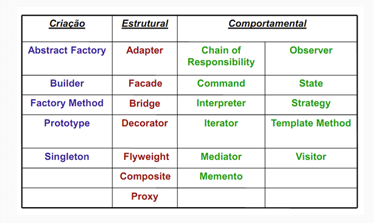

### História e Conceitos :

ECMAScript 6 - >ES6, ECMAScript 6 ou ES2015, é simplesmente a mais nova versão do JavaScript.

TC39 -> Na verdade, o nome mais usado atualmente é ES2015. A ideia do comitê responsável (conhecido como TC39) pelas atualizações da linguagem é justamente fazer um release anual. Então nesse ano teremos o ES2016 (ou ES7). E assim sucessivamente. ES6 é o mais conhecido pela comunidade. Stage 0: strawman, Stage 1: proposal, Stage 2: draft, Stage 3: candidate e Stage 4: finished

O TC39 focou em alguns objetivos no desenvolvimento do ES6: Ser uma linguagem melhor para construir aplicações complexas Resolver problemas antigos do JavaScript Facilidade no desenvolvimento de libraries

babel -> a grande maioria dos browsers ainda não dão suporte ao ES6, então o que podemos fazer para contornar essa limitação? Podemos usar um transpiler como o Babel. O Babel transforma o seu código de ES6 para ES5 (versão que a maioria dos browsers dá suporte hoje).

javascript é interpretada -> código é executado de cima pra baixo sem compilar para linguagem de máquina

Tipagem é fraca ( não há verificação em todas as operações , ex: você pode somar inteiros com strings ) e dinâmica ( a partir da atribuição o tipo saberá o tipo da variável - inferência de tipo) , você pode atribuir a mesma variável a diferentes tipos

```Javascript
var x; // Now x is undefined 
x = 5;// Now x is a Number 
x = "John"; // Now x is a String
```

Typescript -> É um superset da linguagem, adiciona tipos e funcionalidades que o javascript nao tem por padrão (ex: enum)

Flow -> Semelhante ao typescript em relação a checagem de tipos , mas não é um superset da linguagem.

Funções de primeira classe : função pode ser atribuita a estrutura de dados e pode ser passada por argumentos ou retornadas por outras funções [https://github.com/luizrosalba/Introducao_ao_ES6/blob/master/1-funcoes.js](https://github.com/luizrosalba/Introducao_ao_ES6/blob/master/1-funcoes.js)

Closure -> Escopo léxico -> capacidade da funcao de lembrar o ambiente em que foi criada.

obs: console.log( `1- 0 é : " ${exemplo}<span> </span>`); -> mistura variável e texto na impressão

[https://github.com/luizrosalba/Introducao_ao_ES6/blob/master/closure.js](https://github.com/luizrosalba/Introducao_ao_ES6/blob/master/closure.js)

Javascript algorithms and data Structues certification

Cursando o Javascript algorithms and data Structues certification

## Aulas

### Aula 1.2 Currying, Hoisting, Imutabilidade, Tipos e Variáveis

curring -> Técnica de transformar uma função com n parâmetros em apenas uma função que recebe um parâmetro e para cada parâmetro vamos retornando uma nova função

https://github.com/luizrosalba/Introducao_ao_ES6/blob/master/curring.js

hoisting -> Foi um dos motivos para ter o escopo de bloco com let e const, ficou mais amigável , para nao permitir a utilização de uma variavel antes de ser definida.

hosting de variáveis -> eleva a criação da variavel e não sua atribuição hosting de funções -> eleva a função até a assinatura

https://github.com/luizrosalba/Introducao_ao_ES6/blob/master/hostingdevariaveis.js

https://github.com/luizrosalba/Introducao_ao_ES6/blob/master/hostingdefuncao.js

Nos exemplos anteriores vemos que a função funciona ok mas a variável dá undefined pois hosting declara a funcao mesmo antes de sua utilizacao e nao atribui valor a variável , apenas a cria

Imutabilidade -> Em linguagens funcionais o tipo de dado da variável nunca muda. O ES6 permite adicionar parametros a objetos. Evita alterações indesejadas nos atributos

https://github.com/luizrosalba/Introducao_ao_ES6/blob/master/imutabilidade.js

https://github.com/luizrosalba/Introducao_ao_ES6/blob/master/imutabilidade2.js

O exemplo acima a lista de alunos nao sofre mudancas

Tipos e Variáveis -> var , let , const

var-> pioneiro no js , escopo global let e const -> escopo de bloco

obs : Se você atribui um tipo a uma variável primitiva const , ele nao permite que você altere este valor. Agora se vc criar um objeto const ai ele permite que você altere as propriedades desse objeto.

```Javascript
ex: const name = 'A'; name = 'B'; /// nao consigo alterar

const user = { name : 'A'; }; user.name = 'B' ; /// consigo alterar

user = { name : 'B'; }; /// nao dá certo
```

Tipos e variáveis
Obs : Retorna typeof retorna o tipo da variável

lenght,replace(procura e muda) ,slice (fatia da string), substr
tipo : https://www.w3schools.com/js/js_strings.asp métodos : https://www.w3schools.com/js/js_string_methods.asp Conversão : parseFloat (com casas decimais) parseInt (sem casas decimais)

number = numero (int, float,NAN etc... )
tipo : https://www.w3schools.com/js/js_numbers.asp métodos : https://www.w3schools.com/js/js_number_methods.asp

boolean = true ou false ,
null = nulo -> null sempre é object.(typeof null retorna object)
undefined= existe mas nao foi inicializada. Undefined é um tipo e não um object. (typeof undefined retorna undefined)

```Javascript
object =
ex: let user = { name:'Guilherme', endereco:'ABC' };

user.name = 'outro nome' ;/// funciona user['name'] = 'outro nome'; // funciona

const prop ='name'; user[prop] = 'outro nome' ; ///acessa o objeto com valor dinâmico name

function getProp(prop){ /// tb funciona return user[prop]; }

user.lastName = 'Cabrini'; ///cria uma nova propriedade

funções de object:
let user = { name:'Guilherme', endereco:'ABC' };

Object.keys(user); -> retorna as chaves name e endereço

Object.values(user); -> retorna aos valores armazenados nas chaves name e endereço

Object.entries(user); -> retorna um array de arrays, os arrays filhos tem a chave e o valor;

Object.assign(user,{fullName: 'Luiz Sousa' }); -> pega o objeto e concatena fullname ao objeto /// nao eh muito recomendado, nao altera o array principal, para mergear arrays é mais recomendado

novoObjUsrComAge=Object.assign({},user,{age :26}); /// novo array mergeando user com age , nao muda user

Object.freeze(user); /// nao permite qualquer alterações (criar, alterar , etc )no user

Object.seal(user); /// nao permite crie ou deletar keys, mas pode trocar o valor de uma key

delete user.name ; /// deleta a key name
```

function = também é um objeto , mas que pode ser chamado array = um objeto que tem relação com os itens dele , relacionando cada item com o tipo atribuido

// symbol cria um tipo unico

Permite atributos privados dentro de objetos e classes, simulando um objeto do tipo enum. Não é enumerable (isso é vc nao consegue enumerar ela como uma chave dentro de um for)

ex da propriedade enumerable :

```Javascript
for (const key in user ){ if (user.hasOwnProperty(key)){ console.log(${key}) /// so mostra as chaves que nao sao symbols }

}

/// pode ser contornado pela função get.OwnPropertySymbols() /// ai o for consegue listar

ou também pode ser usado o método Reflect.ownKeys(user); /// o metodo reflect consegue forçar a listagem de symblos

ex1) const symbol1 = Symbol(); const symbol2 = Symbol();

symbol1 === symbol2 ; / / retorna falso , cada um tem um tipo unico

ex2) const symbol1 = Symbol('name'); const symbol2 = Symbol('name');

const user = { [symbol1]: 'ABC', [symbol2]: 'DEF', } /// vc nao consegue sobrescrever essa propriedade mesmo elas tendo o mesmo atributo (name), ele vai criar dois symbols com name
```

### Aula2.1 Tipos e variáveis

Obs : Retorna typeof retorna o tipo da variável

String = texto

lenght,replace(procura e muda) ,slice (fatia da string), substr

tipo :
https://www.w3schools.com/js/js_strings.asp
métodos :
https://www.w3schools.com/js/js_string_methods.asp
Conversão :
parseFloat (com casas decimais)
parseInt  (sem casas decimais)

number = numero (int, float,NAN etc... )

tipo :
https://www.w3schools.com/js/js_numbers.asp
métodos :
https://www.w3schools.com/js/js_number_methods.asp

Bolean = true ou false ##### null = nulo  -> null sempre é object.(typeof null retorna object)

### undefined= existe mas nao foi inicializada. Undefined é um tipo e não um object. (typeof undefined retorna undefined)

object =

ex:

```Javascript
let user = {
name:'Guilherme',
endereco:'ABC'
};

user.name = 'outro nome' ;/// funciona
user['name'] = 'outro nome'; // funciona

const prop ='name';
user[prop] = 'outro nome' ; ///acessa o objeto com valor dinâmico name

function getProp(prop){ /// tb funciona
return user[prop];
}

user.lastName = 'Cabrini'; ///cria uma nova propriedade
```

### funções de object:

```Javascript
let user = {
name:'Guilherme',
endereco:'ABC'
};

Object.keys(user); -> retorna as chaves name e endereço

Object.values(user); -> retorna aos valores armazenados nas chaves name e endereço

Object.entries(user); -> retorna um array de arrays, os arrays filhos tem a chave e o valor;

Object.assign(user,{fullName: 'Luiz Sousa' }); -> pega o objeto e concatena fullname ao objeto  /// nao eh muito recomendado, nao altera o array principal, para mergear arrays é mais recomendado

novoObjUsrComAge=Object.assign({},user,{age :26}); /// novo array mergeando user com age , nao muda user

Object.freeze(user); /// nao permite qualquer alterações (criar, alterar , etc )no user

Object.seal(user); /// nao permite crie ou deletar keys, mas pode trocar o valor de uma key

delete user.name ; /// deleta a key name

function = também é um objeto , mas que pode ser chamado
array = um objeto que tem relação com os itens dele , relacionando cada item com o tipo atribuido
```

### symbol cria um tipo unico

Permite atributos privados dentro de objetos e classes, simulando um objeto do tipo enum.  Não é enumerable (isso é vc nao consegue enumerar ela como uma chave dentro de um for)

ex da propriedade enumerable :

```Javascript
for (const key in user ){
if (user.hasOwnProperty(key)){
console.log(${key}) /// so mostra as chaves que nao sao symbols
}

}

/// pode ser contornado pela função get.OwnPropertySymbols() /// ai o for consegue listar

ou também pode ser usado o método
Reflect.ownKeys(user); /// o metodo reflect consegue forçar a listagem de symblos

ex1)
const symbol1 = Symbol();
const symbol2 = Symbol();

symbol1 === symbol2 ; / / retorna falso , cada um tem um tipo unico

ex2)
const symbol1 = Symbol('name');
const symbol2 = Symbol('name');

const user = {
[symbol1]: 'ABC',
[symbol2]: 'DEF',
}
/// vc nao consegue sobrescrever essa propriedade mesmo elas tendo o mesmo atributo (name), ele vai criar dois symbols com name
```

### Aula 2.2 Functions_Operators

#### ES 6 Arrow function

// ES5
var x = function(x, y) {
return x * y;
}

// ES6
const x = (x, y) => x * y;   /// se colocar mais de uma expressão tem que colocar o return

const x = (x, y) => { return x * y };  /// boa pratica colocar return sempre

Funções também são objetos e podem receber propriedades !

const Fn = () => 'Code here' ;

Fn.prop = 'Posso criar propriedades';
console.log (Fn.prop);

const fn1 =>  fnparam => allowed => { /// uma funcao que recebe um parametro e e se permitido executa outra funcao

```Javascript
if (allowed) {
fnParam();
}

}
```

/// A funcao abaixo pode ser reescrita como

```Javascript
function controlFnExec (fnParam)
{
return function(allowed) {
if (alloed) {
  fnParam();
  }
  }
}

/// a funcao abaixo é a reescrita da funcao acima usando arrow function

function controlFnExec (fnParam)
{
return function(allowed) {
if (allowed) {
  fnParam();
  }
  }
}

const controlFnExec => fnParam => allowed => {  /// mais enxuto , mais limpo
if (allowed) {
fnParam();
}
}
```

#### Principal diferença entre funcao arrow e function normal

this referencia o contexto em que foi criada
em funcoes que são arrow function o this aponta sempre para o contexto no qual ele foi criado (ex fora da funcao )
em funcoes que não são arrow function o this aponta sempre para o contexto no qual o this é executado (ex. dentro da função)

#### Array

Também é um objeto . Importante ! Filter map e reduce (sempre criam um novo objeto a partir do objeto original)
Filter -> filtra  ( ex: só valores acima de 10)
Map -> cria um novo array realizando uma funcao em cada elemento (ex mult todo mundo por 2 )
Reduce -> aplica uma funcao a todos os elementos da esquerda para direita (ex: soma todos os valores)

Definicao
https://www.w3schools.com/js/js_arrays.asp
métodos
https://www.w3schools.com/js/js_array_methods.asp
Sort
https://www.w3schools.com/js/js_array_sort.asp
iteração
https://www.w3schools.com/js/js_array_iteration.asp

#### Operadores:

JS possui operadores unários, binario  e ternário

```Javascript
  a = ++2 unário /// a jah recebe valor incrementado
  b = 2++ unário /// b recebe o valor atual 2

  a+b binário
  a%b binário resto
  && and
  || or
  !true retorna false
  !false retorna true
  !"Gato" retorna false /// string preenchida com valor é true
  " " true
  1
  "" false
  0

  !!
```

ternário

```Javascript
  condicao ? valor1:valor2
  true ? 'foo' : 'bar' /// retorna 'foo'
  false ? 'foo' : 'bar' /// retorna 'bar'

  +true  soma 1
  +false soma zero ( funciona como se fosse um parse int)
  +"3" retorna 3

  2**3 exponenciacao

  == igualdade (true)
  === igualdade e do mesmo tipo (true)
  !== operandos iguals mas nao sao do mesmo tipo (true)
```

#### Operador Spread:

Introduzido no ES6

Itera cada item e passa um parametro

```Javascript
var parter = ['ombro','joelho'] ;
var musica = ['cabeca',...partes,'e,'pes'] ;
```

concatena dois arrays criando um novo array , no lugar de partes insere ombro joelho

```Javascript
function fn (x,y,z) {}
var args = [0,1,2];
fn(...args) ;  /// x = 0 , y = 1 , z = 2
```

#### Operador delete e typeof são unários

#### Operador in

```Javascript
var musica = new Array ["A", "B", "C"] ;

0  in musica /// true
"A" in musica; /// retorna false vc deve especificar o num do indice e nao o valor
"A" in musica[0]; /// retorna true
"lenght" in musica /// true pois length é uma propriedade de todo string
```

#### Operador binario instanceof

Verifica se um objeto é uma instancia

```Javascript
var dia = new Date (2018,12,17);
if (dia instance of Date) // true
```

#### for in e for of

```Javascript
for in -> retorna os valores de cada objeto 

for of ->  retorna o indice de cada objeto
```

Exemplo for in

```JS
 let str = "The quick brown fox jumped over the lazy dog";
 const arr = str.split(" ");
  for (let pal of arr)
  {
    console.log(pal);  
  }
```

saida retorna o indice de cada objeto
0
1
2
3
4
5
6
7
8
Exemplo for of

```JS
 let str = "The quick brown fox jumped over the lazy dog";
 const arr = str.split(" ");
  for (let pal of arr)
  {
    console.log(pal);  
  }
```

saida retorna os valores de cada objeto
The
quick
brown
fox
jumped
over
the
lazy
dog

#### continue

```Javascript
if (element %2 ===0 )
continue
```

pula a execução para os pares

### Aula 3.1 Orientação à objeto

At its core, software development solves a problem or achieves a result with computation. The software development process first defines a problem, then presents a solution. Object oriented programming is one of several major approaches to the software development process.

As its name implies, object oriented programming organizes code into object definitions. These are sometimes called classes, and they group together data with related behavior. The data is an object's attributes, and the behavior (or functions) are methods.

The object structure makes it flexible within a program. Objects can transfer information by calling and passing data to another object's methods. Also, new classes can receive, or inherit, all the features from a base or parent class. This helps to reduce repeated code.

Your choice of programming approach depends on a few factors. These include the type of problem, as well as how you want to structure your data and algorithms. This section covers object oriented programming principles in JavaScript.

#### Objetos e propriedades

Think about things people see every day, like cars, shops, and birds. These are all objects: tangible things people can observe and interact with.

What are some qualities of these objects? A car has wheels. Shops sell items. Birds have wings.

These qualities, or properties, define what makes up an object. Note that similar objects share the same properties, but may have different values for those properties. For example, all cars have wheels, but not all cars have the same number of wheels.

Objects in JavaScript are used to model real-world objects, giving them properties and behavior just like their real-world counterparts. Here's an example using these concepts to create a duck object:

```Js
let duck = {
  name: "Aflac",
  numLegs: 2
};
console.log(duck.name);
```

// This prints "Aflac" to the console
Dot notation is used on the object name, duck, followed by the name of the property, name, to access the value of "Aflac".

#### Métodos

Objects can have a special type of property, called a method.

Methods are properties that are functions. This adds different behavior to an object. Here is the duck example with a method:

```Js
let duck = {
  name: "Aflac",
  numLegs: 2,
  sayName: function() {return "The name of this duck is " + duck.name + ".";}
};
duck.sayName();
// Returns "The name of this duck is Aflac.
```

#### Sobre This

sayName: function() {return "The name of this duck is " + duck.name + ".";}

While this is a valid way to access the object's property, there is a pitfall here. If the variable name changes, any code referencing the original name would need to be updated as well. In a short object definition, it isn't a problem, but if an object has many references to its properties there is a greater chance for error.
A way to avoid these issues is with the this keyword:

```Js
let duck = {
  name: "Aflac",
  numLegs: 2,
  sayName: function() {return "The name of this duck is " + this.name + ".";}
};
```

this refers to the object that the method is associated with: duck. If the object's name is changed to mallard, it is not necessary to find all the references to duck in the code. It makes the code reusable and easier to read.

#### Construtores

Constructors are functions that create new objects. They define properties and behaviors that will belong to the new object. Think of them as a blueprint for the creation of new objects.
Here is an example of a constructor:

```Js
function Bird() {
  this.name = "Albert";
  this.color = "blue";
  this.numLegs = 2;
}
```

- Constructors are defined with a capitalized name to distinguish them from other functions that are not constructors.
- Constructors use the keyword this to set properties of the object they will create. Inside the constructor, this refers to the new object it will create.
- Constructors define properties and behaviors instead of returning a value as other functions might.

#### Operador new

```Js
let blueBird = new Bird();
```

Notice that the new operator is used when calling a constructor. This tells JavaScript to create a new instance of Bird called blueBird. Without the new operator, this inside the constructor would not point to the newly created object, giving unexpected results. Now blueBird has all the properties defined inside the Bird constructor:

```Js
blueBird.name; // => Albert
blueBird.color; // => blue
blueBird.numLegs; // => 2
```

Just like any other object, its properties can be accessed and modified:

blueBird.name = 'Elvira';
blueBird.name; // => Elvira

#### Extend Constructors to Receive Arguments

Suppose you were writing a program to keep track of hundreds or even thousands of different birds in an aviary. It would take a lot of time to create all the birds, then change the properties to different values for every one. To more easily create different Bird objects, you can design your Bird constructor to accept parameters:

```Js
function Bird(name, color) {
  this.name = name;
  this.color = color;
  this.numLegs = 2;
}
```

Then pass in the values as arguments to define each unique bird into the Bird constructor: let cardinal = new Bird("Bruce", "red"); This gives a new instance of Bird with name and color properties set to Bruce and red, respectively. The numLegs property is still set to 2. The cardinal has these properties:

```Js
cardinal.name // => Bruce
cardinal.color // => red
cardinal.numLegs // => 2
```

The constructor is more flexible. It's now possible to define the properties for each Bird at the time it is created, which is one way that JavaScript constructors are so useful. They group objects together based on shared characteristics and behavior and define a blueprint that automates their creation.

#### Verify an Object's Constructor with instanceof

instanceof allows you to compare an object to a constructor, returning true or false based on whether or not that object was created with the constructor. Here's an example:

```JS
let Bird = function(name, color) {
  this.name = name;
  this.color = color;
  this.numLegs = 2;
}

let crow = new Bird("Alexis", "black");

crow instanceof Bird; // => true
```

#### Understand Own Properties

```JS
function Bird(name) {
  this.name  = name;
  this.numLegs = 2;
}

let duck = new Bird("Donald");
let canary = new Bird("Tweety");

let ownProps = [];

for (let property in duck) {
  if(duck.hasOwnProperty(property)) {
    ownProps.push(property);
  }
}
console.log(ownProps); // prints [ "name", "numLegs" ]

```

#### Use Prototype Properties to Reduce Duplicate Code

Since numLegs will probably have the same value for all instances of Bird, you essentially have a duplicated variable numLegs inside each Bird instance.

This may not be an issue when there are only two instances, but imagine if there are millions of instances. That would be a lot of duplicated variables.

A better way is to use Bird’s prototype. Properties in the prototype are shared among ALL instances of Bird. Here's how to add numLegs to the Bird prototype:

```JS
Bird.prototype.numLegs = 2;
Now all instances of Bird have the numLegs property.

console.log(duck.numLegs);  // prints 2
console.log(canary.numLegs);  // prints 2
```

Since all instances automatically have the properties on the prototype, think of a prototype as a "recipe" for creating objects. Note that the prototype for duck and canary is part of the Bird constructor as Bird.prototype. Nearly every object in JavaScript has a prototype property which is part of the constructor function that created it.

#### Iterate Over All Properties

You have now seen two kinds of properties: own properties and prototype properties. Own properties are defined directly on the object instance itself. And prototype properties are defined on the prototype.

```JS
function Bird(name) {
  this.name = name;  //own property
}

Bird.prototype.numLegs = 2; // prototype property

let duck = new Bird("Donald");
```

Here is how you add duck's own properties to the array ownProps and prototype properties to the array prototypeProps:

```JS
let ownProps = [];
let prototypeProps = [];

for (let property in duck) {
  if(duck.hasOwnProperty(property)) {
    ownProps.push(property);
  } else {
    prototypeProps.push(property);
  }
}

console.log(ownProps); // prints ["name"]
console.log(prototypeProps); // prints ["numLegs"]
```

#### Understand the Constructor Property

There is a special constructor property located on the object instances duck and beagle that were created in the previous challenges:

```JS
let duck = new Bird();
let beagle = new Dog();

console.log(duck.constructor === Bird);  //prints true
console.log(beagle.constructor === Dog);  //prints true
```

Note that the constructor property is a reference to the constructor function that created the instance. The advantage of the constructor property is that it's possible to check for this property to find out what kind of object it is. Here's an example of how this could be used:

```JS
function joinBirdFraternity(candidate) {
  if (candidate.constructor === Bird) {
    return true;
  } else {
    return false;
  }
}
```

Note
Since the constructor property can be overwritten (which will be covered in the next two challenges) it’s generally better to use the instanceof method to check the type of an object.

#### Change the Prototype to a New Object

Up until now you have been adding properties to the prototype individually:

```JS
Bird.prototype.numLegs = 2;
This becomes tedious after more than a few properties.

Bird.prototype.eat = function() {
  console.log("nom nom nom");
}

Bird.prototype.describe = function() {
  console.log("My name is " + this.name);
}
```

A more efficient way is to set the prototype to a new object that already contains the properties. This way, the properties are added all at once:

```JS
Bird.prototype = {
  numLegs: 2, 
  eat: function() {
    console.log("nom nom nom");
  },
  describe: function() {
    console.log("My name is " + this.name);
  }
};
```

#### Remember to Set the Constructor Property when Changing the Prototype

There is one crucial side effect of manually setting the prototype to a new object. It erases the constructor property! This property can be used to check which constructor function created the instance, but since the property has been overwritten, it now gives false results:

```JS
duck.constructor === Bird; // false -- Oops
duck.constructor === Object; // true, all objects inherit from Object.prototype
duck instanceof Bird; // true, still works
```

To fix this, whenever a prototype is manually set to a new object, remember to define the constructor property:

```JS
Bird.prototype = {
  constructor: Bird, // define the constructor property
  numLegs: 2,
  eat: function() {
    console.log("nom nom nom");
  },
  describe: function() {
    console.log("My name is " + this.name); 
  }
};
```

#### Understand Where an Object’s Prototype Comes From

Just like people inherit genes from their parents, an object inherits its prototype directly from the constructor function that created it. For example, here the Bird constructor creates the duck object:

```Js
function Bird(name) {
  this.name = name;
}

let duck = new Bird("Donald");
```

duck inherits its prototype from the Bird constructor function. You can show this relationship with the isPrototypeOf method:

```Js
Bird.prototype.isPrototypeOf(duck);
// returns true
```

#### Understand the Prototype Chain

All objects in JavaScript (with a few exceptions) have a prototype. Also, an object’s prototype itself is an object.

```JS
function Bird(name) {
  this.name = name;
}

typeof Bird.prototype; // yields 'object'
```

Because a prototype is an object, a prototype can have its own prototype! In this case, the prototype of Bird.prototype is Object.prototype:

```Js
Object.prototype.isPrototypeOf(Bird.prototype); // returns true
```

How is this useful? You may recall the hasOwnProperty method from a previous challenge:

```Js
let duck = new Bird("Donald");
duck.hasOwnProperty("name"); // yields true
```

The hasOwnProperty method is defined in Object.prototype, which can be accessed by Bird.prototype, which can then be accessed by duck. This is an example of the prototype chain. In this prototype chain, Bird is the supertype for duck, while duck is the subtype. Object is a supertype for both Bird and duck. Object is a supertype for all objects in JavaScript. Therefore, any object can use the hasOwnProperty method.

#### Use Inheritance So You Don't Repeat Yourself

There's a principle in programming called Don't Repeat Yourself (DRY). The reason repeated code is a problem is because any change requires fixing code in multiple places. This usually means more work for programmers and more room for errors.

Notice in the example below that the describe method is shared by Bird and Dog:

```Js
Bird.prototype = {
  constructor: Bird,
  describe: function() {
    console.log("My name is " + this.name);
  }
};

Dog.prototype = {
  constructor: Dog,
  describe: function() {
    console.log("My name is " + this.name);
  }
};
```

The describe method is repeated in two places. The code can be edited to follow the DRY principle by creating a supertype (or parent) called Animal:

```Js
function Animal() { };

Animal.prototype = {
  constructor: Animal, 
  describe: function() {
    console.log("My name is " + this.name);
  }
};
```

Since Animal includes the describe method, you can remove it from Bird and Dog:

```Js
Bird.prototype = {
  constructor: Bird
};

Dog.prototype = {
  constructor: Dog
};
```

#### Inherit Behaviors from a Supertype

In the previous challenge, you created a supertype called Animal that defined behaviors shared by all animals:

```Js
function Animal() { }
Animal.prototype.eat = function() {
  console.log("nom nom nom");
};
```

This and the next challenge will cover how to reuse Animal's methods inside Bird and Dog without defining them again. It uses a technique called inheritance. This challenge covers the first step: make an instance of the supertype (or parent). You already know one way to create an instance of Animal using the new operator:

```Js
let animal = new Animal();
```

There are some disadvantages when using this syntax for inheritance, which are too complex for the scope of this challenge. Instead, here's an alternative approach without those disadvantages:

```Js
let animal = Object.create(Animal.prototype);
```

Object.create(obj) creates a new object, and sets obj as the new object's prototype. Recall that the prototype is like the "recipe" for creating an object. By setting the prototype of animal to be Animal's prototype, you are effectively giving the animal instance the same "recipe" as any other instance of Animal.

```JS
animal.eat(); // prints "nom nom nom"
animal instanceof Animal; // => true
```

#### Set the Child's Prototype to an Instance of the Parent

In the previous challenge you saw the first step for inheriting behavior from the supertype (or parent) Animal: making a new instance of Animal.

This challenge covers the next step: set the prototype of the subtype (or child)—in this case, Bird—to be an instance of Animal.
Passaro agora é subtipo de animal

```JS
Bird.prototype = Object.create(Animal.prototype);
```

Remember that the prototype is like the "recipe" for creating an object. In a way, the recipe for Bird now includes all the key "ingredients" from Animal.

```JS
let duck = new Bird("Donald");
duck.eat(); // prints "nom nom nom"
```

duck inherits all of Animal's properties, including the eat method.

#### Reset an Inherited Constructor Property

When an object inherits its prototype from another object, it also inherits the supertype's constructor property.

Here's an example:

```JS
function Bird() { }
Bird.prototype = Object.create(Animal.prototype);
let duck = new Bird();
duck.constructor // function Animal(){...}
```

But duck and all instances of Bird should show that they were constructed by Bird and not Animal. To do so, you can manually set Bird's constructor property to the Bird object:

```JS
Bird.prototype.constructor = Bird; //// pode ser até depois da atribuição let duck = new Bird(); irá corrigir corretamente o  construtor 
duck.constructor // function Bird(){...}
```

#### Add Methods After Inheritance

A constructor function that inherits its prototype object from a supertype constructor function can still have its own methods in addition to inherited methods.

For example, Bird is a constructor that inherits its prototype from Animal:

```Js
function Animal() { }
Animal.prototype.eat = function() {
  console.log("nom nom nom");
};
function Bird() { }
Bird.prototype = Object.create(Animal.prototype);
Bird.prototype.constructor = Bird;

```

In addition to what is inherited from Animal, you want to add behavior that is unique to Bird objects. Here, Bird will get a fly() function.

Functions are added to Bird's prototype the same way as any constructor function:

```Js
Bird.prototype.fly = function() {
  console.log("I'm flying!");
};
```

Now instances of Bird will have both eat() and fly() methods:

```Js
let duck = new Bird();
duck.eat(); // prints "nom nom nom"
duck.fly(); // prints "I'm flying!"
```

#### Override Inherited Methods

In previous lessons, you learned that an object can inherit its behavior (methods) from another object by referencing its prototype object:

```JS
ChildObject.prototype = Object.create(ParentObject.prototype);
```

Then the ChildObject received its own methods by chaining them onto its prototype:

```JS
ChildObject.prototype.methodName = function() {...};
```

It's possible to override an inherited method. It's done the same way - by adding a method to ChildObject.prototype using the same method name as the one to override. Here's an example of Bird overriding the eat() method inherited from Animal:

```JS
function Animal() { }
Animal.prototype.eat = function() {
  return "nom nom nom";
};
function Bird() { }

// Inherit all methods from Animal
Bird.prototype = Object.create(Animal.prototype);

// Bird.eat() overrides Animal.eat()
Bird.prototype.eat = function() {
  return "peck peck peck";
};
```

If you have an instance let duck = new Bird(); and you call duck.eat(), this is how JavaScript looks for the method on duck’s prototype chain:

duck => Is eat() defined here? No.
Bird => Is eat() defined here? => Yes. Execute it and stop searching.
Animal => eat() is also defined, but JavaScript stopped searching before reaching this level.
Object => JavaScript stopped searching before reaching this level.

#### Use a Mixin to Add Common Behavior Between Unrelated Objects

As you have seen, behavior is shared through inheritance. However, there are cases when inheritance is not the best solution. Inheritance does not work well for unrelated objects like Bird and Airplane. They can both fly, but a Bird is not a type of Airplane and vice versa.

For unrelated objects, it's better to use mixins. A mixin allows other objects to use a collection of functions.

```JS
let flyMixin = function(obj) {
  obj.fly = function() {
    console.log("Flying, wooosh!");
  }
};
The flyMixin takes any object and gives it the fly method.

let bird = {
  name: "Donald",
  numLegs: 2
};

let plane = {
  model: "777",
  numPassengers: 524
};

flyMixin(bird);
flyMixin(plane);
```

Here bird and plane are passed into flyMixin, which then assigns the fly function to each object. Now bird and plane can both fly:

```JS
bird.fly(); // prints "Flying, wooosh!"
plane.fly(); // prints "Flying, wooosh!"
```

Note how the mixin allows for the same fly method to be reused by unrelated objects bird and plane.

#### Use Closure to Protect Properties Within an Object from Being Modified Externally

In the previous challenge, bird had a public property name. It is considered public because it can be accessed and changed outside of bird's definition.

bird.name = "Duffy";

Therefore, any part of your code can easily change the name of bird to any value. Think about things like passwords and bank accounts being easily changeable by any part of your codebase. That could cause a lot of issues.

The simplest way to make this public property private is by creating a variable within the constructor function. This changes the scope of that variable to be within the constructor function versus available globally. This way, the variable can only be accessed and changed by methods also within the constructor function.

```JS
function Bird() {
  let hatchedEgg = 10; // private variable

  /* publicly available method that a bird object can use */
  this.getHatchedEggCount = function() { 
    return hatchedEgg;
  };
}
let ducky = new Bird();
ducky.getHatchedEggCount(); // returns 10
```

Here getHatchedEggCount is a privileged method, because it has access to the private variable hatchedEgg. This is possible because hatchedEgg is declared in the same context as getHatchedEggCount. In JavaScript, a function always has access to the context in which it was created. This is called closure.

#### Understand the Immediately Invoked Function Expression (IIFE)

A common pattern in JavaScript is to execute a function as soon as it is declared:
/// note que a funcao nem precisa de nome

```JS
(function () {
  console.log("Chirp, chirp!");
})(); // this is an anonymous function expression that executes right away
// Outputs "Chirp, chirp!" immediately
```

Note that the function has no name and is not stored in a variable. The two parentheses () at the end of the function expression cause it to be immediately executed or invoked. This pattern is known as an immediately invoked function expression or IIFE.

#### Outro exemplo de IIFE

Chamando a funcao add com dois parêntesis

```JS
function add(x){
  return function(y){
    return x + y;
  };
}
var addTwo = add(2);
addTwo(4) === 6; // true
add(3)(4) === 7; // true
```

#### Use an IIFE to Create a Module

An immediately invoked function expression (IIFE) is often used to group related functionality into a single object or module. For example, an earlier challenge defined two mixins:

```JS
function glideMixin(obj) {
  obj.glide = function() {
    console.log("Gliding on the water");
  };
}
function flyMixin(obj) {
  obj.fly = function() {
    console.log("Flying, wooosh!");
  };
}
```

We can group these mixins into a module as follows:

```JS
let motionModule = (function () {
return {
  glideMixin: function(obj) {
    obj.glide = function() {
      console.log("Gliding on the water");
    };
  },
  flyMixin: function(obj) {
    obj.fly = function() {
      console.log("Flying, wooosh!");
    };
  }
}
})(); // The two parentheses cause the function to be immediately invoked

```

Note that you have an immediately invoked function expression (IIFE) that returns an object motionModule. This returned object contains all of the mixin behaviors as properties of the object. The advantage of the module pattern is that all of the motion behaviors can be packaged into a single object that can then be used by other parts of your code. Here is an example using it:

motionModule.glideMixin(duck);
duck.glide();

#### Herança

Baseada em protótipos
prototype : variável que armazena definições do projeto.
Sempre que criamos uma variável em javascrypt ele cria uma variavel __proto__ que aponta para o tipo da variável que criamos (construtor)

Toda função construtora tem um prototype

```Javascript
myText.__proto__.split é o mesmo que my myText.split ou ainda String.prototype.split

myText.__proto__.split === String.prototype.split /// true

myText.constructor === String ///true

__proto __ -> prototype -> constructor

new Foo(); /// um novo objeto é criado a partir da função construtora Foo herdando Foo.prototype
```

se a função construtora tem um retorno será respeitado. Senão será retornado o objeto criado em 1

```Javascript
function Pessoa(name){
this.name = name;
  return {
    name:'teste'
  };
}

const p = new Pessoa ('Guilherme' )
console.log (p);  /// retrona teste

function Pessoa(name){
this.name = name;
}
const p = new Pessoa ('Guilherme' )
console.log (p);  /// retorna Guilherme
```

obs  : função call passa um contexto para esta função ser executada

```Javascript
ex 2: O problema dessa abordagem é que toda vez que realizarmos new Cachorro() latir e movimentar serão criadas
'use scrict';
function Animal (qtdePatas){
  this.qtdePatas = qtdePatas;
  this.movimentar = function() {
  }
}

function Cachorro (morde){
Animal.call(this,4); /// a funcao animal vai ser executada quando Cachorro for instanciada
this.morde = morde;
this.latir = function() {
    console.log ('Au !');
  }
}
//
const pug = new Cachorro (false);
//const pitbull  = new Cachorro (true);

console.log(pug);
```

ex 3  : Nesta abordagem usamos o prototype que define o objeto cachorro tera qt deparas e movimentar por padrao
nao serão criadas as funcoes movimentar e latir , se new cachorro já foi dado e um novo objeto for criado , o cachorro terá esta nova propriedade

```Javascript
'use scrict';

function Animal (){}
Animal.prototype.qtdePatas =0;
Animal.prototype.movimentar = function(){};

function Cachorro (morde){
this.qtdePatas = 4;
this.morde = morde;
}

Cachorro.prototype = Object.create(Animal);
Cachorro.prototype.latir = function(){
console.log ('Au!');
}

//
const pug = new Cachorro (false);
//const pitbull  = new Cachorro (true);
console.log(pug);
```

Cuidado! com prototype vc pode trocar a implementação até mesmo de um tipo nativo , vc pode mudar
a programação do String.split por exemplo
ex: String.prototype.split = function (){ console.log ('Deu ruim')} ;

#### Classes

Criado no Es6 como uma simplificação de protótipos , uma supersintaxe de funções , por baixo dos panos é criado um prototype

```Javascript
class Animal {
constructor(qtdePatas) {
  this.qtdePatas =4 ;
  }
}

class Cachorro extends Animal {
constructor(morde) {
  super(4);
  this.morde = morde;
  }
 }
const pug = new Cachorro (false);
console.log(pug);
```

### JavaScript Classes

A class is a type of function, but instead of using the keyword function to initiate it, we use the keyword class, and the properties are assigned inside a constructor() method:

Example
Create a Car class, and then create an object called "mycar" based on the Car class:

```Javascript
class Car {  // Create a class
  constructor(brand) {  // Class constructor
    this.carname = brand;  // Class body/properties
  }
}
mycar = new Car("Ford");  // Create an object of Car class
```

#### Class Keywords

Keyword	Description

- extends	Extends a class (inherit)
- static	Defines a static method for a class
- super	Refers to the parent class

#### Modificadores de Acesso

Js nao tem
Atualmente v 12 do node , mas ainda nao tem suporte nos browsers , controla o que é privado e publico nos browsers usa funções get e set para recuperar os atributos
sintaxe:

- hashtag_nomevar -> torna a variável privada

#### Encapsulamento

Oculta detalhes do funcionamento interno

pode-se usar metodos set e get (v12 do node) para setar e obter o valor de um atributo

#### Static

permite que acesse métodos e atributos sem instanciar uma classe

ex1: com funcoes , implementação de static do JS

```Javascript
'use strict';

function Person() {}

Person.walk = function () {
  console.log('walking');
}
console.log(Person.walk());

ex2: com classes com ES6 temos a palavra chave static pode ser chamada sem instanciar

'use strict';
function Person() {}
static walk()  {
  console.log('walking');
}

console.log(Person.walk());
```

### Programação Funcional

Functional programming is a style of programming where solutions are simple, isolated functions, without any side effects outside of the function scope.

INPUT -> PROCESS -> OUTPUT

Functional programming is about:

1) Isolated functions - there is no dependence on the state of the program, which includes global variables that are subject to change
2) Pure functions - the same input always gives the same output
3) Functions with limited side effects - any changes, or mutations, to the state of the program outside the function are carefully controlled

#### Understand Functional Programming Terminology

The FCC Team had a mood swing and now wants two types of tea: green tea and black tea. General Fact: Client mood swings are pretty common.

With that information, we'll need to revisit the getTea function from last challenge to handle various tea requests. We can modify getTea to accept a function as a parameter to be able to change the type of tea it prepares. This makes getTea more flexible, and gives the programmer more control when client requests change.
But first, let's cover some functional terminology:

Callbacks are the functions that are slipped or passed into another function to decide the invocation of that function. You may have seen them passed to other methods, for example in filter,
the callback function tells JavaScript the criteria for how to filter an array.

Functions that can be assigned to a variable, passed into another function, or returned from another function just like any other normal value, are called first class functions. In JavaScript, all functions are first class functions.

The functions that take a function as an argument, or return a function as a return value are called higher order functions.

When the functions are passed in to another function or returned from another function, then those functions which gets passed in or returned can be called a lambda.

```Js
// Function that returns a string representing a cup of green tea
const prepareGreenTea = () => 'greenTea';

// Function that returns a string representing a cup of black tea
const prepareBlackTea = () => 'blackTea';

/*
Given a function (representing the tea type) and number of cups needed, the
following function returns an array of strings (each representing a cup of
a specific type of tea).
*/
const getTea = (prepareTea, numOfCups) => {
  const teaCups = [];

  for(let cups = 1; cups <= numOfCups; cups += 1) {
    const teaCup = prepareTea();
    teaCups.push(teaCup);
  }
  return teaCups;
};

// Only change code below this line
const tea4GreenTeamFCC = getTea(prepareGreenTea,27);
const tea4BlackTeamFCC = getTea(prepareBlackTea,13);
// Only change code above this line

console.log(
  tea4GreenTeamFCC,
  tea4BlackTeamFCC
);
```

#### Understand the Hazards of Using Imperative Code

Functional programming is a good habit. It keeps your code easy to manage, and saves you from sneaky bugs. But before we get there, let's look at an imperative approach to programming to highlight where you may have issues.

In English (and many other languages), the imperative tense is used to give commands. Similarly, an imperative style in programming is one that gives the computer a set of statements to perform a task.

Often the statements change the state of the program, like updating global variables. A classic example is writing a for loop that gives exact directions to iterate over the indices of an array.

In contrast, functional programming is a form of declarative programming. You tell the computer what you want done by calling a method or function.

JavaScript offers many predefined methods that handle common tasks so you don't need to write out how the computer should perform them. For example, instead of using the for loop mentioned above, you could call the map method which handles the details of iterating over an array. This helps to avoid semantic errors, like the "Off By One Errors" that were covered in the Debugging section.

Consider the scenario: you are browsing the web in your browser, and want to track the tabs you have opened. Let's try to model this using some simple object-oriented code.

A Window object is made up of tabs, and you usually have more than one Window open. The titles of each open site in each Window object is held in an array. After working in the browser (opening new tabs, merging windows, and closing tabs), you want to print the tabs that are still open. Closed tabs are removed from the array and new tabs (for simplicity) get added to the end of it.

The code editor shows an implementation of this functionality with functions for tabOpen(), tabClose(), and join(). The array tabs is part of the Window object that stores the name of the open pages.

```JS
// tabs is an array of titles of each site open within the window
var Window = function(tabs) {
  this.tabs = tabs; // We keep a record of the array inside the object
};

// When you join two windows into one window
Window.prototype.join = function (otherWindow) {
  this.tabs = this.tabs.concat(otherWindow.tabs);
  return this;
};

// When you open a new tab at the end
Window.prototype.tabOpen = function (tab) {
  this.tabs.push('new tab'); // Let's open a new tab for now
  return this;
};

// When you close a tab
Window.prototype.tabClose = function (index) {

  //foi necessario trocar o splice ( mutavel ) por slice (imutavel )

  var tabsBeforeIndex = this.tabs.slice(0, index); // Get the tabs before the tab
  var tabsAfterIndex = this.tabs.slice(index + 1); // Get the tabs after the tab

  this.tabs = tabsBeforeIndex.concat(tabsAfterIndex); // Join them together

  // Only change code above this line

  return this;
 };

// Let's create three browser windows
var workWindow = new Window(['GMail', 'Inbox', 'Work mail', 'Docs', 'freeCodeCamp']); // Your mailbox, drive, and other work sites
var socialWindow = new Window(['FB', 'Gitter', 'Reddit', 'Twitter', 'Medium']); // Social sites
var videoWindow = new Window(['Netflix', 'YouTube', 'Vimeo', 'Vine']); // Entertainment sites

// Now perform the tab opening, closing, and other operations
var finalTabs = socialWindow
  .tabOpen() // Open a new tab for cat memes
  .join(videoWindow.tabClose(2)) // Close third tab in video window, and join
  .join(workWindow.tabClose(1).tabOpen());
console.log(finalTabs.tabs);
```

#### Avoid Mutations and Side Effects Using Functional Programming

If you haven't already figured it out, the issue in the previous challenge was with the splice call in the tabClose() function. Unfortunately, splice changes the original array it is called on, so the second call to it used a modified array, and gave unexpected results.

This is a small example of a much larger pattern - you call a function on a variable, array, or an object, and the function changes the variable or something in the object.

One of the core principles of functional programming is to not change things. Changes lead to bugs. It's easier to prevent bugs knowing that your functions don't change anything, including the function arguments or any global variable.

The previous example didn't have any complicated operations but the splice method changed the original array, and resulted in a bug.

Recall that in functional programming, changing or altering things is called mutation, and the outcome is called a side effect. A function, ideally, should be a pure function, meaning that it does not cause any side effects.

Let's try to master this discipline and not alter any variable or object in our code.

Fill in the code for the function incrementer so it returns the value of the global variable fixedValue increased by one.

```Js
// The global variable
var fixedValue = 4;

function incrementer () { /// funcao pura 
  // Only change code below this line
  return fixedValue+1;

  // Only change code above this line
}
```

#### Pass Arguments to Avoid External Dependence in a Function

The last challenge was a step closer to functional programming principles, but there is still something missing.

We didn't alter the global variable value, but the function incrementer would not work without the global variable fixedValue being there.

Another principle of functional programming is to always declare your dependencies explicitly. This means if a function depends on a variable or object being present, then pass that variable or object directly into the function as an argument.

There are several good consequences from this principle. The function is easier to test, you know exactly what input it takes, and it won't depend on anything else in your program.

This can give you more confidence when you alter, remove, or add new code. You would know what you can or cannot change and you can see where the potential traps are.

Finally, the function would always produce the same output for the same set of inputs, no matter what part of the code executes it.

Let's update the incrementer function to clearly declare its dependencies.

Write the incrementer function so it takes an argument, and then returns a result after increasing the value by one.

```Js
// The global variable
var fixedValue = 4;

// Only change code below this line
function incrementer (fixedValue) {
  return fixedValue+1;

  // Only change code above this line
}
```

#### Use the filter Method to Extract Data from an Array

Another useful array function is Array.prototype.filter(), or simply filter().

filter calls a function on each element of an array and returns a new array containing only the elements for which that function returns true. In other words, it filters the array, based on the function passed to it. Like map, it does this without needing to modify the original array.

The callback function accepts three arguments. The first argument is the current element being processed. The second is the index of that element and the third is the array upon which the filter method was called.

See below for an example using the filter method on the users array to return a new array containing only the users under the age of 30. For simplicity, the example only uses the first argument of the callback.

```JS
const users = [
  { name: 'John', age: 34 },
  { name: 'Amy', age: 20 },
  { name: 'camperCat', age: 10 }
];

const usersUnder30 = users.filter(user => user.age < 30);
console.log(usersUnder30); // [ { name: 'Amy', age: 20 }, { name: 'camperCat', age: 10 } ]
```

#### Refactor Global Variables Out of Functions

So far, we have seen two distinct principles for functional programming:

1) Don't alter a variable or object - create new variables and objects and return them if need be from a function.
2) Declare function arguments - any computation inside a function depends only on the arguments, and not on any global object or variable.

Adding one to a number is not very exciting, but we can apply these principles when working with arrays or more complex objects.

Rewrite the code so the global array bookList is not changed inside either function. The add function should add the given bookName to the end of the array passed to it and return a new array (list). The remove function should remove the given bookName from the array passed to it.

Note: Both functions should return an array, and any new parameters should be added before the bookName parameter.

```JS
// The global variable
var bookList = ["The Hound of the Baskervilles", "On The Electrodynamics of Moving Bodies", "Philosophiæ Naturalis Principia Mathematica", "Disquisitiones Arithmeticae"];

// Change code below this line
function add (bookList,bookName) {
  let bookList2 = [...bookList];
  bookList2.push(bookName);
  return bookList2;
  
  // Change code above this line
}

// Change code below this line
function remove (bookList,bookName) {
  var book_index = bookList.indexOf(bookName);
  let bookList2 = [...bookList];
  if (book_index >= 0) {

    bookList2.splice(book_index, 1);
    return bookList2;

    // Change code above this line
    }
}

var newBookList = add(bookList, 'A Brief History of Time');
var newerBookList = remove(bookList, 'On The Electrodynamics of Moving Bodies');
var newestBookList = remove(add(bookList, 'A Brief History of Time'), 'On The Electrodynamics of Moving Bodies');

console.log(bookList);

```

#### Use the map Method to Extract Data from an Array

So far we have learned to use pure functions to avoid side effects in a program. Also, we have seen the value in having a function only depend on its input arguments.

This is only the beginning. As its name suggests, functional programming is centered around a theory of functions.

It would make sense to be able to pass them as arguments to other functions, and return a function from another function. Functions are considered first class objects in JavaScript, which means they can be used like any other object. They can be saved in variables, stored in an object, or passed as function arguments.

Let's start with some simple array functions, which are methods on the array object prototype. In this exercise we are looking at Array.prototype.map(), or more simply map.

The map method iterates over each item in an array and returns a new array containing the results of calling the callback function on each element. It does this without mutating the original array.

When the callback is used, it is passed three arguments. The first argument is the current element being processed. The second is the index of that element and the third is the array upon which the map method was called.

See below for an example using the map method on the users array to return a new array containing only the names of the users as elements. For simplicity, the example only uses the first argument of the callback.

```Js
const users = [
  { name: 'John', age: 34 },
  { name: 'Amy', age: 20 },
  { name: 'camperCat', age: 10 }
];

const names = users.map(user => user.name);
console.log(names); // [ 'John', 'Amy', 'camperCat' ]

```

#### Implement map on a Prototype

As you have seen from applying Array.prototype.map(), or simply map() earlier, the map method returns an array of the same length as the one it was called on. It also doesn't alter the original array, as long as its callback function doesn't.

In other words, map is a pure function, and its output depends solely on its inputs. Plus, it takes another function as its argument.

It would teach us a lot about map to try to implement a version of it that behaves exactly like the Array.prototype.map() with a for loop or Array.prototype.forEach().

Note: A pure function is allowed to alter local variables defined within its scope, although, it's preferable to avoid that as well.

Write your own Array.prototype.myMap(), which should behave exactly like Array.prototype.map(). You may use a for loop or the forEach method.

```JS
// The global Array
var s = [23, 65, 98, 5];

Array.prototype.myMap = function(callback) {
  var newArray = [];

  // Add your code below this line
  for (let i = 0; i < this.length; i++) {
    newArray.push(callback(this[i]));  /// this se refere ao objeto que chama a funcao (s)
  }
  // Add your code above this line

  return newArray;
};

var new_s = s.myMap(function(item) {
  return item * 2;
});
```

#### Implement the filter Method on a Prototype

It would teach us a lot about the filter method if we try to implement a version of it that behaves exactly like Array.prototype.filter(). It can use either a for loop or Array.prototype.forEach().

Note: A pure function is allowed to alter local variables defined within its scope, although, it's preferable to avoid that as well.

Write your own Array.prototype.myFilter(), which should behave exactly like Array.prototype.filter(). You may use a for loop or the Array.prototype.forEach() method.

```JS
// The global variable
var s = [23, 65, 98, 5];

Array.prototype.myFilter = function(callback){
  // Only change code below this line
  var newArray = [];
   for (let i = 0; i < this.length; i++) {
     if ( callback(this[i]) )
      newArray.push(this[i]);  /// this se refere ao objeto que chama a funcao (s)
  }
  // Only change code above this line
  console.log(newArray);
  return newArray;

};

var new_s = s.myFilter(function(item){
  return item % 2 === 1;
});

```

#### Return Part of an Array Using the slice Method

The slice method returns a copy of certain elements of an array. It can take two arguments, the first gives the index of where to begin the slice, the second is the index for where to end the slice (and it's non-inclusive). If the arguments are not provided, the default is to start at the beginning of the array through the end, which is an easy way to make a copy of the entire array. The slice method does not mutate the original array, but returns a new one.

Here's an example:

var arr = ["Cat", "Dog", "Tiger", "Zebra"];
var newArray = arr.slice(1, 3);
// Sets newArray to ["Dog", "Tiger"]

### Remove Elements from an Array Using slice Instead of splice

A common pattern while working with arrays is when you want to remove items and keep the rest of the array. JavaScript offers the splice method for this, which takes arguments for the index of where to start removing items, then the number of items to remove. If the second argument is not provided, the default is to remove items through the end. However, the splice method mutates the original array it is called on. Here's an example:

```JS
var cities = ["Chicago", "Delhi", "Islamabad", "London", "Berlin"];
cities.splice(3, 1); // Returns "London" and deletes it from the cities array
```

// cities is now ["Chicago", "Delhi", "Islamabad", "Berlin"]
As we saw in the last challenge, the slice method does not mutate the original array, but returns a new one which can be saved into a variable. Recall that the slice method takes two arguments for the indices to begin and end the slice (the end is non-inclusive), and returns those items in a new array. Using the slice method instead of splice helps to avoid any array-mutating side effects.

```JS
function nonMutatingSplice(cities) {
  // Only change code below this line
  return cities.slice(0,3);

  // Only change code above this line
}
var inputCities = ["Chicago", "Delhi", "Islamabad", "London", "Berlin"];
nonMutatingSplice(inputCities);
```

#### Combine Two Arrays Using the concat MethodPassed

Concatenation means to join items end to end. JavaScript offers the concat method for both strings and arrays that work in the same way. For arrays, the method is called on one, then another array is provided as the argument to concat, which is added to the end of the first array. It returns a new array and does not mutate either of the original arrays. Here's an example:

```JS
[1, 2, 3].concat([4, 5, 6]);
```

// Returns a new array [1, 2, 3, 4, 5, 6]
Use the concat method in the nonMutatingConcat function to concatenate attach to the end of original. The function should return the concatenated array.

```Js
function nonMutatingConcat(original, attach) {
  // Only change code below this line


  // Only change code above this line
}
var first = [1, 2, 3];
var second = [4, 5];
nonMutatingConcat(first, second);
```

#### Add Elements to the End of an Array Using concat Instead of push

Functional programming is all about creating and using non-mutating functions.

The last challenge introduced the concat method as a way to combine arrays into a new one without mutating the original arrays. Compare concat to the push method. Push adds an item to the end of the same array it is called on, which mutates that array. Here's an example:

```JS
var arr = [1, 2, 3];
arr.push([4, 5, 6]);
```

// arr is changed to [1, 2, 3, [4, 5, 6]]
// Not the functional programming way
Concat offers a way to add new items to the end of an array without any mutating side effects.

```JS
function nonMutatingPush(original, newItem) {
  // Only change code below this line
  return original.concat(newItem);

  // Only change code above this line
}
var first = [1, 2, 3];
var second = [4, 5];
nonMutatingPush(first, second);
```

#### Use the reduce Method to Analyze Data

Array.prototype.reduce(), or simply reduce(), is the most general of all array operations in JavaScript. You can solve almost any array processing problem using the reduce method.

The reduce method allows for more general forms of array processing, and it's possible to show that both filter and map can be derived as special applications of reduce. The reduce method iterates over each item in an array and returns a single value (i.e. string, number, object, array). This is achieved via a callback function that is called on each iteration.

The callback function accepts four arguments. The first argument is known as the accumulator, which gets assigned the return value of the callback function from the previous iteration, the second is the current element being processed, the third is the index of that element and the fourth is the array upon which reduce is called.

In addition to the callback function, reduce has an additional parameter which takes an initial value for the accumulator. If this second parameter is not used, then the first iteration is skipped and the second iteration gets passed the first element of the array as the accumulator.

See below for an example using reduce on the users array to return the sum of all the users' ages. For simplicity, the example only uses the first and second arguments.

```JS
const users = [
  { name: 'John', age: 34 },
  { name: 'Amy', age: 20 },
  { name: 'camperCat', age: 10 }
];
```

const sumOfAges = users.reduce((sum, user) => sum + user.age, 0);
console.log(sumOfAges); // 64
In another example, see how an object can be returned containing the names of the users as properties with their ages as values.

```JS
const users = [
  { name: 'John', age: 34 },
  { name: 'Amy', age: 20 },
  { name: 'camperCat', age: 10 }
];

const usersObj = users.reduce((obj, user) => {
  obj[user.name] = user.age;
  return obj;
}, {});
console.log(usersObj); // { John: 34, Amy: 20, camperCat: 10 }
```

The variable watchList holds an array of objects with information on several movies. Use reduce to find the average IMDB rating of the movies directed by Christopher Nolan. Recall from prior challenges how to filter data and map over it to pull what you need. You may need to create other variables, and return the average rating from getRating function. Note that the rating values are saved as strings in the object and need to be converted into numbers before they are used in any mathematical operations.

#### Use Higher-Order Functions map, filter, or reduce to Solve a Complex Problem

Now that you have worked through a few challenges using higher-order functions like map(), filter(), and reduce(), you now get to apply them to solve a more complex challenge.

We have defined a function named squareList. You need to complete the code for the squareList function using any combination of map(), filter(), and reduce() so that it returns a new array containing only the square of only the positive integers (decimal numbers are not integers) when an array of real numbers is passed to it. An example of an array containing only real numbers is [-3, 4.8, 5, 3, -3.2].

Note: Your function should not use any kind of for or while loops or the forEach() function.

```JS
const squareList = (arr) => {
  // Only change code below this line
  
  const filteredList = arr.filter( item => !(item%1) && item>=0)   
  const mapped = filteredList.map(item => item*item); 
  arr = [...mapped];
  return arr;
  // Only change code above this line
};

const squaredIntegers = squareList([-3, 4.8, 5, 3, -3.2]);
console.log(squaredIntegers);
```

#### Sort an Array Alphabetically using the sort Method

The sort method sorts the elements of an array according to the callback function.

For example:

```JS

function ascendingOrder(arr) {
  return arr.sort(function(a, b) {
    return a - b;
  });
}
ascendingOrder([1, 5, 2, 3, 4]);
// Returns [1, 2, 3, 4, 5]

function reverseAlpha(arr) {
  return arr.sort(function(a, b) {
    return a === b ? 0 : a < b ? 1 : -1;
  });
}
reverseAlpha(['l', 'h', 'z', 'b', 's']);
// Returns ['z', 's', 'l', 'h', 'b']
```

JavaScript's default sorting method is by string Unicode point value, which may return unexpected results. Therefore, it is encouraged to provide a callback function to specify how to sort the array items. When such a callback function, normally called compareFunction, is supplied, the array elements are sorted according to the return value of the compareFunction: If compareFunction(a,b) returns a value less than 0 for two elements a and b, then a will come before b. If compareFunction(a,b) returns a value greater than 0 for two elements a and b, then b will come before a. If compareFunction(a,b) returns a value equal to 0 for two elements a and b, then a and b will remain unchanged.

```JS
function alphabeticalOrder(arr) {
  // Only change code below this line
 
  arr.sort(function(a, b) {
    return a === b ? 0 : a > b ? 1 : -1;
  });
  return arr; 
  // Only change code above this line
}
alphabeticalOrder(["a", "d", "c", "a", "z", "g"]);

```

### Return a Sorted Array Without Changing the Original Array

A side effect of the sort method is that it changes the order of the elements in the original array. In other words, it mutates the array in place. One way to avoid this is to first concatenate an empty array to the one being sorted (remember that slice and concat return a new array), then run the sort method.

hard coded

```JS
var globalArray = [5, 6, 3, 2, 9];
function nonMutatingSort(arr) {
  // Only change code below this line
  let arr2 = arr.slice();
  return arr2.sort(function(a, b) { return a - b;});
}

  // Only change code above this line

nonMutatingSort(globalArray);
```

not hard coded

```JS
var globalArray = [5, 6, 3, 2, 9];
function nonMutatingSort(arr) {
  // Only change code below this line
  return arr.slice().sort(function(a, b) { return a - b;});
}

  // Only change code above this line

nonMutatingSort(globalArray);
```

#### Split a String into an Array Using the split Method

The split method splits a string into an array of strings. It takes an argument for the delimiter, which can be a character to use to break up the string or a regular expression. For example, if the delimiter is a space, you get an array of words, and if the delimiter is an empty string, you get an array of each character in the string.

Here are two examples that split one string by spaces, then another by digits using a regular expression:

```JS
var str = "Hello World";
var bySpace = str.split(" ");
// Sets bySpace to ["Hello", "World"]

var otherString = "How9are7you2today";
var byDigits = otherString.split(/\d/);
// Sets byDigits to ["How", "are", "you", "today"]
```

Since strings are immutable, the split method makes it easier to work with them.
Use the split method inside the splitify function to split str into an array of words. The function should return the array. Note that the words are not always separated by spaces, and the array should not contain punctuation.

```JS
function splitify(str) {
  // Only change code below this line
  return str.split(/\W/);
  // Only change code above this line
}
splitify("Hello World,I-am code");
```

### Combine an Array into a String Using the join Method

The join method is used to join the elements of an array together to create a string. It takes an argument for the delimiter that is used to separate the array elements in the string.

Here's an example:

var arr = ["Hello", "World"];
var str = arr.join(" ");
// Sets str to "Hello World"
Use the join method (among others) inside the sentensify function to make a sentence from the words in the string str. The function should return a string. For example, "I-like-Star-Wars" would be converted to "I like Star Wars". For this challenge, do not use the replace method.

```JS

function sentensify(str) {
  // Only change code below this line
  let arr = str.split(/\W/);
  return arr.join(" ");

  // Only change code above this line
}
sentensify("May-the-force-be-with-you");
```

#### Apply Functional Programming to Convert Strings to URL Slugs

The last several challenges covered a number of useful array and string methods that follow functional programming principles. We've also learned about reduce, which is a powerful method used to reduce problems to simpler forms. From computing averages to sorting, any array operation can be achieved by applying it. Recall that map and filter are special cases of reduce.

Let's combine what we've learned to solve a practical problem.

Many content management sites (CMS) have the titles of a post added to part of the URL for simple bookmarking purposes. For example, if you write a Medium post titled "Stop Using Reduce", it's likely the URL would have some form of the title string in it (".../stop-using-reduce"). You may have already noticed this on the freeCodeCamp site.

Fill in the urlSlug function so it converts a string title and returns the hyphenated version for the URL. You can use any of the methods covered in this section, and don't use replace. Here are the requirements:

The input is a string with spaces and title-cased words

The output is a string with the spaces between words replaced by a hyphen (-)

The output should be all lower-cased letters

The output should not have any spaces

```JS
// Only change code below this line
function urlSlug(title) {
  const trim = title.trim();
  const lower = trim.toLowerCase();
  const sep = lower.split(" ");
  const filtro = sep.filter(item => item !=="");
  const junto = filtro.join("-");
  return  junto ; 
}
// Only change code above this line
console.log(urlSlug(" Winter Is  Coming"));
```

#### Use the every Method to Check that Every Element in an Array Meets a Criteria

The every method works with arrays to check if every element passes a particular test. It returns a Boolean value - true if all values meet the criteria, false if not.

For example, the following code would check if every element in the numbers array is less than 10:

var numbers = [1, 5, 8, 0, 10, 11];
numbers.every(function(currentValue) {
return currentValue < 10;
});
// Returns false

```JS
function checkPositive(arr) {
  // Only change code below this line
  return arr.every(function(currentValue) {
  return currentValue > 0;
  });
  // Only change code above this line
}
checkPositive([1, 2, 3, -4, 5]);
```

#### Use the some Method to Check that Any Elements in an Array Meet a Criteria

he some method works with arrays to check if any element passes a particular test. It returns a Boolean value - true if any of the values meet the criteria, false if not.

For example, the following code would check if any element in the numbers array is less than 10:

var numbers = [10, 50, 8, 220, 110, 11];
numbers.some(function(currentValue) {
return currentValue < 10;
});
// Returns true
Use the some method inside the checkPositive function to check if any element in arr is positive. The function should return a Boolean value.

```JS
function checkPositive(arr) {
  // Only change code below this line
  return arr.some(function(currentValue) {
  return currentValue > 0 ;
  });

  // Only change code above this line
}
checkPositive([1, 2, 3, -4, 5]);
```

#### Introduction to Currying and Partial Application

The arity of a function is the number of arguments it requires. Currying a function means to convert a function of N arity into N functions of arity 1.

In other words, it restructures a function so it takes one argument, then returns another function that takes the next argument, and so on.

Here's an example:

//Un-curried function
function unCurried(x, y) {
return x + y;
}

//Curried function
function curried(x) {
return function(y) {
return x + y;
}
}
//Alternative using ES6
const curried = x => y => x + y

curried(1)(2) // Returns 3
This is useful in your program if you can't supply all the arguments to a function at one time. You can save each function call into a variable, which will hold the returned function reference that takes the next argument when it's available. Here's an example using the curried function in the example above:

// Call a curried function in parts:
var funcForY = curried(1);
console.log(funcForY(2)); // Prints 3
Similarly, partial application can be described as applying a few arguments to a function at a time and returning another function that is applied to more arguments. Here's an example:

//Impartial function
function impartial(x, y, z) {
return x + y + z;
}
var partialFn = impartial.bind(this, 1, 2);
partialFn(10); // Returns 13
Fill in the body of the add function so it uses currying to add parameters x, y, and z.

```JS
function add(x) {
  // Only change code below this line
  return function(y) {
    return function(z){
       return x + y + z;
    }
  }
  // Only change code above this line
}
add(10)(20)(30);
```

### Desing patterns

DP são soluções gerais para problemas recorrentes em desenvolvimento de um software
Não se trata de um framework ou um código , mas uma definiçao de alto nivel de como um problema pode ser solucionado

Pattern Languange -> 1978 Christopher Alexander Sara , Murray  253 tipos de problemas / desafios de projetos

formato de um patterns :

Nome, Exemplo, contexto , problema, solução.

1987 kent e ward 5 padroes de projetos ->

1994 Gof Erich, Richard , Ralph John  DP Elements of Reusable OO Software -> Tipos Criação , estruturais e comportamentais



```Javascript
Padroes de criação (design pattern): abstraem e / ou adiam o processo de criação dos objetos , tornamm o sistema independete de como seus objetos são criados , compostos e representados
mais famosos :
Abstract Factory
Builder
Factory Method
Prototype
Singleton
```

#### Algoritmos  Intermediate Algorithm Scripting: Sum All Numbers in a RangePassed

We'll pass you an array of two numbers. Return the sum of those two numbers plus the sum of all the numbers between them. The lowest number will not always come first.

For example, sumAll([4,1]) should return 10 because sum of all the numbers between 1 and 4 (both inclusive) is 10.

```JS
function sumAll(arr) {
  const mapped =[];
  let i; 
  if (arr[0]>arr[1]) { /// era melhor dar um sort :( 
      let temp= arr[0]; 
      arr[0]=arr[1]; 
      arr[1]=temp; 
      }  ; 
  for (i=arr[0];i<=arr[1];i++) mapped.push(i)
  return mapped.reduce( 
    (total,value) => total+= value, 0 
    );
}

console.log(sumAll([1, 4]));
```

#### Diff Two Arrays

Compare two arrays and return a new array with any items only found in one of the two given arrays, but not both. In other words, return the symmetric difference of the two arrays.

Note
You can return the array with its elements in any order.
Verifica a diferenca entre dois vetores

```JS
function diffArray(arr1, arr2) {
  var newArr = [];
      arr1.forEach( val1 =>  {
        if(!arr2.includes(val1)) 
          newArr.push(val1); 
      } );
      arr2.forEach( val2 =>  {
        if(!arr1.includes(val2)) 
          newArr.push(val2); 
      })
  return newArr;
}
console.log(diffArray([1, "calf", 3, "piglet"], [7, "filly"]));
 /// [ 1, 'calf', 3, 'piglet', 7, 'filly' ]

```

Sorted Union
Write a function that takes two or more arrays and returns a new array of unique values in the order of the original provided arrays.

In other words, all values present from all arrays should be included in their original order, but with no duplicates in the final array.

The unique numbers should be sorted by their original order, but the final array should not be sorted in numerical order.

Check the assertion tests for examples.

Passed
uniteUnique([1, 3, 2], [5, 2, 1, 4], [2, 1]) should return [1, 3, 2, 5, 4].
Passed
uniteUnique([1, 2, 3], [5, 2, 1]) should return [1, 2, 3, 5].
Passed
uniteUnique([1, 2, 3], [5, 2, 1, 4], [2, 1], [6, 7, 8]) should return [1, 2, 3, 5, 4, 6, 7, 8].

```Js
function uniteUnique(arr) {
  let saida = [];
  let tam = arguments.length; 
  //console.log(tam);
  //console.log(arguments[2]);
  let valUnicos = [...new Set(arguments[0])];      
  //console.log(valUnicos);
  for (let i = 1 ; i < tam;i++)
  {
      arguments[i].forEach(element => {
        if (!arguments[0].includes(element))
        {
          valUnicos.push(element);
        }
      });
  }
  return valUnicos;
}

uniteUnique([1, 3, 2], [5, 2, 1, 4], [2, 1]);

```

#### Seek and DestroyPassed

You will be provided with an initial array (the first argument in the destroyer function), followed by one or more arguments. Remove all elements from the initial array that are of the same value as these arguments.

Note
You have to use the arguments object.

Filtra ps elementos em um vetor usando a variável
reservada arguments (algoritmo mutável)

```JS
function destroyer(arr) {
 let alvo=arguments[0];
 for (let i = 1 ; i < arguments.length; i++)
 {
      alvo= alvo.filter( val => val!==arguments[i]);
 }
 arr = alvo; 
 return arr;
}

destroyer([1, 2, 3, 1, 2, 3], 2, 3); /// [1,1]

```

#### Wherefore art thou

Make a function that looks through an array of objects (first argument) and returns an array of all objects that have matching name and value pairs (second argument). Each name and value pair of the source object has to be present in the object from the collection if it is to be included in the returned array.

For example, if the first argument is [{ first: "Romeo", last: "Montague" }, { first: "Mercutio", last: null }, { first: "Tybalt", last: "Capulet" }], and the second argument is { last: "Capulet" }, then you must return the third object from the array (the first argument), because it contains the name and its value, that was passed on as the second argument.

### Design PAtterns Padroes estruturais :

Se preocupam com a forma como classes e objetos sao compostos para formar estruturas maiores : Adapter, Bridge, Composite, Decorator , Facade , Business Delegate , Flyweight, Proxy

Padroes Comportamentais :
Algoritmos e atribuições de responsabilidades entre os objetos, não descrevem apenas padroes classe se objetos , mas tb de comunicação entre os objetos : Chain of Responsibility , Command, Interpreter , Iterator, Mediator , Observer , State, Strategy , Template Method e visitor

Patterns mais usados em Js : Factory , Singleton , Decorator , Observer e Module

```
Factory > Funções que retornam um objeto sem a necessidade de chamalas com new são consideradas factory

Singleton > cria um unica instancia de uma funcao construtora e retorna-la toda vez que for necessário utilizala (ex: JQuery) , mesmo que você crie uma nova instancia , ela sempre retornará o mesmo valro

Decorator > Uma funcão que recebe outra função como parametro e altera seu comportamento sem modifica-la explicitamente

Observer >  A instancia (subscriber) mantem uma coleção de objetos (observers) e notifica todos eles quando ocorrem mudanças de estado (no VUE a propriedade notify ,toda vez que há uma mudança de estado quem estiver escutando será notificado ) manter uma lista no observer , criar uma função subscribe , outra unsubscribe e notify

Modoule > Permite organizar o corido sem a necessidade de expor variáveis globais No ES6 (export default)
```

React Patterns :

- Contents
- Translations
- Element
- Component
- Expressions
- Props
- defaultProps
- Destructuring props
- JSX spread attributes
- Merge destructured props with other values
- Conditional rendering
- Children types
- Array as children
- Function as children
- Render prop
- Children pass-through
- Proxy component
- Style component
- Event switch
- Layout component
- Container component
- Higher-order component
- State hoisting
- Controlled input
- Translations
  These translations are not verified and links are not endorsements.
  Chinese

Element
Elements are anything inside angle brackets.

```JS
<div></div>
<Greeting />
```

Components return Elements.

Component
Define a Component by declaring a function that returns a React Element.

```JS
function Greeting() {
  return <div>Hi there!</div>;
}
```

Expressions
Use curly braces to embed expressions in JSX.

```JS
function Greeting() {
  let name = "chantastic";

  return <div>Hi {name}!</div>;
}
```

Props
Take props as an argument to allow outside customizations of your Component.

```JS

function Greeting(props) {
  return <div>Hi {props.name}!</div>;
}
defaultProps
Specify default values for props with defaultProps.

function Greeting(props) {
  return <div>Hi {props.name}!</div>;
}
Greeting.defaultProps = {
  name: "Guest"
};
```

Destructuring props
Destructuring assignment is a JavaScript feature.
It was added to the language in ES2015.
So it might not look familiar.

Think of it like the opposite of literal assignment.

```JS

let person = { name: "chantastic" };
let { name } = person;
Works with Arrays too.

let things = ["one", "two"];
let [first, second] = things;
```

Destructuring assignment is used a lot in function components.
These component declarations below are equivalent.

```JS

function Greeting(props) {
  return <div>Hi {props.name}!</div>;
}

function Greeting({ name }) {
  return <div>Hi {name}!</div>;
}
```

There's a syntax for collecting remaining props into an object.
It's called rest parameter syntax and looks like this.

```JS

function Greeting({ name, ...restProps }) {
  return <div>Hi {name}!</div>;
}
```

Those three dots (...) take all the remaining properties and assign them to the object restProps.

So, what do you do with restProps once you have it?
Keep reading...

JSX spread attributes
Spread Attributes is a feature of JSX.
It's a syntax for providing an object's properties as JSX attributes.

Following the example from Destructuring props,
We can spread restProps over our <div>.

```JS

function Greeting({ name, ...restProps }) {
  return <div {...restProps}>Hi {name}!</div>;
}
```

This makes Greeting super flexible.
We can pass DOM attributes to Greeting and trust that they'll be passed through to div.

<Greeting name="Fancy pants" className="fancy-greeting" id="user-greeting" />

Avoid forwarding non-DOM props to components.
Destructuring assignment is popular because it gives you a way to separate component-specific props from DOM/platform-specific attributes.

```JS

function Greeting({ name, ...platformProps }) {
  return <div {...platformProps}>Hi {name}!</div>;
}
```

Merge destructured props with other values
Components are abstractions.
Good abstractions allow for extension.

Consider this component that uses a class attribute for style a button.

```JS

function MyButton(props) {
  return <button className="btn" {...props} />;
}
This works great until we try to extend it with another class.
```

```JS

<MyButton className="delete-btn">Delete...</MyButton>
In this case, delete-btn replaces btn.
```

Order matters for JSX spread attributes.
The props.className being spread is overriding the className in our component.

We can change the order but now the className will never be anything but btn.

```JS

function MyButton(props) {
  return <button {...props} className="btn" />;
}
```

We need to use destructuring assignment to get the incoming className and merge with the base className.
We can do this simply by adding all values to an array and joining them with a space.

```JS

function MyButton({ className, ...props }) {
  let classNames = ["btn", className].join(" ");

  return <button className={classNames} {...props} />;
  
}
```

To guard from undefined showing up as a className, you could update your logic to filter out falsy values:

```JS

function MyButton({ className, ...props }) {
  let classNames = ["btn", className].filter(Boolean).join(" ").trim();

  return <button className={classNames} {...props} />;
}
```

Bear in mind though that if an empty object is passed it'll be included in the class as well, resulting in: btn [object Object].

The better approach is to make use of available packages, like classnames or clsx, that could be used to join classnames, relieving you from having to deal with it manually.

Conditional rendering
You can't use if/else statements inside a component declarations.
So conditional (ternary) operator and short-circuit evaluation are your friends.

```JS

if
{
  condition && <span>Rendered when `truthy`</span>;
}
unless
{
  condition || <span>Rendered when `falsy`</span>;
}
if-else
{
  condition ? (
    <span>Rendered when `truthy`</span>
  ) : (
    <span>Rendered when `falsy`</span>
  );
}
```

Children types
React can render children from most types.
In most cases it's either an array or a string.3

```JS

String
<div>Hello World!</div>
Array
<div>{["Hello ", <span>World</span>, "!"]}</div>
Array as children
```

Providing an array as children is a very common.
It's how lists are drawn in React.

We use map() to create an array of React Elements for every value in the array.

```JS333

<ul>
  {["first", "second"].map(item => (
    <li>{item}</li>
  ))}
</ul>
That's equivalent to providing a literal array.

<ul>{[<li>first</li>, <li>second</li>]}</ul>
This pattern can be combined with destructuring, JSX Spread Attributes, and other components, for some serious terseness.

<ul>
  {arrayOfMessageObjects.map(({ id, ...message }) => (
    <Message key={id} {...message} />
  ))}
</ul>
```

Function as children
React components don't support functions as children. However, render props is a pattern for creating components that take functions as children.

Render prop
Here's a component that uses a render callback.
It's not useful, but it's an easy illustration to start with.

```JS

const Width = ({ children }) => children(500);
The component calls children as a function, with some number of arguments. Here, it's the number 500.
```

To use this component, we give it a function as children.

```JS

<Width>{width => <div>window is {width}</div>}</Width>
We get this output.

<div>window is 500</div>
With this setup, we can use this width to make rendering decisions.

<Width>
  {width => (width > 600 ? <div>min-width requirement met!</div> : null)}
</Width>
```

If we plan to use this condition a lot, we can define another components to encapsulate the reused logic.

```JS

const MinWidth = ({ width: minWidth, children }) => (
  <Width>{width => (width > minWidth ? children : null)}</Width>
);
```

Obviously a static Width component isn't useful but one that watches the browser window is. Here's a sample implementation.

```JS

class WindowWidth extends React.Component {
  constructor() {
    super();
    this.state = { width: 0 };
  }

  componentDidMount() {
    this.setState({ width: window.innerWidth }, () =>
      window.addEventListener("resize", ({ target }) =>
        this.setState({ width: target.innerWidth })
      )
    );
  }

  render() {
    return this.props.children(this.state.width);
  }
}
```

Many developers favor Higher Order Components for this type of functionality. It's a matter of preference.

Children pass-through
You might create a component designed to apply context and render its children.

```JS

class SomeContextProvider extends React.Component {
  getChildContext() {
    return { some: "context" };
  }

  render() {
    // how best do we return `children`?
  }
}
```

You're faced with a decision. Wrap children in an extraneous <div /> or return children directly. The first options gives you extra markup (which can break some stylesheets). The second will result in unhelpful errors.

```JS

// option 1: extra div
return <div>{children}</div>;

// option 2: unhelpful errors
return children;
It's best to treat children as an opaque data type. React provides React.Children for dealing with children appropriately.

return React.Children.only(this.props.children);
```

Proxy component
(I'm not sure if this name makes sense)

Buttons are everywhere in web apps. And every one of them must have the type attribute set to "button".

```

<button type="button">
Writing this attribute hundreds of times is error prone. We can write a higher level component to proxy props to a lower-level button component.

const Button = props =>
  <button type="button" {...props}>
We can use Button in place of button and ensure that the type attribute is consistently applied everywhere.

<Button />
// <button type="button"><button>

<Button className="CTA">Send Money</Button>
// <button type="button" class="CTA">Send Money</button>
Style component
This is a Proxy component applied to the practices of style.

Say we have a button. It uses classes to be styled as a "primary" button.


<button type="button" className="btn btn-primary">
We can generate this output using a couple single-purpose components.
```

import classnames from "classnames";

```JS

const PrimaryBtn = props => <Btn {...props} primary />;

const Btn = ({ className, primary, ...props }) => (
  <button
    type="button"
    className={classnames("btn", primary && "btn-primary", className)}
    {...props}
  />
);
```

It can help to visualize this.

```JS

PrimaryBtn()
  ↳ Btn({primary: true})
    ↳ Button({className: "btn btn-primary"}, type: "button"})
      ↳ '<button type="button" class="btn btn-primary"></button>'
Using these components, all of these result in the same output.

<PrimaryBtn />
<Btn primary />
<button type="button" className="btn btn-primary" />
This can be a huge boon to style maintenance. It isolates all concerns of style to a single component.

Event switch
When writing event handlers it's common to adopt the handle{eventName} naming convention.


handleClick(e) { /* do something */ }

For components that handle several event types, these function names can be repetitive. The names themselves might not provide much value, as they simply proxy to other actions/functions.
``` JS

handleClick() { require("./actions/doStuff")(/* action stuff */) }
handleMouseEnter() { this.setState({ hovered: true }) }
handleMouseLeave() { this.setState({ hovered: false }) }
```

Consider writing a single event handler for your component and switching on event.type.

```JS

handleEvent({type}) {
  switch(type) {
    case "click":
      return require("./actions/doStuff")(/* action dates */)
    case "mouseenter":
      return this.setState({ hovered: true })
    case "mouseleave":
      return this.setState({ hovered: false })
    default:
      return console.warn(`No case for event type "${type}"`)
  }
}
```

Alternatively, for simple components, you can call imported actions/functions directly from components, using arrow functions.

<div onClick={() => someImportedAction({ action: "DO_STUFF" })}
Don't fret about performance optimizations until you have problems. Seriously don't.

Layout component
Layout components result in some form of static DOM element. It might not need to update frequently, if ever.

Consider a component that renders two children side-by-side.

```JS

<HorizontalSplit
  startSide={<SomeSmartComponent />}
  endSide={<AnotherSmartComponent />}
/>
```

We can aggressively optimize this component.

While HorizontalSplit will be parent to both components, it will never be their owner. We can tell it to update never, without interrupting the lifecycle of the components inside.

```JS

class HorizontalSplit extends React.Component {
  shouldComponentUpdate() {
    return false;
  }

  render() {
    return (
      <FlexContainer>
        <div>{this.props.startSide}</div>
        <div>{this.props.endSide}</div>
      </FlexContainer>
    );
  }
}
```

Container component
"A container does data fetching and then renders its corresponding sub-component. That’s it."—Jason Bonta

Given this reusable CommentList component.

```JS

const CommentList = ({ comments }) => (
  <ul>
    {comments.map(comment => (
      <li>
        {comment.body}-{comment.author}
      </li>
    ))}
  </ul>
);
```

We can create a new component responsible for fetching data and rendering the CommentList function component.

```JS

class CommentListContainer extends React.Component {
  constructor() {
    super()
    this.state = { comments: [] }
  }

  componentDidMount() {
    $.ajax({
      url: "/my-comments.json",
      dataType: 'json',
      success: comments =>
        this.setState({comments: comments});
    })
  }

  render() {
    return <CommentList comments={this.state.comments} />
  }
}
```

We can write different containers for different application contexts.

Higher-order component
A higher-order function is a function that takes and/or returns a function. It's not more complicated than that. So, what's a higher-order component?

If you're already using container components, these are just generic containers, wrapped up in a function.

Let's start with our Greeting component.

```JS

const Greeting = ({ name }) => {
  if (!name) {
    return <div>Connecting...</div>;
  }

  return <div>Hi {name}!</div>;
};
```

If it gets props.name, it's gonna render that data. Otherwise it'll say that it's "Connecting...". Now for the the higher-order bit.

```JS

const Connect = ComposedComponent =>
  class extends React.Component {
    constructor() {
      super();
      this.state = { name: "" };
    }

    componentDidMount() {
      // this would fetch or connect to a store
      this.setState({ name: "Michael" });
    }

    render() {
      return <ComposedComponent {...this.props} name={this.state.name} />;
    }
  };
```

This is just a function that returns component that renders the component we passed as an argument.

Last step, we need to wrap our Greeting component in Connect.

const ConnectedMyComponent = Connect(Greeting);
This is a powerful pattern for providing fetching and providing data to any number of function components.

State hoisting
function-component don't hold state (as the name implies).

Events are changes in state. Their data needs to be passed to stateful container components parents.

This is called "state hoisting". It's accomplished by passing a callback from a container component to a child component.

```JS

class NameContainer extends React.Component {
  render() {
    return <Name onChange={newName => alert(newName)} />;
  }
}

const Name = ({ onChange }) => (
  <input onChange={e => onChange(e.target.value)} />
);
Name receives an onChange callback from NameContainer and calls on events.

The alert above makes for a terse demo but it's not changing state. Let's change the internal state of NameContainer.

class NameContainer extends React.Component {
  constructor() {
    super();
    this.state = { name: "" };
  }

  render() {
    return <Name onChange={newName => this.setState({ name: newName })} />;
  }
}
```

The state is hoisted to the container, by the provided callback, where it's used to update local state. This sets a nice clear boundary and maximizes the re-usability of function component.

This pattern isn't limited to function components. Because function components don't have lifecycle events, you'll use this pattern with component classes as well.

Controlled input is an important pattern to know for use with state hoisting

(It's best to process the event object on the stateful component)

Controlled input
It's hard to talk about controlled inputs in the abstract. Let's start with an uncontrolled (normal) input and go from there.

```
<input type="text" />
When you fiddle with this input in the browser, you see your changes. This is normal.

A controlled input disallows the DOM mutations that make this possible. You set the value of the input in component-land and it doesn't change in DOM-land.


<input type="text" value="This won't change. Try it." />
Obviously static inputs aren't very useful to your users. So, we derive a value from state.

```

```JS
class ControlledNameInput extends React.Component {
  constructor() {
    super();
    this.state = { name: "" };
  }

  render() {
    return <input type="text" value={this.state.name} />;
  }
}
```

Then, changing the input is a matter of changing component state.

```JS
return (
  <input
    value={this.state.name}
    onChange={e => this.setState({ name: e.target.value })}
  />
);

```

This is a controlled input. It only updates the DOM when state has changed in our component. This is invaluable when creating consistent UIs.

If you're using function components for form elements, read about using state hoisting to move new state up the component tree.

### ES6 let e var

let foi introduzido no Es6 para evitar os problemas da variável pública var a variable with the same name can only be declared once

```Javascript
let camper = 'James';
let camper = 'David'; // throws an error
```

Note the "use strict". This enables Strict Mode, which catches common coding mistakes and "unsafe" actions. For instance:
"use strict";
x = 3.14; // throws an error because x is not declared

When you declare a variable with the var keyword, it is declared globally, or locally if declared inside a function.

```Javascript
var printNumTwo;
for (var i = 0; i < 3; i++) {
if (i === 2) {
    printNumTwo = function() {
    return i;
    };
  }
}
console.log(printNumTwo());
// returns 3

printNumTwo() prints 3 and not 2 i foi atualizado e o valor retornado é o valor global de u e nao o valor de i de quando a função foi criada dentro do loop a correção é utilizar o let

'use strict';
let printNumTwo;
for (let i = 0; i < 3; i++) {
if (i === 2) {
      printNumTwo = function() {
    return i;
    };
  }
}
console.log(printNumTwo());
// returns 2
console.log(i);
// returns "i is not defined"

function checkScope() {
'use strict';
let i = 'function scope';
if (true) {
    let i = 'block scope';
    console.log('Block scope i is: ', i);
    }
    console.log('Function scope i is: ', i);
    return i;
}
```

### ES6 const

const has all the awesome features that let has, with the added bonus that variables declared using const are read-only. They are a constant value, which means that once a variable is assigned with const, it cannot be reassigned.
trying to reassign a variable declared with const will throw an error.
A common practice when naming constants is to use all uppercase letters, with words separated by an underscore.

However, it is important to understand that objects (including arrays and functions) assigned to a variable using const are still mutable. Using the const declaration only prevents reassignment of the variable identifier.Pode mudar cada elemento mas nao pode mudar o vetor inteiro

```Javascript
"use strict";
const s = [5, 6, 7];
s = [1, 2, 3]; // throws error, trying to assign a const
s[2] = 45; // works just as it would with an array declared with var or let
console.log(s); // returns [5, 6, 45]
```

### ES6 Object.freeze

To ensure your data doesn't change, JavaScript provides a function Object.freeze(nome_objeto) to prevent data mutation.

### ES6 arrow function

Nova Sintaxe que permite simplificar a declaração de funções. magic recebe o resultado da função ou seja uma data.

```Javascript
const magic = () => {
"use strict";
return new Date();
};
```

Quando a função nao tem corpo pode-se omitir o return

const myFunc = () => "value";

Argumentos em uma arrow function :

```Javascript
// doubles input value and returns it
const doubler = (item) => item * 2;

// the same function, without the argument parentheses
const doubler = item => item * 2;

// multiplies the first input value by the second and returns it
const multiplier = (item, multi) => item * multi;
```

parametro default em arrow functions

```Javascript
const greeting = (name = "Anonymous") => "Hello " + name;
console.log(greeting("John")); // Hello John
console.log(greeting()); // Hello Anonymous
```

Parametro rest em arrow functions

```Javascript
function howMany(...args) {
return "You have passed " + args.length + " arguments.";
}
console.log(howMany(0, 1, 2)); // You have passed 3 arguments.
console.log(howMany("string", null, [1, 2, 3], { })); // You have passed 4 arguments.

const sum = (...args) => {
return args.reduce((a, b) => a + b, 0);
}
```

### Operador Spread :

ES6 introduces the spread operator, which allows us to expand arrays and other expressions in places where multiple parameters or elements are expected.

```Javascript
const arr = [6, 89, 3, 45];
const maximus = Math.max(...arr); // returns 89

...arr returns an unpacked array. In other words, it spreads the array. However, the spread operator only works in-place, like in an argument to a function or in an array literal. The following code will not work:

const spreaded = ...arr; // will throw a syntax error

/// copia todo conteudo de arr1 em arr2
const arr1 = ['JAN', 'FEB', 'MAR', 'APR', 'MAY'];
let arr2;

arr2 = [...arr1];  // Change this line

console.log(arr2);
```

### Destructuring Assignment

Extrai informações de um objeto de maneira visualmente limpa
Destructuring assignment is special syntax introduced in ES6, for neatly assigning values taken directly from an object.

```Javascript
const { name, age } = user;
// name = 'John Doe', age = 34

Here, the name and age variables will be created and assigned the values of their respective values from the user object. You can see how much cleaner this is.

const HIGH_TEMPERATURES = {
yesterday: 75,
today: 77,
tomorrow: 80
};

// Only change code below this line
const {today,tomorrow} = HIGH_TEMPERATURES;
// Only change code above this line

Destructuring Assignment mudando o nome da variavel ao usar Destructuring Assigment

const HIGH_TEMPERATURES = {
yesterday: 75,
today: 77,
tomorrow: 80
};

// Only change code below this line

const {today:highToday,tomorrow:highTomorrow}= HIGH_TEMPERATURES;

// Only change code above this line

Destructuring Assignment variáveis vindas de um objeto encapsulado

const user = {
johnDoe: {
age: 34,
email: 'johnDoe@freeCodeCamp.com'
}
};

const { johnDoe: { age, email }} = user; /// mesmo nome de variaveis

const { johnDoe: { age: userAge, email: userEmail }} = user; /// mudnado o nome da variavel

const LOCAL_FORECAST = {
yesterday: { low: 61, high: 75 },
today: { low: 64, high: 77 },
tomorrow: { low: 68, high: 80 }
};

// Only change code below this line
const { today: {low:lowToday, high:highToday}} = LOCAL_FORECAST ;
// Only change code above this line
```

Destructuring Assignment variáveis vindas de um array

One key difference between the spread operator and array destructuring is that the spread operator unpacks all contents of an array into a comma-separated list. Consequently, you cannot pick or choose which elements you want to assign to variables.

```Javascript
const [a, b,,, c] = [1, 2, 3, 4, 5, 6];
console.log(a, b, c); // 1, 2, 5

let a = 8, b = 6;
// Only change code below this line

[b,a] = [a,b];
```

Usando Destructuring com parametro rest para redesignar variaveis

In some situations involving array destructuring, we might want to collect the rest of the elements into a separate array.

The result is similar to Array.prototype.slice(), as shown below:

```Javascript
const [a, b, ...arr] = [1, 2, 3, 4, 5, 7];
console.log(a, b); // 1, 2
console.log(arr); // [3, 4, 5, 7]
```

The rest element only works correctly as the last variable in the list.

```Javascript
const source = [1,2,3,4,5,6,7,8,9,10];
function removeFirstTwo(list) {
"use strict";
// Only change code below this line

const  [,,...arr]= list; // Change this line
// Only change code above this line
return arr;
}
const arr = removeFirstTwo(source);
```

Use Destructuring Assignment to Pass an Object as a Function's Parameters

```Javascript
const profileUpdate = (profileData) => {
const { name, age, nationality, location } = profileData;
// do something with these variables
}

ou ainda
const profileUpdate = ({ name, age, nationality, location }) => {
/* do something with these fields */
}
```

Use destructuring assignment within the argument to the function half to send only max and min inside the function.

```Javascript
const stats = {
max: 56.78,
standard_deviation: 4.34,
median: 34.54,
mode: 23.87,
min: -0.75,
average: 35.85
};

// Only change code below this line
const half = ({max,min}) => (max + min) / 2.0;
// Only change code above this line
console.log(half(stats));  /// pega os parametros do max e min do objeto dentro dos parametros na chamada half(param) e aplica a função a ele
```

### Create Strings using Template Literals

A new feature of ES6 is the template literal. This is a special type of string that makes creating complex strings easier.

Template literals allow you to create multi-line strings and to use string interpolation features to create strings.

Consider the code below:

```Javascript
const person = {
name: "Zodiac Hasbro",
age: 56
};

// Template literal with multi-line and string interpolation
const greeting = `Hello, my name is ${person.name}! I am ${person.age} years old.`;

console.log(greeting); // prints
// Hello, my name is Zodiac Hasbro!
// I am 56 years old.
```

A lot of things happened there. Firstly, the example uses backticks (`), not quotes (' or "), to wrap the string. Secondly, notice that the string is multi-line, both in the code and the output. This saves inserting \n within strings. The ${variable} syntax used above is a placeholder. Basically, you won't have to use concatenation with the + operator anymore. To add variables to strings, you just drop the variable in a template string and wrap it with ${ and }. Similarly, you can include other expressions in your string literal, for example ${a + b}. This new way of creating strings gives you more flexibility to create robust strings.

```Javascript
const result = {
success: ["max-length", "no-amd", "prefer-arrow-functions"],
failure: ["no-var", "var-on-top", "linebreak"],
skipped: ["id-blacklist", "no-dup-keys"]
};
function makeList(arr) {
"use strict";

// Only change code below this line
const resultDisplayArray = [];
for (let i = 0 ; i < arr.length; i++ )
{
resultDisplayArray [i]= `<li class="text-warning">${arr[i]}</li>`;
}

// Only change code above this line

return resultDisplayArray;
}

const resultDisplayArray = makeList(result.failure);

console.log (resultDisplayArray);
```

ES6: Write Concise Object Literal Declarations Using Object Property Shorthand

ES6 adds some nice support for easily defining object literals.

Consider the following code:

```Javascript
const getMousePosition = (x, y) => ({
x: x,
y: y
});
```

getMousePosition is a simple function that returns an object containing two properties. ES6 provides the syntactic sugar to eliminate the redundancy of having to write x: x. You can simply write x once, and it will be converted tox: x (or something equivalent) under the hood. Here is the same function from above rewritten to use this new syntax:

```Javascript
const getMousePosition = (x, y) => ({ x, y });
```

ES6: Write Concise Declarative Functions with ES6

When defining functions within objects in ES5, we have to use the keyword function as follows:

```Javascript
const person = {
name: "Taylor",
sayHello: function() {
return `Hello! My name is ${this.name}.`;
}
};
```

With ES6, You can remove the function keyword and colon altogether when defining functions in objects. Here's an example of this syntax:

```Javascript
const person = {
name: "Taylor",
sayHello() {
return `Hello! My name is ${this.name}.`;
}
};
```

### ES6: Use class Syntax to Define a Constructor Function

ES6 provides a new syntax to create objects, using the class keyword. It should be noted that the class syntax is just syntax, and not a full-fledged class-based implementation of an object-oriented paradigm, unlike in languages such as Java, Python, Ruby, etc.
In ES5, we usually define a constructor function and use the new keyword to instantiate an object.

```Javascript
var SpaceShuttle = function(targetPlanet){
this.targetPlanet = targetPlanet;
}
var zeus = new SpaceShuttle('Jupiter');

The class syntax simply replaces the constructor function creation:

class SpaceShuttle {
constructor(targetPlanet) {
this.targetPlanet = targetPlanet;
}
}
const zeus = new SpaceShuttle('Jupiter');
```

It should be noted that the class keyword declares a new function, to which a constructor is added. This constructor is invoked when new is called to create a new object.
Notes:

UpperCamelCase should be used by convention for ES6 class names, as in SpaceShuttle used above.
The constructor method is a special method for creating and initializing an object created with a class. You will learn more about it in the Object Oriented Programming section of the JavaScript Algorithms And Data Structures Certification.

### ES6: Use getters and setters to Control Access to an Object

You can obtain values from an object and set the value of a property within an object.

These are classically called getters and setters.

Getter functions are meant to simply return (get) the value of an object's private variable to the user without the user directly accessing the private variable.

Setter functions are meant to modify (set) the value of an object's private variable based on the value passed into the setter function. This change could involve calculations, or even overwriting the previous value completely.

```Javascript
class Book {
constructor(author) {
this._author = author;
}
// getter
get writer() {
return this._author;
}
// setter
set writer(updatedAuthor) {
this._author = updatedAuthor;
}
}

const lol = new Book('anonymous');
console.log(lol.writer);  // anonymous
lol.writer = 'wut';
console.log(lol.writer);  // wut
```

Notice the syntax used to invoke the getter and setter. They do not even look like functions. Getters and setters are important because they hide internal implementation details. Note: It is convention to precede the name of a private variable with an underscore (_). However, the practice itself does not make a variable private.

```Javascript
// Only change code below this line
class Thermostat {
constructor(temperature) {
this.temperature = (5/9) * (temperature-32);;
}
// getter
get temperature() {
return this._temperature;
}
// setter
set temperature(temperature) {
this._temperature = temperature;
}
}
// Only change code above this line

const thermos = new Thermostat(76); // Setting in Fahrenheit scale
let temp = thermos.temperature; // 24.44 in Celsius
console.log (temp);
thermos.temperature = 26;
temp = thermos.temperature; // 26 in Celsius
console.log (temp);
```

### ES6: Create a Module Script

utilizando um script

```Javascript
<html>
  <body>
    <!-- Only change code below this line -->
  <script type="module" src="filename.js"></script>
    <!-- Only change code above this line -->
  </body>
</html>
```

ES6: Use export to Share a Code Block
Imagine a file called math_functions.js that contains several functions related to mathematical operations. One of them is stored in a variable, add, that takes in two numbers and returns their sum. You want to use this function in several different JavaScript files. In order to share it with these other files, you first need to export it.

```Javascript
export const add = (x, y) => {
return x + y;
}
The above is a common way to export a single function, but you can achieve the same thing like this:

const add = (x, y) => {
return x + y;
}

export { add };
```

When you export a variable or function, you can import it in another file and use it without having to rewrite the code. You can export multiple things by repeating the first example for each thing you want to export, or by placing them all in the export statement of the second example, like this:

```Javascript
export { add, subtract };

const uppercaseString = (string) => {
return string.toUpperCase();
}

const lowercaseString = (string) => {
return string.toLowerCase();
}

export { uppercaseString,lowercaseString };
```

### ES6: Reuse JavaScript Code Using import

import { add, subtract } from './math_functions.js';

### ES6: Use * to Import Everything from a File

import * as myMathModule from "./math_functions.js";

### ES6: Create an Export Fallback with export default

you will use this syntax if only one value is being exported from a file. It is also used to create a fallback value for a file or module.

```Javascript
// named function
export default function add(x, y) {
return x + y;
}

// anonymous function
export default function(x, y) {
return x + y;
}
```

There is another export syntax you need to know, known as export default. Usually you will use this syntax if only one value is being exported from a file. It is also used to create a fallback value for a file or module.
Since export default is used to declare a fallback value for a module or file, you can only have one value be a default export in each module or file. Additionally, you cannot use export default with var, let, or const

### ES6: Import a Default Export

import add from "./math_functions.js";

The syntax differs in one key place. The imported value, add, is not surrounded by curly braces ({}). add here is simply a variable name for whatever the default export of the math_functions.js file is. You can use any name here when importing a default.

### ES6: Create a JavaScript Promise

A promise in JavaScript is exactly what it sounds like - you use it to make a promise to do something, usually asynchronously. When the task completes, you either fulfill your promise or fail to do so. Promise is a constructor function, so you need to use the new keyword to create one. It takes a function, as its argument, with two parameters - resolve and reject. These are methods used to determine the outcome of the promise. The syntax looks like this:

const myPromise = new Promise((resolve, reject) => {

});

### ES6: Complete a Promise with resolve and reject

A promise has three states: pending, fulfilled, and rejected. The promise you created in the last challenge is forever stuck in the pending state because you did not add a way to complete the promise. The resolve and reject parameters given to the promise argument are used to do this. resolve is used when you want your promise to succeed, and reject is used when you want it to fail. These are methods that take an argument, as seen below.

```Javascript
const makeServerRequest = new Promise((resolve, reject) => {
// responseFromServer represents a response from a server
let responseFromServer;

if(responseFromServer) {
resolve("We got the data");// Change this line
} else {
reject("Data not received");// Change this line
}
});
```

### ES6: Handle a Fulfilled Promise with then

Promises are most useful when you have a process that takes an unknown amount of time in your code (i.e. something asynchronous), often a server request. When you make a server request it takes some amount of time, and after it completes you usually want to do something with the response from the server. This can be achieved by using the then method. The then method is executed immediately after your promise is fulfilled with resolve. Here’s an example:

```Javascript
myPromise.then(result => {
// do something with the result.
});

ex :

const makeServerRequest = new Promise((resolve, reject) => {
// responseFromServer is set to true to represent a successful response from a server
let responseFromServer = true;

if(responseFromServer) {
resolve("We got the data");
} else {
reject("Data not received");
}

makeServerRequest.then(result => {
console.log(result);
});

});
```

### ES6: Handle a Rejected Promise with catch

```Javascript
myPromise.catch(error => {
// do something with the error.
});

const makeServerRequest = new Promise((resolve, reject) => {
// responseFromServer is set to false to represent an unsuccessful response from a server
let responseFromServer = false;

if(responseFromServer) {
resolve("We got the data");
} else {
reject("Data not received");
}
});

makeServerRequest.then(result => {
console.log(result);

makeServerRequest.catch(error => {
console.log(error); // do something with the error.
});

});
```

## ES6 Avancado

### Promisses

Promises have replaced callback functions as the preferred programming style for handling asynchronous calls. A promise is a holder for a result (or an error) that will become available in the future (when the async call returns). Promises have been available in JavaScript through third-party libraries (for example, [jQuery](https://api.jquery.com/promise/) and [q](https://github.com/kriskowal/q)). ECMAScript 6 adds built-in support for promises to JavaScript.

In this unit, you create a simple application called ratefinder that returns a list of available mortgage rates.

### Curso entendendo promises de uma vez por todas

Lucas Santos -> https://medium.com/trainingcenter/entendendo-promises-de-uma-vez-por-todas-32442ec725c2

#### Parte 2

Promises : Podemos fazer varias requisições em javascript para diversas páginas e isto pode nao ser respondido na hora
poderíamos paralelizar essas promises realizando um código assíncrono :

Código Assíncrono
Requests HTTP
Leitura de arquivos
Acesso a serviços externos
I/O

Em um código assíncrono , o tempo total de execução é o tempo de execução da promisse mais lenta
pois todas estão executando em paralelo

Funcionamento de uma promisse no node.js


Loop infinito fica rodando recebendo as requisições e armazenando. Caso você precise ler um arquivo imenso , nao precisa parar a execução para lê-lo.

Leitura Assíncrona : Le o poema inteiro e pega o buffer e imprime na tela

```Javascript
const fs = require('fs')
const path = require('path')
const basePath = './assets/'

console.log('Begin')

// This is an example of a sync file read, it pauses the program and reads the file
const content = fs.readFileSync(path.resolve(basePath, 'arquivo.txt'))

console.log(content.toString())

console.log('end')
```

```Javascript
const fs = require('fs')
const path = require('path')
const basePath = './assets/'

console.log('Begin\n')

// Take all files in the directory
const files = fs.readdirSync(path.resolve(basePath))
// Filter the ones we want
const sentences = files.filter((file) => /s[1-4].txt/gi.test(file))
//Read all files in order, synchronously
for (const file of sentences) {
  const sentence = fs.readFileSync(path.resolve(basePath, file)).toString()
  console.log(sentence, '\n')
}

console.log('end')
```

Callback : função que será executada apos outra função. Leitura assincrona . Perceber que ele executou begin (síncrono) , iniciou a leitura do texto (assíncrono) que é demorada , nao parou a execução , executou o end (síncrono) e somente quando terminou a leitura que imprimiu o texto

```Javascript
const fs = require('fs')
const path = require('path')
const basePath = './assets/'

console.log('Begin')

// This is an async fileRead process, it won't stop the program
// Notice the function in the end, that is a callback
fs.readFile(path.resolve(basePath, 'arquivo.txt'), { encoding: 'utf-8' }, (err, data) => {
  // This is the way we handle errors in callbacks
  if (err) throw err
  console.log(data)
})

console.log('End')
```

Utilizando uma função como callback

```Javascript
const fs = require('fs')
const path = require('path')
const basePath = './assets/'

console.log('Begin')

// This is an async fileRead process, it won't stop the program
// Notice the function in the end, that is a callback
fs.readFile(path.resolve(basePath, 'arquivo.txt'), { encoding: 'utf-8' }, cb)

console.log('End')

function cb (err, data) {
  // This is the way we handle errors in callbacks
  if (err) throw err
  console.log(data)
}
```

Lendo 4 arquivos de maneira assíncrona, cada execução trará um resultado diferente pois não podemos prever qual levará menos tempo para ler. Cada Arquivo terá um callback

```Javascript
const fs = require('fs')
const path = require('path')
const basePath = './assets/'

console.log('Begin')

// Take all files in the directory
const files = fs.readdirSync(path.resolve(basePath))
// Filter the ones we want
const sentences = files.filter((file) => /s[1-4].txt/gi.test(file))

//Read all files in order, synchronously
for (const file of sentences) {
  fs.readFile(path.resolve(basePath, file), { encoding: 'utf-8' }, cb)
}

console.log('End')

function cb (err, data) {
  if (err) throw err
  console.log(data)
}
```

Callback hell

```Javascript
const fs = require('fs')
const path = require('path')
const basePath = './assets/'

console.log('Begin')

// Take all files in the directory
fs.readFile(path.resolve(basePath, 's1.txt'), { encoding: 'utf-8' }, (err, data) => {
  cb(err, data)
  fs.readFile(path.resolve(basePath, 's2.txt'), { encoding: 'utf-8' }, (err, data) => {
    cb(err, data)
    fs.readFile(path.resolve(basePath, 's3.txt'), { encoding: 'utf-8' }, (err, data) => {
      cb(err, data)
      fs.readFile(path.resolve(basePath, 's4.txt'), { encoding: 'utf-8' }, (err, data) => {
        cb(err, data)
      })
    })
  })
})

console.log('End')

function cb (err, data) {
  if (err) throw err
  console.log(data)
}
```

callback hell um pouco mais ordenado

```Javascript
const fs = require('fs')
const path = require('path')
const basePath = './assets/'

console.log('Begin')

// Take all files in the directory
fs.readdir(path.resolve(basePath), (err, files) => {
  if (err) throw err
  files
    .filter((file) => /s[1-4].txt/gi.test(file)) // Filter the files
    .forEach((sentenceFile) => { // For each sentence, reads and prints (async)
      fs.readFile(path.resolve(basePath, sentenceFile), { encoding: 'utf-8' }, cb) // Will print unordered
    })
})

console.log('End')

// this callback is called everytime readFile executes
function cb (err, data) {
  if (err) throw err
  console.log(data)
}
```

CAllback recursivo

```Javascript
const fs = require('fs')
const path = require('path')
const basePath = './assets/'

console.log('Begin')

// Take all files in the directory
start(1, 4)

console.log('End')

function start (index, max) {
  if (index > max) return
  fs.readFile(path.resolve(basePath, `s${index}.txt`), { encoding: 'utf-8' }, (err, data) => cb(err, data, index, max))
}

function cb (err, data, index, max) {
  if (err) throw err
  console.log(data)
  return start(index + 1, max)
}
```

Utilizando promises ao inves de callbacks . todo catch e then nao é uma promise propriamente dita mas retorna uma promise

```Javascript
const promise = new Promise((resolve, reject) => {
  setTimeout(() => resolve('End'), 5000)
})

console.log('Begin')
promise.then((text) => console.log(text)) 
// Or
promise.then(console.log)
// Or
promise.then(
  (res) => setTimeout(() => res('End'), 5000),
  (rej) => console.error(rej)
)
```

then = resolvido , catch = erro

```Javascript
promise.then((res)=> {),(rej)=>{}) 
é o mesmo que 
promise.then((res)=> {)) 
promise.catch((rej)=>{})
```

A maioria das libs externas nao funciona com promisify

```Javascript
const fs = require('fs')
const path = require('path')
const { promisify } = require('util')
const basePath = './assets/'

const readFileAsync = promisify(fs.readFile)

// Will render Begin and End first
console.log('Begin')
readFileAsync(path.resolve(basePath, 'invictus.txt'), { encoding: 'utf-8' })
  .then((data) => console.log(data))
  .catch((err) => console.error(err))
console.log('End')
```

Encadeamento de promises
podemos encadear thens e catches

```Javascript
const coinFlip = new Promise((resolve, reject) => Math.random() > 0.5 ? resolve(true) : reject(false))
/// 50% de chance de dar erro 
console.log('Begin')

// First case, if we have an error the last 'then' won't execute
coinFlip.then((data) => console.log('Yay 1'))
  .then(() => console.log('End1'))
  .catch((err) => console.error('Error in first case, then will not execute'))

// Second case, in an exception the last then will execute
coinFlip.then((data) => console.log('Yay 2'))
coinFlip.catch((err) => console.error('Next then will execute'))
coinFlip.then(() => console.log('End2'))

// Same thing
coinFlip
  .then((success) => console.log('Yay 3'), (fail) => console.log('Error in third case'))
  .then(() => console.log('End3'))
```

Cada catch só vale pra um then; quando ocorre um erro no then ele percorre todos os outros até encontrar o primeiro catch

```Javascript
// Second case, in an exception the last then will execute
coinFlip.then((data) => console.log('Yay 2'))
coinFlip.catch((err) => console.error('Next then will execute'))
coinFlip.then(() => console.log('End2'))

// Same thing
coinFlip
  .then((success) => console.log('Yay 3'), (fail) => console.log('Error in third case'))
  .then(() => console.log('End3'))
```

then = garçom (pode ter dois ) e catch seria outro pedido. A execução não para

```Javascript
const coinFlip = new Promise((resolve, reject) => Math.random() > 0.5 ? resolve(true) : reject(false))

console.log('Begin')

coinFlip.then((data) => console.log(data))
  .catch((err) => { throw err })
  .then(() => console.log('End1'))

new Promise((resolve) => setTimeout(() => resolve(), 2000)).then(() => console.log('Yay'))
```

Multiple catches

```Javascript
const coinFlip = new Promise((resolve, reject) => Math.random() > 0.5 ? resolve(true) : reject(false))

console.log('Begin')

// First catch will capture error from first then, last catch will capture errors from next then
coinFlip.then((data) => console.log('Yay 1'))
  .catch(() => console.log('First catch'))
  .then(() => console.log('Result'))
  .catch((err) => console.error('Error in last then'))
  .then(() => console.log('End1'))


// // Both catches will be executed
coinFlip.then((data) => console.log('Yay 1'))
  .then(() => console.log('Result'))
  .then(() => console.log('End1'))

coinFlip.catch(() => console.log('First catch'))
  .catch((err) => console.error('Error in first case, next then will not execute'))


// Both catches will be executed
coinFlip.then((data) => console.log('Yay 1'))
  .catch((err) => console.error('Catch after then'))
  .then(() => console.log('Result'))
  .then(() => console.log('End1'))

coinFlip.catch(() => console.log('First catch'))

// Catch from coinFlip will execute only when the first then fails, second catch will always be executed
coinFlip.then((data) => console.log('Yay 1'))
  .then(() => { throw new Error() })
  .catch((err) => console.error('Error in last then'))
  .then(() => console.log('End1'))

coinFlip.catch(() => console.log('First catch'))
```

```Javascript
const coinFlip = new Promise((resolve, reject) => setTimeout(() => Math.random() > 0.5 ? resolve(true) : reject(false), 2000))
let p = Promise.resolve('Yay').then(coinFlip) /// coinflip nao eh funcao eh uma promise 
/// Promise.resolve retorna uma promise 

// P will resolve immediately to YAY, but will not be settled until the second promise resolves with the coinflip
p.then(console.log).catch(() => console.log('error')) /// resolve a primeira depois espera 2 s e resolve a segunda
```

Finally Será sempre executando dando erro ou nao

```Javascript
const fs = require('fs')
const path = require('path')
const { promisify } = require('util')
const basePath = './assets/'

const readFileAsync = promisify(fs.readFile)

console.log('Begin')
readFileAsync(path.resolve(basePath, 'invictus.txt'), { encoding: 'utf-8' })
  .then((data) => console.log(data))
  .catch((err) => console.error(err))
  .finally(() => console.log('End'))
```

Promise hell , encadeamento de promises

```Javascript
const fs = require('fs')
const path = require('path')
const { promisify } = require('util')
const basePath = './assets/'

const readFileAsync = promisify(fs.readFile)

console.log('Begin')
readFileAsync(path.resolve(basePath, 's1.txt'), { encoding: 'utf-8' })
  .then((sentence) => {
    console.log(sentence, '\n')
    return readFileAsync(path.resolve(basePath, 's2.txt'), { encoding: 'utf-8' })
  })
  .then((sentence) => {
    console.log(sentence, '\n')
    return readFileAsync(path.resolve(basePath, 's3.txt'), { encoding: 'utf-8' })
  })
  .then((sentence) => {
    console.log(sentence, '\n')
    return readFileAsync(path.resolve(basePath, 's4.txt'), { encoding: 'utf-8' })
  })
  .then(console.log)
  .finally(() => console.log('End'))
```

Melhorando o promise hell

```Javascript
const fs = require('fs')
const path = require('path')
const { promisify } = require('util')
const basePath = './assets/'

const readFileAsync = promisify(fs.readFile)

function read (index) {
  return readFileAsync(path.resolve(basePath, `s${index}.txt`), { encoding: 'utf-8' })
}

function start (index, max) {
  if (index > max) return
  read(index).then((data) => {
    console.log(data, '\n')
    start(index + 1, max)
  })
}

start(1, 4)
```

Promise.all resolve todas as promises
Se qquer uma falhar vai dar erro em todas e retornara apenas o 1º catch

```Javascript
const fs = require('fs')
const path = require('path')
const { promisify } = require('util')
const basePath = './assets/'

const readFileAsync = promisify(fs.readFile)

function read (index) {
  return readFileAsync(path.resolve(basePath, `s${index}.txt`), { encoding: 'utf-8' })
}

console.log('Begin')
const promiseArray = []
for (let i = 1; i <= 4; i++) promiseArray[i - 1] = read(i) // Arrays start at 0, so if we are populating index 1, the 0 will be undefined

Promise.all(promiseArray).then(console.log)
```

### Funções avançadas do ES6

### 1.1 Arrow function

O arrow function traz funções anonimas e veio para solucionar o problema do contexto no qual ele é realizado. Antes do ES6, haviam algumas situações onde o contexto (this) poderia ser ambíguo (criar confusão sobre a qual objeto o this está se referindo) . Arrow functions tem o contexto igual ao código que o envolve , o this se referencia as chaves do arrow function .

Se houver apenas um argumento e uma expressao (que não seja destruction ou rest operator (...) )
pode-se omitir o return se o lado direito for apenas uma expressão

```javascript
var sum = a => a+5;  
console.log(sum(1));
```

parenteses quando há mais de um argumento

```javascript
var sum = (a,b)=> a+b; 
console.log(sum);
console.log(sum(1,2));
```

caso haja mais de uma expressão   expressão as chaves são obrigatórias

```javascript
var sum = (a,b)=> {
  if (a>b) return a+b; 
  else  return a-b;  
}
console.log(sum(1,2));
```

### Hoisting e Arrow function

Arrow functions nao realizam hoisting , você terá erro se tentar invocar antes de declarar

### Criando objetos

Criando um objeto via função construtora

```javascript
function Car(){
  this.foo ='bar'; 
}
console.log(new Car());

Criando um objeto via arrow function 
```javascript
 var createObj = () => ({test:123});
console.log(createObj());
```

Obs: Não é possível criar um objeto usando uma função construtora por arrow function

### 1.2 Default Function Arguments

Evita problemas com valores não inicializados

```javascript
function multiply (a=b,b=1)
{
  return a*b; 
}
console.log(multiply(2,3)); //6
console.log(multiply(2)); ///2 
console.log(multiply(undefined,2));///4
```

```javascript
function multiply (a=1,b=a)
{
  return a*b; 
}
console.log(multiply(2,undefined)); /// b =a resultado 4
```

lazy evaluation
Sempre que o parametro for esquecido uma função será chamada

```javascript
function randNumber()
{
  return Math.random() *10; 
}

function multiply (a,b = randNumber())
{
  return a*b; 
}
console.log(multiply(2,undefined)); /// resultado aleatório só invocará a função randNumber caso não haja parametro2
```

### 1.3 Enhanced Object Literals

um objeto pode ter métodos

```javascript
var obj = {
  sum:  function (a,b) { return a+ b; } /// poderia ser sum:  function batata(a,b) { return a+ b; } 
}; 
console.log(obj.sum(1,2));
```

Também pode ser declarado como

```javascript
var obj = {
  sum(a,b) { return a+ b; }
}; 

console.log(obj.sum(1,2)); /// 3
```

No ES6 Quando a propriedade do objeto é igual a uma variavel , podemos omitir o prop1 : prop1 dentro do obj

```javascript
var prop1 = 'bla bla'; 
var obj = {
  prop1
}; 
console.log (obj.prop1); /// bla bla
```

Também funciona com métodos

```javascript
function metodo1(){
  console.log('bla bla'); 
}
var obj = {
  metodo1
}; 
obj.metodo1(); /// bla bla
```

No ES6 podemos também usar variaveis e até concatenar o nome da propriedade de um objeto

```javascript
var propName ='test'; 

var obj = {
  [propName + 'concat']: 'prop value' 
}; 

console.log(obj);
```

### Aplicando Conceitos Rest, Spread , Operator e Destructuring

### 2.1 Conheça Rest e Spread Operator

Arguments -> variavel reservada dentro de uma função para armazenar os argumentos da função
Antes do ES6 :

```Javascript
function soma(a,b){
  var value=0; 
  for (var i=0; i<arguments.length ; i++ )
  {
    value+= arguments[i];
  }
  return value; 
}
console.log(soma(1,2,3,4,5)); /// 15
```

Depois do ES6 com o rest operator ... (tres pontos dentro da lista de argumentos)
(pega todos os argumentos de uma função e transforma em um array)

```Javascript
function soma(...args){
  return args.reduce((acc,value)=> acc+value,0); 
}
console.log(soma(1,2,3,4,5)); //// 15
```

Obs : arguments tem como prototype um objeto enquanto o operador rest retorna um array
Obs2 : arguments é inexistente em arrow functions

Mesmo exemplo com arrow function

```Javascript
const sum = (...rest) => {
 console.log( rest.reduce((acc,value)=> acc+value,0));
} ;
(sum(1,2,3,4,5)); /// 15
```

Apply pega o retorno do método multiply e aplica no metodo soma

```Javascript
const multiply  = (...args) => {
 console.log( args.reduce((acc,value)=> acc*value,1));
} ;

const sum = (...rest) => {
 multiply.apply(undefined,rest);
} ;
(sum(5,5,5,2,3));
```

Para evitar o problema dos contextos novamente , utiliza-se o spread operator ele pega todos os itens de um array e transforma em argumentos para uma segunda função (parecido com o apply)

```Javascript
const multiply  = (...args) => {
 console.log( args.reduce((acc,value)=> acc*value,1));
} ;

const sum = (...rest) => {
 multiply(...rest);
} ;
(sum(5,5,5,2,3)); ///750
```

O spread operator pode ser usado em strings, arrays, e objetos literais e iteraveis

```Javascript
const str = 'Digital Input'; 
const arr = [1,2,3,4]; 
function logArgs(a,b,c,) {
  console.log(a,b,c);
}
logArgs(...str); /// D i g 
logArgs(...arr); /// 1 2 3 cada item vira um argumento da funcao log
```

Concatenando com o spread operator

```Javascript
const arr = [1,2,3,4]; 
const arr2 = [...arr,5,6,7]; 
console.log(arr2); /// 1 , 2 , 3 , 4, 5 , 6 ,7
```

Pode ser usado em objetos

```Javascript
const obj = {
  test:123
};

const obj2 = { 
 ...obj,
  test:'hello' ,
   
}
console.log(obj2); 
/// {  test:"hello"  } 
/// obs; a ordem faz diferença  nesse caso obj vem antes de hello por isso a saida eh hello
```

Erro , não pode ser feito pois spread só pode ser usado com objetos iteraveis

```Javascript
const obj = {
  test:123
};
const arr = [...obj];  /// erro
```

Shallow clone (clone raso ): Utilizar um spread operator para clonar um objeto inicial não permite que alterar o objeto clonado altere o objeto  inicial

```Javascript
const obj = {
  test:123
};
const obj2 = obj;
obj2.test = 456 ; 

console.log(obj); /// 456 alterou o objeto inical
```

```Javascript
const obj = {
  test:123
};
const obj2 = {...obj};
obj2.test = 456 ; 

console.log(obj);/// 123  nao alterou o objeto inicial
```

### 2.2 Destructuring em React.js (imutável)

utilizado para destruir arrays com uma notação enxuta

```Javascript
var arr = ['apple','banana','orange',['Tomato']];

var apple=arr[0];
var banana=arr[1];
var orange=arr[2];
var tomato=arr[3][0];
/// com destruction 
var [apple2,banana2,orange2,[tomato2]] =   [
  'apple',
  'banana',
  'orange',
  ['tomato']]; /// notacao é mais enxuta
```

O mesmo pode ser feito com objetos

```Javascript
var obj  = {
  name:'Celso'
}
 /// sem destruction name = obj.name;  
var {name} = obj /// destroi o objeto , procura a propriedade name e pega seu valor 
console.log(name);
```

Destruindo e logo em seguida atribuindo a outra variável

```Javascript
var obj  = {
  name:'Celso'
}
var {name:name2} = obj
console.log(name2);
```

Também pode ser feito com nestes props

```Javascript
var obj  = {
  name:'Celso',
  props:{
    age:26
  }
}

//var age = obj.prop.age;  antigo 
var {props:{age}} = obj;  /// com destruction 
console.log(age);
```

Posso acessar diretamente uma propriedade de um objeto e customizar seu nome

```Javascript
var arr = [ {name: 'apple' , type : 'fruit'}] ; 

var [{name:fruitname,type}]=arr; 
console.log(fruitname,type);
```

Demonstrando a destrução como argumento com default values de uma função

```Javascript
function sum([a,b]=[0,0]){
  return a + b; 
} 
console.log(sum([5,5]));  ///10 
console.log(sum([5]));  /// NAn ?
```

### 3.1 Symbols e Iterators

Symbols são maneiras de gerar um identificador único. Symbol nao pode ser invocado usando new.

```Javascript
const uniqueId = Symbol (); 
console.log (uniqueId);
```

Mesmo com o mesmo valor , symbols são identificadores unicos e retornam falso

```Javascript
const uniqueId = Symbol ("Oi"); 
const uniqueId2 = Symbol ("Oi"); 
console.log (uniqueId===uniqueId2);
```

Pode ser utilizado para gerar propriedades privadas. Não é listado se imprimimos (log) o objeto somente quando fazemos Object.getOwnPropertySymbols();

Propriedades do symbols : Iterator , to Primitive

```Javascript
const arr = [1,2,3,4]; 
const it = arr[Symbol.iterator]();
console.log (it.next());
```

Iterando só os valores

```Javascript
const arr = [1,2,3,4]; 
const it = arr[Symbol.iterator]();
while (true){
  let {value,done} = it.next(); 
  console.log (value); 
  if (done)   break; 
}
```

strict

Transformando um objeto não iteravel em iteravel, possivelmente igonrando valores , etc ...

```Javascript
//// well known symbols 


const arr = [1,2,3,4]; 
const str = 'Digital Inovation One'; 

const obj = {
  values:[1,2,3,4],
  [Symbol.iterator](){
    let i = 0; 
      return {
        next:() => {
          i++;
          return {
            value: this.values[i-1],
            done: i>this.values.length
          };
        }
      };
  }
};

const it = obj[Symbol.iterator]()

console.log(it.next());
```

### 3.2 Generators

Generators são funções com pausa e despausa de valores atraves da interface de iteração criada por um iterator

```Javascript
//// well known symbols 
const arr = [1,2,3,4]; 
const str = 'Digital Inovation One'; 

const obj = {
  values:[1,2,3,4],
  [Symbol.iterator](){
    let i = 0; 
      return {
        next:() => {
          i++;
          return {
            value: this.values[i-1],
            done: i>this.values.length
          };
        }
      };
  }
};

//// generator 
function* hello (){
  console.log('Hello');
  yield 1; /// pausa a execação da função e executa em partes 
  console.log('From');
  yield 2; /// pausa a execação da função e executa em partes 
  console.log('Function!');
}
const it = hello();
console.log(it.next()); 
console.log(it.next());
console.log(it.next());
```

Pode receber valores de fora da função

```Javascript
//// generator 
function* hello (){
  console.log('Hello');
  yield 1; /// pausa a execação da função e executa em partes 
  console.log('From');
  const value = yield 2; /// pausa a execação da função e executa em partes 
  console.log(value);
}
const it = hello();
console.log(it.next()); 
console.log(it.next());
console.log(it.next('Outside!'));
```

Executa cada step do while apos invocar o next

```Javascript
//// generator 
function* naturalNumbers(){
  let number = 0 ; 
  while(true){
    yield number; 
    number++;
  }
}
const it = naturalNumbers();
console.log(it.next());
console.log(it.next());
console.log(it.next());
```

Iterando um generator com pausa , reproduzindo o exemplo anterior de maneira mais simples
Generator aqui foi utilizado como uma forma de construir iteradores

```Javascript
const arr = [1,2,3,4]; 
const str = 'Digital Inovation One'; 

const obj = {
  values:[1,2,3,4],
  *[Symbol.iterator](){
    for (var i = 0 ; i < this.values.length;i++){
      yield this.values[i];
    }
  }
};

for (let value of obj) { /// for of é para objetos iteraveis 
  console.log(value)
}
```
### 4.1 Callbacks e Promises

### Callbacks e Promises

Callback hell Fica dificil saber quem está tratando os dados de quem

```Javascript
function doSomething(callback){
  setTimeout(function(){
    callback('First data'); 
  },1000);
}

function doOtherThing (callback){
  setTimeout(function(){
    callback ('Second data'); 
  },1000);
}

function doAll()
{
    try
    {
        doSomething(function(data)
        {
              var processedData = data.split(''); 
              try
              {
                doOtherThing(function(data2)
                {
                  var processedData2 = data2.split('');
                  try{
                     setTimeout(function()
                      {
                        console.log(processedData,processedData2);
                      },1000);
                  }catch(err)
                  { ///handle error 

                  }
                });
             }
             catch(err)
            {
              ///handle error 
            }

      });
  } catch (err)
  {
      /// handle error 
  }
}

doAll();
```

### Promise

Uma Promisse pode ter 3 estados : Pending (em execução ), Fulfilled (terminou de executar)  e Reject (caso ocorra algum erro) . Uma grande vantagem da  promise é que já faz o tratamento do erro conforme abaixo
////1000 = 1ms

```Javascript
////Promisses 
const doSomethingPromise = new Promise((resolve,reject)=>{
 setTimeout(function(){
   // did something 
  resolve('First data'); 
  },1000); 
});

const doOtherThingPromise = new Promise((resolve,reject)=>{
  setTimeout(function(){
      // did something 
    resolve ('Second data'); 
  },1000);
});
doSomethingPromise.then(data=>console.log(data));
```

Tratamento com throw new Error :

```Javascript
////Promisses 
const doSomethingPromise = new Promise((resolve,reject)=>{
  throw new Error ('something went wrong');
  setTimeout(function(){
   // did something 
  resolve('First data'); 
  },1000); 
});

const doOtherThingPromise = new Promise((resolve,reject)=>{
  setTimeout(function(){
      // did something 
    resolve ('Second data'); 
  },1000);
});

doSomethingPromise
.then(data=>console.log(data))
.catch(error=>console.log(error));
```

Executando uma depois a outra promise

```Javascript
////Promisses 
const doSomethingPromise = new Promise((resolve,reject)=>{
  setTimeout(function(){
   // did something 
  resolve('First data'); 
  },1000); 
});

const doOtherThingPromise = new Promise((resolve,reject)=>{
  setTimeout(function(){
      // did something 
    resolve ('Second data'); 
  },1000);
});

doSomethingPromise
.then(data=>{
  console.log(data);  
  return doOtherThingPromise;
})
.then(data2=>console.log(data2))
.catch();
```

Usando função para garantir o tempo de execução e incluindo um tratamento de erro global para ambos as promisses encadeadas

```Javascript
////Promisses 
////Promisses 
const doSomethingPromise = ()=> new Promise((resolve,reject)=>{
  setTimeout(function(){
   // did something 
  resolve('First data'); 
  },1000); 
});

const doOtherThingPromise = () => new Promise((resolve,reject)=>{
  setTimeout(function(){
      // did something 
    resolve ('Second data'); 
  },1000);
});

doSomethingPromise()
.then(data=>{
  console.log(data);  
  return doOtherThingPromise();
})
.then(data2=>console.log(data2))
.catch(error => console.log('Ops',error)); /// tratamento global de erro
```

Callback hell resolvido por promise

```Javascript
////Promisses 
const doSomethingPromise = ()=> 
new Promise((resolve,reject)=>{
   
  setTimeout(function(){
   // did something 
  resolve('First data'); 
  },1000); 
});

const doOtherThingPromise = () => 
  new Promise((resolve,reject)=>{
     setTimeout(function(){
      // did something 
      resolve ('Second data'); 
  },1000);
});

doSomethingPromise()
.then(data=>{
  console.log(data.split(''));  
  return doOtherThingPromise();
})
.then(data2=>console.log(data2.split('')))
.catch(error => console.log('Ops',error)); /// tratamento global de erro
```

Executando em paralelo ( o then só é executado após o fim da promise)

```Javascript
////Promisses 
const doSomethingPromise = ()=> 
new Promise((resolve,reject)=>{
   
  setTimeout(function(){
   // did something 
  resolve('First data'); 
  },1000); 
});

const doOtherThingPromise = () => 
  new Promise((resolve,reject)=>{
     setTimeout(function(){
      // did something 
      resolve ('Second data'); 
  },1000);
});

Promise.all([doSomethingPromise(),doOtherThingPromise()]).then(data => {
  console.log(data[0].split(''));
  console.log(data[1].split(''));
});
```

No Promisse all caso haja interrupção de uma , cancela-se o funcionamento das duas funções

```Javascript
////Promisses 
const doSomethingPromise = ()=> 
new Promise((resolve,reject)=>{
   
  setTimeout(function(){
   // did something 
  resolve('First data'); 
  },1000); 
});

const doOtherThingPromise = () => 
  new Promise((resolve,reject)=>{
    throw new Error("ops");
     setTimeout(function(){
      // did something 
      resolve ('Second data'); 
  },1000);
});

Promise.all([doSomethingPromise(),doOtherThingPromise()]).then(data => {
  console.log(data[0].split(''));
  console.log(data[1].split(''));
}).catch(err=>{
  console.log(err);
});
```

Retornando a que resolver primeiro

```Javascript
////Promisses 
const doSomethingPromise = ()=> 
new Promise((resolve,reject)=>{
   
  setTimeout(function(){
   // did something 
  resolve('First data'); 
  },1500); 
});

const doOtherThingPromise = () => 
  new Promise((resolve,reject)=>{
     setTimeout(function(){
      // did something 
      resolve ('Second data'); 
  },1000);
});

Promise.race([doSomethingPromise(),doOtherThingPromise()]).then(data => {
  console.log(data);
});
```

### 4.2 Fetch Async await Eventemmiter

Fetch é uma nova API com o mesmo intuito da antiga xmlhttpRequest , fazer requisições, mas utiliza promises
Fetch retorna uma promise . O exemplo mostra uma requisição

```Javascript
fetch('/data.json').then(responseStream=>{
   responseStream.json().then(data=>{
       console.log(data);
   });
  })
```

Caso haja um erro de rede será pego no catch

```Javascript
fetch('http:localhost:8081/data.json') /// erro de rede nao existe esta porta 
.then(responseStream=> responseStream.json())
.then(data=>{
       console.log(data);
   }).catch(err=> {
        console.log("Erro de rede",err);
   });
```

Outro exemplo , agora com erro de nome de arquivo inexistente

```Javascript
fetch('http:localhost:8080/datassss.json') /// erro de fim inesperado de input json
.then(responseStream=> responseStream.json())
.then(data=>{
       console.log(data);
   }).catch(err=> {
        console.log("Erro de rede",err);
   });
```

Tratando o erro para nao tentar parsear para json

```Javascript
fetch('http:localhost:8080/data222.json') 
.then(responseStream => {
    console.log(responseStream)
    if(responseStream.status===200){
        return responseStream.json();
    }else {
        throw new Error('Request error');
    }
})
.then(data=>{
       console.log(data);
   }).catch(err=> {
        console.log("Erro de rede",err);
   });
```

por default o segundo parametro do fetch eh um get. mas podemos forçar um post

```Javascript
fetch('http:localhost:8080/data.json',{
    method:'post',
    body:JSON.stringfy
}) /// erro de fim inesperado de input json
.then(responseStream => {
    console.log(responseStream)
    if(responseStream.status===200){
        return responseStream.json();
    }else {
        throw new Error('Request error');
    }
})
.then(data=>{
       console.log(data);
   }).catch(err=> {
        console.log("Erro de rede",err);
   });
```

### Async / Await

A partir do ES7 , forma de criar promises de maneira mais simples e lidar com promises dentro de promises de maneira mais simples
O programa abaixo retorna uma promise já resolvida

```Javascript
const simpleFunc = async ()=> {
  return 12345;
};

console.log(simpleFunc().then(data=>{
  console.log(data); 
} ));
console.log(simpleFunc());
```

Tratando erros

```Javascript
const simpleFunc = async ()=> {
  throw new Error ('oh no'); 
  return 12345;
};

simpleFunc()
  .then(data=>{
  console.log(data); 
} )
.catch(err=>{
  console.log(err);
});
```

Await : Espera que outras promises sejam resolvidas. O await aguardou a resolução da promise e retorno o dado

```Javascript
const asyncTimer = () => new Promise((resolve,reject)=> {
  setTimeout(()=> {
    resolve(12345);
  },1000);
});


const simpleFunc = async ()=> {
  const data = await asyncTimer();
  return data;
};

simpleFunc()
  .then(data=>{
  console.log(data); 
} )
.catch(err=>{
  console.log(err);
});
```

Await pode tornar o processamento asíncrono sequencial

```Javascript
const asyncTimer = () => new Promise((resolve,reject)=> {
  setTimeout(()=> {
    resolve(12345);
  },1000);
});


const simpleFunc = async ()=> {
  const data = await asyncTimer();
  console.log(data);
  const dataJSON = await fetch ('/data.json').then(resStream=> 
    resStream.json()
    );
  return dataJSON;
};

simpleFunc()
  .then(data=>{
  console.log(data); 
} )
.catch(err=>{
  console.log(err);
});
```

Processando de maneira paralela

```Javascript
const asyncTimer = () => new Promise((resolve,reject)=> {
  setTimeout(()=> {
    resolve(12345);
  },1000);
});


const simpleFunc = async ()=> {
  const data = await Promise.all([
      asyncTimer(),
      fetch ('/data.json').then(resStream=> resStream.json())])
  return data;
};

simpleFunc()
  .then(data=>{
  console.log(data); 
} )
.catch(err=>{
  console.log(err);
});
```

### como funciona async/await

Promise -> programação asíncrona
colocar async em uma function faz com que ela se torne uma promise

resolve termina a execução de uma promise . sem resolve ela nunca termina

promise dá uma sintax melhor para callback

const text = await promise ; /// espera a promise terminar para prosseguir

console.log (await promise) ; /// aguarda para logar

funções nao asincronas (map, reduce, ... ) nao podem usar await pois nao sao asinc

para que um erro seja capturado dentro de uma promisse, é necessário colocar await antes da chamada do then senao o tratamento do erro nunca será chamado

await -> transforma o codigo em sincrono

async function () {
const result = await coinFlip
.then(resultado => `O resultado é : ${result}`)
.then(resultado => `Alguem disse que  é : ${text}`)
}
/// bom para Api o retorno de uma query vai para outra query que vai para outra query  ....

### Aplicando e praticando os conceitos - event emiter

Programação asíncrona dentro do node . Event emiter é exclusivo do node .
para utiliza-lo promeiro temos que importar a classe event emiter do módulo events.
Ao emitir o evento , o emiter o consumiu

```Javascript
const EventEmitter = require('events');

const emitter = new EventEmitter ();

emitter.on('User logged',data => {
    console.log(data); 
});

emitter.emit('User logged' , {user : 'Celso' });
```

Extendendo uma classe

```Javascript
const EventEmitter = require('events');

class Users extends EventEmitter{
    userLogged(data){
        this.emit('User loged',data);
    }
}

const users = new Users ();

users.on('User logged',data => {
    console.log(data); 
});

users.userLogged({user : "Luiz "});
```

Trava o segundo login , users.once só permite 1 login

```Javascript
const EventEmitter = require('events');

class Users extends EventEmitter{
    userLogged(data){
        this.emit('User loged',data);
    }
}

const users = new Users ();

users.once('User logged',data => {
    console.log("Ola" + data); 
});

users.userLogged({user : "Luiz "}); 
users.userLogged({user : "joao "});
```

Lidando com programação asincrona

```Javascript
const EventEmitter = require('events');

class Users extends EventEmitter{
    userLogged(data){
        setTimeout(()=>{
        this.emit('User loged',data);
    },2000);
    } 
}

const users = new Users ();

users.on('User logged',data => {
    console.log("Ola" + data); 
});

users.userLogged({user : "Luiz "}); 
users.userLogged({user : "joao "});
```

Event target trabalha com a api do browser eventListner
